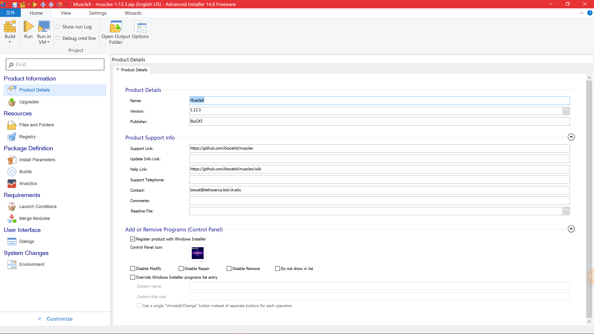
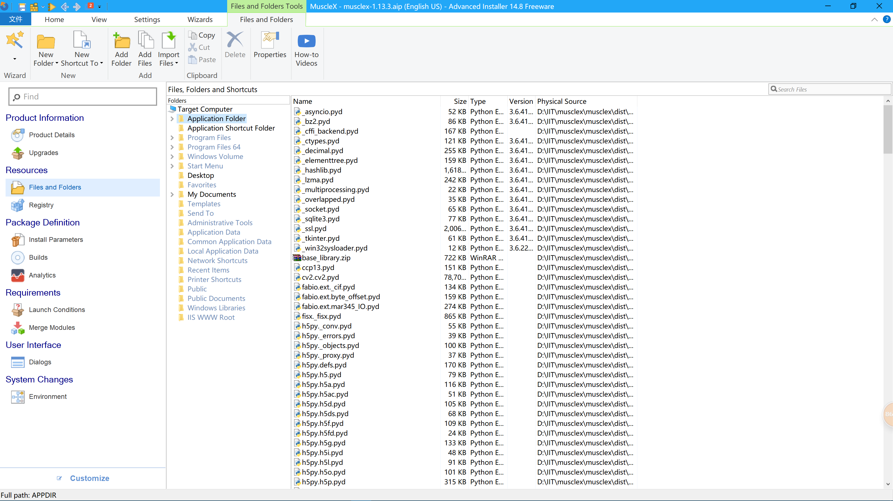

# Build MSI using Advanced Installer
Make sure you have finished building the stand-alone program of
musclex with PyInstaller.

Basic features of Advanced Installer are enough for our purpose.
See [Creating a Simple package][1].

## Basic steps
1. Create a project  
  
2. Product Details  
  
3. Files and Folders  
  
4. Install Parameters  
  

[1]:https://www.advancedinstaller.com/user-guide/tutorial-simple.html