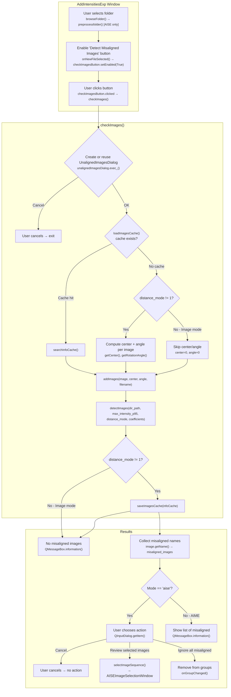
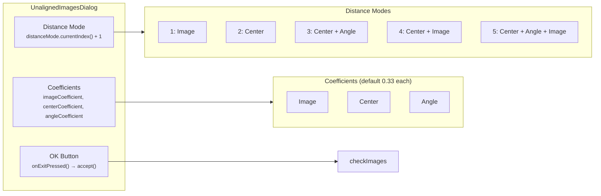
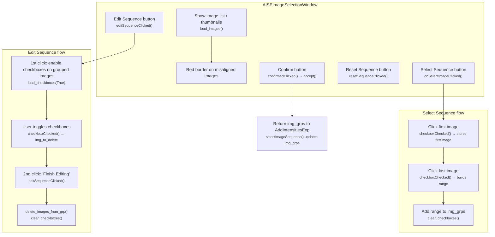
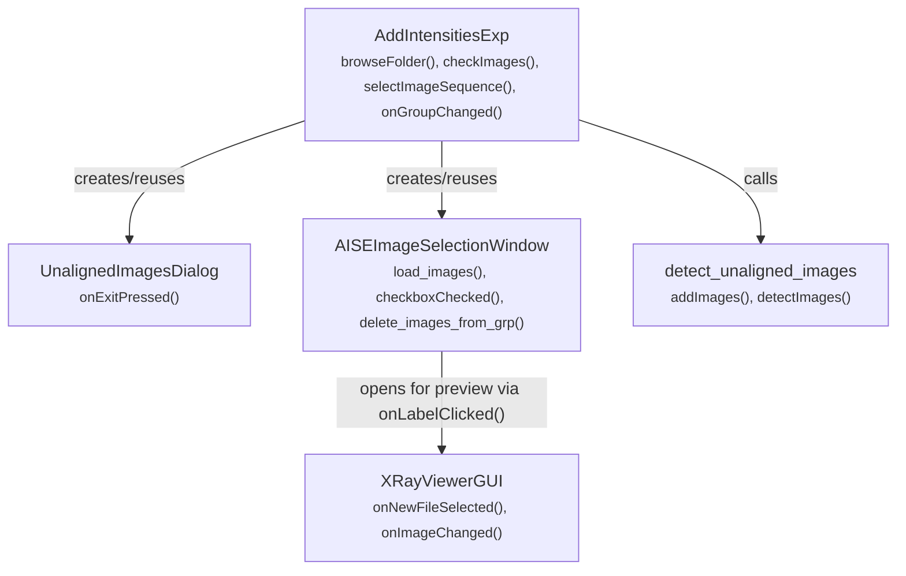

# Detect Misaligned Images — Flow Diagram

This document describes the flow when using the **Detect Misaligned Images** feature in Add Intensities (AISE/AIME).

## Overview

## UnalignedImagesDialog — Detection Settings

## AISE Image Selection (after "Review selected images")

## Component Relationships

