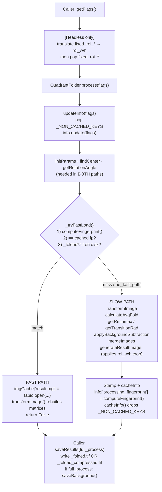

# Quadrant Folding · Parameter-Only Cache + Fast-Path Reload

> Companion diagram: [`QF-Cache-And-FastPath.drawio`](./QF-Cache-And-FastPath.drawio)

## Overview

Before this change `qf_cache/<name>.info` stored both processing
parameters **and** the intermediate image arrays
(`avg_fold`, `bgimg1`, `bgimg2`, `bg_line`). The same image was
also serialised again as `qf_results/<name>_folded[_compressed].tif`,
so every processed image cost ~12 MB on disk **twice** — once in
the pickle, once as the canonical TIFF.

The cache also did not protect against a stale schema: the legacy
"any cache file means we have a result" check would short-circuit
processing using whatever happened to be in the pickle, even if a
parameter that affected pixels had changed since.

| Problem | Impact |
|---|---|
| Image arrays duplicated in `.info` and `_folded.tif` | ~12 MB / image of pure duplication; slow disk I/O on cold open |
| Cache validity decided by *presence*, not *content* | Param changes silently reused stale `bgimg1/bgimg2/avg_fold` |
| `fixed_roi_w/h` (a *cross-image preference*) leaked into the per-image cache | Two names for the same concept, polluted the params dict |
| `Save Cropped Image (Original Size)` UI option | Crashed on every click (`self.initImg = None` was never set), and was redundant with later `transformImage()` changes that always produce an original-sized result |

The new design separates concerns:

- **`qf_cache/<name>.info`** — parameters + a comprehensive
  `processing_fingerprint`, **never** image arrays. Drops to ~1 KB.
- **`qf_results/<name>_folded[_compressed].tif`** — the only place
  the result image lives.
- **Fast-path** — on next open, recompute the fingerprint; if it
  matches what's stamped in the pickle and a `_folded*.tif` is on
  disk, reload the TIFF and skip the entire pipeline.

---

## Data Layout

### `qf_cache/<name>.info` (CACHE_FORMAT_VERSION = 2)

```
musclex/modules/QuadrantFolder.py
  CACHE_FORMAT_VERSION = 2          # bumped → old caches discarded
  FAST_PATH_RESULT_SUFFIXES = ("_folded.tif", "_folded_compressed.tif")

  _NON_CACHED_KEYS = (
      'roi_w', 'roi_h',                              # per-session ROI
      'avg_fold', 'bgimg1', 'bgimg2', 'bg_line',     # image arrays
  )
  _IMAGE_ARRAY_KEYS = ('avg_fold', 'bgimg1', 'bgimg2', 'bg_line')
  _NON_FINGERPRINT_KEYS = (
      'program_version',
      'cache_format_version',
      'processing_fingerprint',     # avoid self-reference
      'transform', 'inv_transform', 'centImgTransMat',  # runtime matrices
      'folded',                     # runtime flag
  )
```

`cacheInfo()` writes only `info[k] for k not in _NON_CACHED_KEYS`,
plus stamps `program_version` and `cache_format_version` on every
save.

`loadCache()` discards the file when:

1. it cannot be unpickled, or
2. `program_version` doesn't match `__version__`, or
3. `cache_format_version` doesn't match the constant above.

### `qf_results/<name>_folded*.tif`

Two variants are accepted by the fast-path:

| Suffix | Compression | Lossless |
|---|---|---|
| `_folded.tif` | none | ✓ |
| `_folded_compressed.tif` | LZW | ✓ |

Both are full-size snapshots of `resultImg` after **all** processing
(including ROI cropping, which is computed-side and bakes into the
pixels). The compressed variant round-trips bit-for-bit, so either
file is sufficient evidence to skip the pipeline.

---

## `processing_fingerprint`

```python
sha1( json.dumps({
    'cache_format_version': CACHE_FORMAT_VERSION,
    'program_version':      self.version,
    'image_data':           self._image_data.get_fingerprint(),
    'params':               { k: normalize(v)
                              for k, v in self.info.items()
                              if k not in _NON_FINGERPRINT_KEYS
                              and k not in _IMAGE_ARRAY_KEYS },
}, sort_keys=True) ).hexdigest()
```

`_normalize_for_fingerprint` recursively flattens the value to
deterministic JSON: sets become sorted lists, dict keys are sorted,
numpy scalars become Python scalars. This guarantees stable hashes
across runs.

### What goes in

| Bucket | Contents |
|---|---|
| **Schema / version** | `cache_format_version`, `program_version` |
| **`ImageData.get_fingerprint()`** | `(mtime, size)` of `blank_image_settings.json`, `mask.tif`, `mask_config.json`, `.blank_image_disabled`, `.mask_disabled`; `manual_center`, `manual_rotation` (only if user-set); `apply_blank`, `apply_mask`, `blank_weight`, `inpaint` |
| **`self.info` params** | `detector`, `orientation_model`, `ignore_folds` (set→sorted list), `fold_image`, `rotate`, `rmin`, `rmax`, `fixed_rmin/max`, `transition_radius`, `transition_delta`, `bgsub` + method params (`tophat1`, `cirmin/cirmax`, `deg1`, `radial_bin`, `smooth`, `tension`, `win_size_*`, …), `bgsub2` + `tophat2` / `cirmin2/cirmax2` / `deg2`, `sigmoid`, **`roi_w` / `roi_h`**, `scale` |

ROI is the subtle one: it's in `_NON_CACHED_KEYS` (not pickled),
but it **is** in the fingerprint. The pickle stamps the
fingerprint that was computed *with* ROI; ROI is re-supplied via
`flags` on every load. If the user toggles ROI off the new
fingerprint won't match → fast-path bypassed → full reprocess.

### What's excluded (and why)

| Key | Excluded because |
|---|---|
| `program_version`, `cache_format_version` | already top-level of payload |
| `processing_fingerprint` | self-reference would make it impossible to recompute |
| `transform`, `inv_transform`, `centImgTransMat` | runtime matrices derived from center/rotation each run |
| `folded` | runtime flag, follows `fold_image` |
| `avg_fold`, `bgimg1`, `bgimg2`, `bg_line` | **outputs**, not inputs — including them would mutate the fingerprint every run |

---

## Pipeline Flow



`process()` returns `True` if the slow path ran, `False` if the
fast-path served the request. Callers use this to decide whether
slow-path-only side artefacts (`saveBackground` needs `BgSubFold`
+ `avg_fold` which weren't reconstructed on the fast-path) are
runnable.

`flags` keys consumed by the new logic:

| Flag | Effect |
|---|---|
| `no_fast_path` | Force slow path even when fingerprint matches |
| `no_cache` | Skip writing `qf_cache/*.info` (used by tests that snapshot `info`) |

---

## ROI Responsibility Inversion

Before:

- GUI sometimes wrote `roi_w/h`, sometimes `fixed_roi_w/h`.
- `QuadrantFolder.updateInfo()` did the translation
  (`if 'fixed_roi_w' in flags: flags['roi_w'] = ...`).
- The cache could end up holding either name depending on entry
  point — confusing for fingerprinting and search.

After:

- **`QuadrantFolder` only sees `roi_w/h`**.
- Translation lives at the entry point closest to the user
  preference:
  - GUI already passes `roi_w/h`.
  - Headless does:

    ```python
    # musclex/headless/QuadrantFoldingh.py
    fixed_w = flags.pop('fixed_roi_w', None)
    fixed_h = flags.pop('fixed_roi_h', None)
    if fixed_w is not None and fixed_h is not None and fixed_w > 0 and fixed_h > 0:
        flags['roi_w'] = fixed_w
        flags['roi_h'] = fixed_h
    ```

  `fixed_roi_*` is the *cross-image preference* in
  `qfsettings.json`; `roi_w/h` is the *concrete ROI applied to
  this image*. Keeping them separate at the boundary makes the
  per-image cache and fingerprint clean.

---

## Removed Feature: "Save Cropped Image (Original Size)"

**Removed entirely.** Reasoning:

| Aspect | Detail |
|---|---|
| Original intent | When the folded image came out *larger* than the input image, this option would crop the result back to the input dimensions before saving. |
| Why obsolete | A later refactor of `transformImage()` always recentres the result on the original image's centre and produces an output of identical shape to `orig_img`. The "oversized result" case the feature targeted no longer occurs. |
| Why broken | `self.initImg` was initialised to `None` in `__init__` and never assigned anywhere. The `if crop:` branch in `saveResults()` immediately did `self.quadFold.initImg.shape`, raising `AttributeError`. The exception was swallowed by a surrounding `try/except`, silently aborting **all** TIF writes when the box was checked. |
| Architectural mess | The dead checkbox state was injected into `info['saveCroppedImage']`, which polluted the fingerprint payload until normalised away. |

Files cleaned up:

- `musclex/ui/QuadrantFoldingGUI.py` — removed the
  `cropFoldedImageChkBx` widget, its slot connection,
  `cropFoldedImageChanged()`, the `if crop:` branch in
  `saveResults()`, the `info['saveCroppedImage']` injection in
  `_on_image_changed`.
- `musclex/modules/QuadrantFolder.py` — removed dead
  `self.initImg = None`.
- Documentation: removed sections from
  `ui/BASE_GUI_USAGE.md` and
  `docs/AppSuite/QuadrantFolding/Quadrant-Folding--How-to-use.md`.

---

## GUI / Headless Save Responsibilities

`process()` no longer writes the result TIF — it only fills
`imgCache['resultImg']`. The caller decides which physical
variant to persist:

```
                      ┌──────────────────────────┐
                      │  imgCache['resultImg']   │   (in-memory only)
                      └────────────┬─────────────┘
                                   │
        ┌──────────────────────────┴──────────────────────────┐
        │                                                     │
   GUI saveResults()                          Headless saveResults() ──┐
        │                                                              │
   compressFoldedImageChkBx?                  qfsettings: compressed?  │
        │                                              │               │
   true → _folded_compressed.tif              true →  _folded_compressed.tif
   false → _folded.tif                        false → _folded.tif      │
        │                                              │               │
        ▼                                              ▼               │
   if full_process: saveBackground()         if full_process: saveBackground()
```

Either suffix is recognised by `fastPathCandidates()` next session.
There is no `_folded_cropped*.tif` any more.

---

## Performance

Measured on MAR detector image (2048 × 2048):

| Path | Time | Notes |
|---|---|---|
| Cold (slow path) | ~2.9 s | identical to legacy slow path |
| Hot (fast path) | ~0.24 s | **≈ 12× speed-up** |
| Cache file size per image | ~12 MB → **~1 KB** | image arrays no longer pickled |

Disk savings scale linearly with collection size: a 1 000-image run
drops from ~12 GB of `qf_cache` to ~1 MB.

---

## Backward Compatibility

| Scenario | Behaviour |
|---|---|
| Old `qf_cache/*.info` from CACHE_FORMAT_VERSION 1 (image-array pickle) | Discarded on load (`cache_format_version` mismatch) → image is reprocessed and a v2 cache + `_folded.tif` are written |
| Old `qf_cache/*.info` written by a different `program_version` | Same — discarded, reprocessed |
| Pre-existing `qf_results/_folded.tif` from an older run, but no matching v2 cache | Fast-path declines (no `processing_fingerprint` to compare); slow path runs once, then future opens hit the fast path |
| Pre-existing `qf_results/_folded_cropped*.tif` files on disk | Ignored by the fast-path (not in `FAST_PATH_RESULT_SUFFIXES`); not regenerated |
| Tests that pass `no_cache=True` | Cache write skipped, `processing_fingerprint` not stamped → fast-path inert on next run too |
| Tests that pass `no_fast_path=True` | Force slow path regardless of cache state |

---

## File Change Summary

| File | Type | Change |
|---|---|---|
| `musclex/modules/QuadrantFolder.py` | Modified | `CACHE_FORMAT_VERSION`, `FAST_PATH_RESULT_SUFFIXES`, `_NON_CACHED_KEYS`/`_IMAGE_ARRAY_KEYS`/`_NON_FINGERPRINT_KEYS`; new `_normalize_for_fingerprint`, `computeFingerprint`, `fastPathCandidates`, `_tryFastLoad`; `cacheInfo` drops non-cached keys; `loadCache` enforces version; `process()` runs fast-path before pipeline and returns `bool`; removed dead `self.initImg`; removed `fixed_roi_*` translation in `updateInfo` |
| `musclex/ui/QuadrantFoldingGUI.py` | Modified | `processImage` / `saveResults(full_process=...)` plumbing; `saveResults` writes only `_folded[_compressed].tif`; `rminmax` click handlers read `imgCache['resultImg']` instead of `info['avg_fold']`; removed `cropFoldedImageChkBx`, its slot, `cropFoldedImageChanged`, dead `info['saveCroppedImage']` injection, dead `initImg` reference |
| `musclex/headless/QuadrantFoldingh.py` | Modified | `getFlags()` translates `fixed_roi_w/h` → `roi_w/h` and pops the original keys; saves `_folded.tif` or `_folded_compressed.tif` based on `qfsettings.compressed`; `saveBackground` only on `full_process` |
| `musclex/utils/image_data.py` | Unchanged interface | `get_fingerprint()` is the source for the `image_data` bucket — no code change required |
| `ui/BASE_GUI_USAGE.md` | Modified | Removed `cropFoldedImageChkBx` reference |
| `docs/AppSuite/QuadrantFolding/Quadrant-Folding--How-to-use.md` | Modified | Removed "Save Cropped Image Checkbox" section |
| `dev_docs/Architecture/QF-Cache-And-FastPath.drawio` | New | Flow diagram (this doc's companion) |
| `dev_docs/Architecture/QF-Cache-And-FastPath.md` | New | This document |
