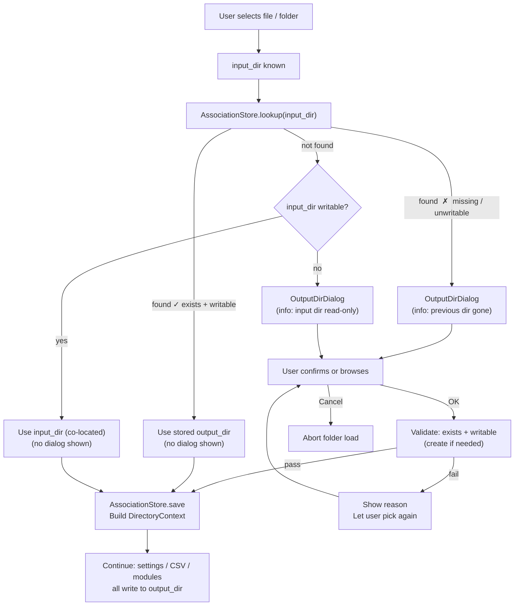
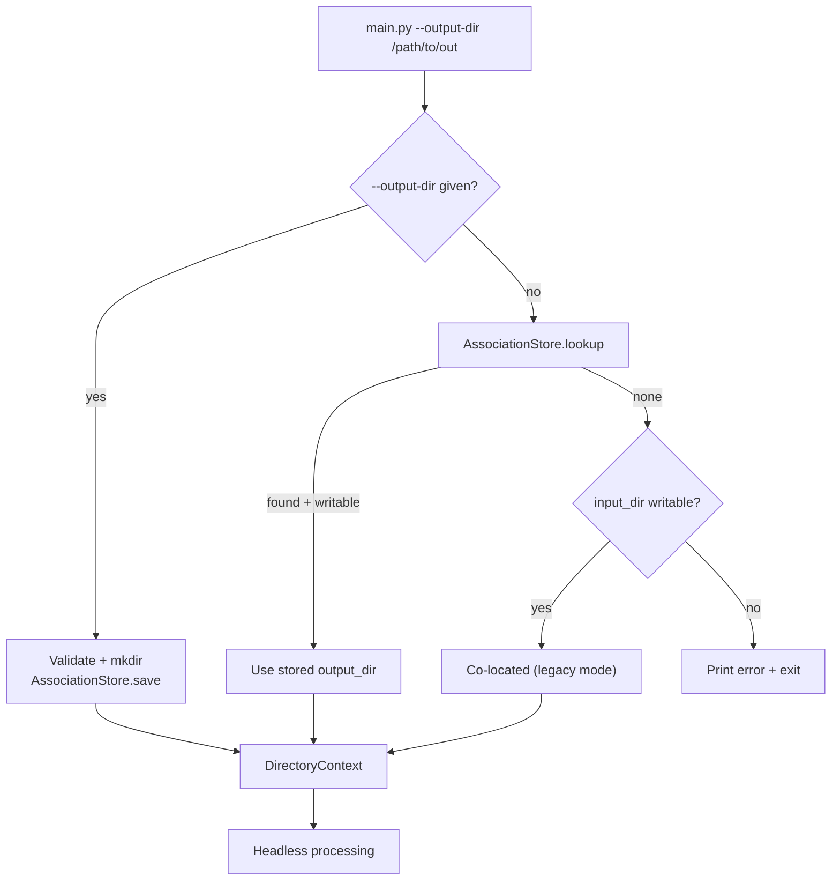

# Read/Write Directory Separation

## Overview

Prior to this change every output artefact produced by MuscleX —
`*_cache/`, `*_results/`, `settings/`, `log/`, `.musclex_cache/` — was
written **co-located with the source images** under a single `dir_path`.
This caused three practical problems:

| Problem | Impact |
|---|---|
| Read-only input directories | Application crashed on the first write attempt |
| Shared datasets | Multiple users overwrote each other's results |
| Archive pollution | Generated files mixed with pristine source data |

The solution introduces an explicit **input / output directory split** that
is transparent to existing co-located datasets while enabling fully
separated layouts.

---

## Architecture

### New Core Components

```
musclex/
  utils/
    directory_context.py   ← DirectoryContext dataclass
    association_store.py   ← AssociationStore (persistence)
  ui/
    widgets/
      output_dir_dialog.py ← OutputDirDialog + resolve helpers
```

#### `DirectoryContext`

```python
@dataclass
class DirectoryContext:
    input_dir:  str   # where images live  (never written unless == output_dir)
    output_dir: str   # where ALL writes go (*_cache, *_results, settings, log)

    @property
    def is_colocated(self) -> bool: ...

    @staticmethod
    def colocated(dir_path: str) -> "DirectoryContext": ...
```

A lightweight value object threaded from the folder-open event down to
every layer that performs disk writes.  `colocated()` produces the
legacy behaviour (input == output) with zero code-path changes.

#### `AssociationStore`

Persists a JSON map of `realpath(input_dir) → realpath(output_dir)` in
`~/.musclex/directory_associations.json`.

```
~/.musclex/
  directory_associations.json
    {
      "/data/experiment_A": "/home/alice/results/experiment_A",
      "/data/shared_run":   "/home/bob/my_results"
    }
```

| Method | Behaviour |
|---|---|
| `lookup(input_dir)` | Returns stored `output_dir` **only** if it still exists on disk; `None` otherwise |
| `save(input_dir, output_dir)` | Persists canonicalised real-paths |
| `remove(input_dir)` | Drops the entry |

#### `OutputDirDialog`

A modal `QDialog` that surfaces **only when needed** (see flow below).
It shows:

- The input directory (read-only label)
- An editable path field (pre-filled with a suggested path or blank)
- A *Browse* button
- OK / Cancel — OK validates existence and writability before accepting

Two helper functions wrap the dialog for the two execution contexts:

| Function | Context |
|---|---|
| `resolve_output_directory(input_dir, parent)` | GUI — interactive |
| `resolve_output_directory_headless(input_dir, output_dir)` | CLI — non-interactive |

---

## Folder-Open Flow

### GUI (interactive)



**Summary:** the dialog is shown only in two cases — the input directory
is not writable, or a previously stored output directory is no longer
valid.  For the common case (writable input, first visit), the app
silently falls back to co-located behaviour.

### CLI (headless / `--output-dir`)



---

## Changing the Output Directory at Runtime

Every GUI module exposes a **"Change Output Directory..."** action in its
File menu.  This lets the user switch the output directory for the
currently loaded folder without having to re-open it.

### Navigator-based GUIs (Equator, QF, PT, AISE)

The action is wired to `ProcessingWorkspace.change_output_directory()`:

```python
# ProcessingWorkspace
def change_output_directory(self):
    dlg = OutputDirDialog(input_dir, current_output_dir, parent=self)
    # on accept:
    _store.save(input_dir, new_output)
    self.dir_context = DirectoryContext(input_dir, new_output)
    self.navigator.file_manager.output_dir = new_output
    self.set_settings_dir(new_output)
    self.update_blank_mask_states()
    self.outputDirChanged.emit(new_output)   # ← Signal
```

Each GUI connects `outputDirChanged` to reset its CSV manager:

```python
# e.g. EquatorWindow
self.workspace.outputDirChanged.connect(self._on_output_dir_changed)

def _on_output_dir_changed(self, new_output_dir):
    self.csvManager = EQ_CSVManager(new_output_dir)
```

### Legacy GUIs (XV, DI, TDI, DC, AIME)

Each window implements its own `_change_output_directory()` that opens
`OutputDirDialog` directly, updates `self.dir_context`, the association
store, and any CSV managers it owns.

---

## Integration Points

### Navigator-Based GUIs (Equator, QuadrantFolding, ProjectionTraces, AISE)

All share a single chokepoint:

```
ImageNavigatorWidget.load_from_file
  └─ emits fileLoaded(dir_path)
       └─ ProcessingWorkspace.on_file_loaded(dir_path)
            ├─ resolve_output_directory(dir_path)  ← NEW
            ├─ stores self.dir_context
            ├─ file_manager.output_dir = ctx.output_dir
            └─ set_settings_dir(ctx.output_dir)    ← was input_dir
```

One change — in `ProcessingWorkspace.on_file_loaded` — covers all four
GUIs at once.

### Legacy GUIs (DIImageWindow, DIBatchWindow, DiffractionCentroids, TotalDisplayIntensity)

Each window resolves the context immediately after `browseFile` sets its
`filePath`:

```python
# e.g. DIImageWindow.__init__
ctx = resolve_output_directory(self.filePath, parent=self)
self.dir_context = ctx if ctx else DirectoryContext.colocated(self.filePath)
```

### XRayViewerGUI

Uses `ImageNavigatorWidget` directly (no `ProcessingWorkspace` wrapper),
so it connects to the `fileLoaded` signal itself:

```python
self.navigator.fileLoaded.connect(self._on_file_loaded)

def _on_file_loaded(self, dir_path):
    ctx = resolve_output_directory(dir_path, parent=self)
    self.dir_context = ctx
    self.csv_manager = None   # reset for new output dir
```

### AddIntensitiesMultipleExp (AIME)

AIME's "input" is a *parent* directory containing multiple experiment
sub-directories — not a single image folder.  It therefore cannot reuse
`ProcessingWorkspace.change_output_directory()` (which would show the
wrong input path).  Instead it implements its own
`_change_output_directory()` keyed on `self._parent_dir`, and explicitly
calls `workspace.set_settings_dir(new_output)` to keep settings in sync.

---

## Write-Path Changes Per Layer

```
┌─────────────────────────────────────────────────────────────────┐
│  User selects folder                                            │
│                                                                 │
│  DirectoryContext                                               │
│    .input_dir  ──► FileManager (reads images)                   │
│    .output_dir ──► SettingsManager  → output_dir/settings/      │
│                ──► CSV managers     → output_dir/*_results/     │
│                ──► Processing mods  → output_dir/*_cache/       │
│                ──► FileManager      → output_dir/.musclex_cache/│
│                ──► Error log        → output_dir/log/           │
└─────────────────────────────────────────────────────────────────┘
```

### SettingsManager

`switch_dir` already accepted a `settings_dir` string.  Callers now pass
`ctx.output_dir` instead of `dir_path`.  No internal change needed.

### CSV Managers

`EQ_CSVManager`, `QF_CSVManager`, `PT_CSVManager`, `DI_CSVManager`,
`DC_CSVManager`, `XV_CSVManager` each construct
`fullPath(dir_path, "*_results")`.  No internal changes — callers pass
`ctx.output_dir` as the `dir_path` argument.

### Processing Modules

Each module gains an optional `output_dir` parameter (defaults to
`None` → input directory, preserving backward compatibility):

| Module | Cache folder | Parameter added |
|---|---|---|
| `EquatorImage` | `eq_cache/` | `output_dir=None` |
| `QuadrantFolder` | `qf_cache/` | `output_dir=None` |
| `ProjectionProcessor` | `pt_cache/` | `output_dir=None` |
| `ScanningDiffraction` | `di_cache/` | `output_dir=None` |
| `DiffractionCentroids` | `dc_cache/` | `output_dir=None` |

### FileManager Scan Cache (`.musclex_cache/`)

Strategy: **try input first, fall back to output**.

```
_load_scan_cache_from_disk(dir_path, sig, fallback_dir=None)
  1. Try  dir_path/.musclex_cache/          (input — shared benefit)
  2. Try  fallback_dir/.musclex_cache/      (output_dir — if input read-only)

_save_scan_cache_to_disk(dir_path, sig, payload, fallback_dir=None)
  1. Try  dir_path/.musclex_cache/          (input — shared benefit)
  2. Fall back to fallback_dir/.musclex_cache/
```

`FileManager` gains `self.output_dir`; the async scan worker passes it as
`fallback_cache_dir`.

### Error Log

`_write_error_log` gains a `fallback_dir` parameter; the log is written to
`output_dir/log/` when the input directory is not writable.

---

## CLI Usage

```bash
# Explicit output directory
musclex eq -f /data/readonly_experiment --output-dir ~/results/exp1

# Re-uses stored association automatically (no --output-dir needed)
musclex eq -f /data/readonly_experiment

# Co-located (default, input must be writable)
musclex qf -f /data/my_experiment
```

---

## Backward Compatibility

| Scenario | Behaviour |
|---|---|
| Writable input, no stored association | Co-located silently — identical to legacy, no dialog |
| User previously confirmed co-located | Association stored; reused silently on next open |
| Existing datasets with co-located results | Left untouched; no migration |
| Module without `output_dir` kwarg caller | Defaults to input dir |
| `DirectoryContext` with `input_dir == output_dir` | Degenerate case = legacy |
| CLI without `--output-dir` and writable input | Falls back to co-located |

---

## File Change Summary

| File | Type | Change |
|---|---|---|
| `musclex/utils/directory_context.py` | **New** | `DirectoryContext` dataclass |
| `musclex/utils/association_store.py` | **New** | `AssociationStore` — persistent JSON map |
| `musclex/ui/widgets/output_dir_dialog.py` | **New** | `OutputDirDialog` + `resolve_output_directory[_headless]` |
| `musclex/ui/widgets/processing_workspace.py` | Modified | `on_file_loaded` resolves + stores `DirectoryContext`; `change_output_directory()` method; `outputDirChanged` signal |
| `musclex/ui/XRayViewerGUI.py` | Modified | `_on_file_loaded` signal handler; `self.dir_context`; File menu action |
| `musclex/ui/DIImageWindow.py` | Modified | Resolves context after browse; all write paths use `dir_context.output_dir`; File menu action |
| `musclex/ui/DIBatchWindow.py` | Modified | Same pattern as `DIImageWindow`; File menu created |
| `musclex/ui/EquatorWindow.py` | Modified | Passes `output_dir` to `EquatorImage` and `EQ_CSVManager`; File menu action; resets CSV on `outputDirChanged` |
| `musclex/ui/QuadrantFoldingGUI.py` | Modified | Passes `output_dir` to `QuadrantFolder` and `QF_CSVManager`; File menu action; resets CSV on `outputDirChanged` |
| `musclex/ui/ProjectionTracesGUI.py` | Modified | Passes `output_dir` to `ProjectionProcessor` and `PT_CSVManager`; File menu action; resets CSV on `outputDirChanged` |
| `musclex/ui/AddIntensitiesSingleExp.py` | Modified | Uses `dir_context.output_dir` for `aise_results/`; File menu created; resets results path on `outputDirChanged` |
| `musclex/ui/AddIntensitiesMultipleExp.py` | Modified | Uses `dir_context.output_dir` for `aime_results/`; File menu created; own `_change_output_directory()` keyed on parent dir |
| `musclex/ui/diffraction_centroids.py` | Modified | Passes `output_dir` to `DiffractionCentroids` and `DC_CSVManager`; File menu on both start and process windows |
| `musclex/ui/TotalDisplayIntensity.py` | Modified | Uses `dir_context.output_dir` for `tdi_results/`; File menu action |
| `musclex/utils/file_manager.py` | Modified | Scan-cache fallback; `self.output_dir`; log fallback |
| `musclex/utils/settings_manager.py` | Modified | Callers pass `output_dir` to `switch_dir` |
| `musclex/modules/EquatorImage.py` | Modified | `output_dir` param; cache writes use it |
| `musclex/modules/QuadrantFolder.py` | Modified | `output_dir` param; cache writes use it |
| `musclex/modules/ProjectionProcessor.py` | Modified | `output_dir` param; cache writes use it |
| `musclex/modules/ScanningDiffraction.py` | Modified | `output_dir` param; cache writes use it |
| `musclex/modules/DiffractionCentroids.py` | Modified | `output_dir` param; cache writes use it |
| `musclex/headless/EquatorWindowh.py` | Modified | `output_dir` plumbed through; all paths updated |
| `musclex/headless/EQStartWindowh.py` | Modified | Passes `output_dir` to subprocess `EquatorWindowh` |
| `musclex/headless/QuadrantFoldingh.py` | Modified | `output_dir` plumbed through |
| `musclex/headless/ProjectionTracesh.py` | Modified | `output_dir` plumbed through |
| `musclex/headless/DIImageWindowh.py` | Modified | `output_dir` plumbed through |
| `musclex/headless/DIBatchWindowh.py` | Modified | Passes `output_dir` to subprocess workers |
| `musclex/main.py` | Modified | `--output-dir` / `-o` flag for `eq`, `di`, `qf`, `pt` |
