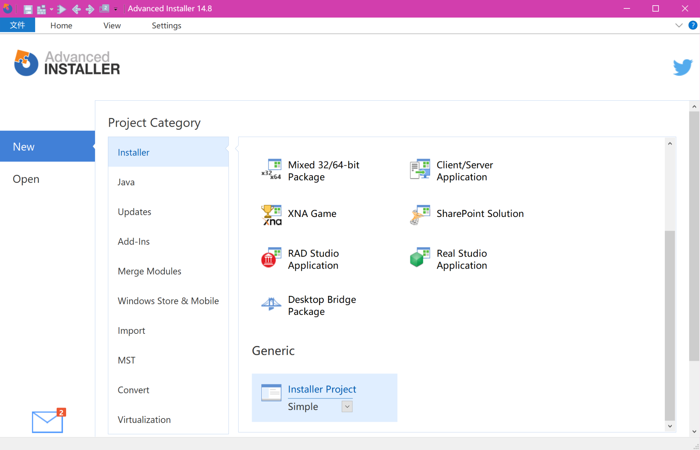
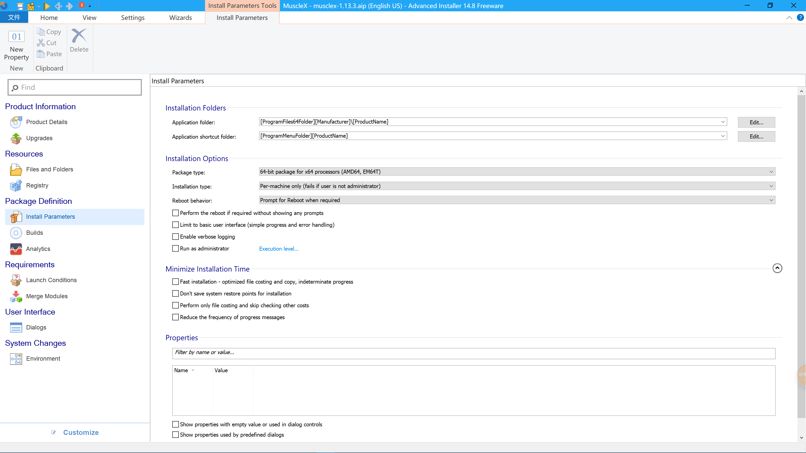

# Build MSI using Advanced Installer
Make sure you have finished building the stand-alone program of
musclex with PyInstaller.

Basic features of Advanced Installer are enough for our purpose.
See [Creating a Simple package][1].

## Basic steps
1. Create a project  
  

2. Product Details  
  
When asked to generate a new Product Code, click on Generate New. This will allow users to have multiple versions installed on their computers without having to uninstall the previous ones.

3. Files and Folders  
  
- Copy all the files created by pyinstaller inside the Application folder.
- Create a Application folder shortcut: select "musclex-launcher", then click on "New Shortcut" on the top left corner. Rename to "musclex@1.21.1", add the icon and press OK.
- Create a Desktop shortcut: Go to the Desktop folder in the Folder tree, click on "New Shortcut" on the top left corner and choose "musclex-launcher". Rename to "musclex@1.21.1", add the icon and press OK.

4. Install Parameters  
  
Switch to 64-bit package for x64 processors, verify everything is set, then click on "Build". The .msi installer file will be in the SetupFile folder generated.

[1]:https://www.advancedinstaller.com/user-guide/tutorial-simple.html