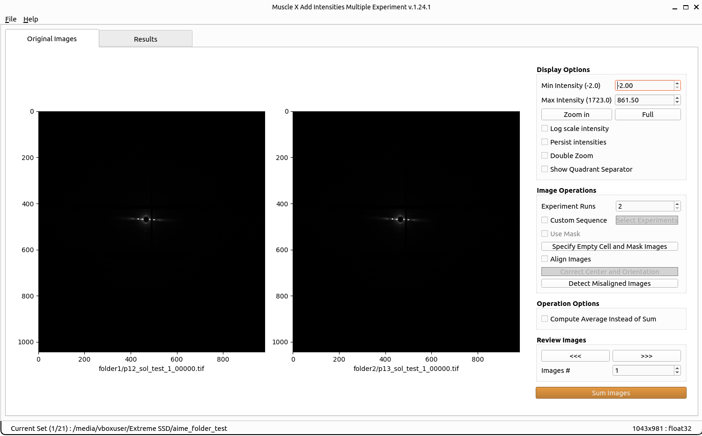

# How to use

Once the program runs, you will have to select a folder containing multiple rounds or images from different experiments (it goes from 2 to 8 experiments simultaneously). The program will automatically, based on the files names, select the first image of each experiment. You will see a new window as below:



Auto grouping is performed automatically and the images you see on the screen are directly processed and saved into `aime_results`.

* Select an input directory by pressing "Select Folder"

* What is displayed has been processed and is accessible in the `aime_results` folder. You can see the result in the 'Result' tab.


* You can change the display options in order to have visually better images (won't affect the true result).

* You can also change the processing options: the number of exposures you want to add simultaneously, averaging the images instead of summing them, calibrating the common center and the rotation of each image (can be done automatically or manually for each image).

```eval_rst
.. note:: After clicking on a calibration button, you need to select an image by clicking on it before using the calibration function on this image.
```

* Use the arrows to go from one group of exposure to the other and process the results groups by groups, use the spinbox `Images #` to jump to a specific group of exposures, or click on `Process Current Folder` to process everything.

## Calibration options

#### Set Rotation and Center
Before setting manual rotation and center, it’s better to zoom the image to the area of the diffraction because it will be easier to set these parameters correctly. To set the rotation and center, you need to click 2 positions of the image. The first one will be a reflection peak on one side of the equator, and the second one will be the corresponding (opposite) reflection peak on the other side of the equator. To cancel, press ESC.<br/>


#### Set Center By Chords
Before setting center by chords, it’s better to zoom the image to the area of the diffraction because it will be easier to set these parameters correctly. This method is used to find the diffraction center and uses the fact that "All perpendiculars to the chords in a circle intersect at the center". On clicking this button, you will be prompted to select points along the circumference of the diffraction patter. As you select these points, perpendicular lines to the chords formed using these points start to appear on the image in blue color.  Once you finish selecting the points, click the same button again to start processing. The diffraction center will then be calculated by taking the average of the intersection points of the perpendicular lines (blue lines in the figure).<br/>


#### Set Center By Perpendiculars
Before setting center by perpendiculars, it’s better to zoom the image to the area of the diffraction because it will be easier to set these parameters correctly. This method finds the center of diffraction using intersection of perpendicular lines. On clicking this button, you are prompted to select multiple positions in the image. You can start by clicking the first reflection peak on one side of the equator and the second will be the corresponding (opposite) reflection peak on the other side of the equator. This forms one horizontal line. You can continue drawing as many horizontal lines using this process of selecting reflection peaks. Next, you can click the reflection peak vertically above the equator and the following point symmetrically below the equator. Again, you can draw multiple such lines. Once you finish selecting the points, click the same button (Set Center By Perpendiculars) again to start processing. The diffraction center will then be calculated by taking the average of the intersection points obtained by the horizontal and vertical lines plotted.<br/>


#### Set Rotation Angle
This assumes that the center of diffraction is correct. After the button is clicked, the program will allow users to select an angle by moving a line. Clicking on image when the line is on the equator of the diffraction will set manual rotation angle. To cancel, press ESC.<br/>


The Mask Threshold is used for excluding certain pixel values when calculating the folded image. The program will ignore pixels with intensity below mask threshold. This can be used to remove the dark gaps in images resulting from the gaps between detector elements in Pilatus detectors, as well as other detector abnormalities.

To fix the center position to a user supplied value, you can check Fix Center check box, specify the coordinates of the beam center (before rotation). The image will be reprocessed when x, or y is changed. This will affect the next image if it’s still checked.

##### Double Zoom
This feature is used to zoom into subpixel level accuracy. On checking this box, a new subplot is created on the top right of the image. As you move the mouse pointer into the image area, 20 x 20 pixels centered at the location of the mouse pointer is cropped from the image and scaled up to 10 times and plotted in the subplot mentioned earlier. This feature can be used with any calibration feature (Set Rotation, Set Center and Rotation...). Click the double zoom check box so that the subplot appears. Click on a calibration button, for example the Set Center and Rotation button. Drag your mouse pointer to the position you want to select the first point (or the first reflection peak as described earlier). Click the image to freeze the subplot region. A message appears, check do not show again box to not see this message again. Click on the exact point in the subplot region, which plots an equivalent point in the main image. Perform the previous two steps to select the second point. Uncheck the Double Zoom checkbox to hide the subplot window.<br/>


#### Set Region of Interest
This feature is used to select part of the image and perform AIME on that part. For example, we would want to ignore the artefacts on the edges of the image. On clicking this button, a default rectangle appears around the center of diffraction. As you move the mouse pointer into the image area, the vertical edges of the rectangle move to where the mouse pointer is located in a symmetrical fashion. Click on the image to accept the current width of the region. Next, as you move the pointer, the horizontal edges of the rectangle start moving to where the mouse pointer is located in a symmetrical fashion. Click on the image to accept the current height of the fitting region. Once the width and height is fixed, the resultant image will be cropped to the region selected by the rectangle following which we process AIME on the resultant image. Therefore, any artefacts present outside the selected region are ignored while adding or averaging. One can only select the region of interest about the center of diffraction.
