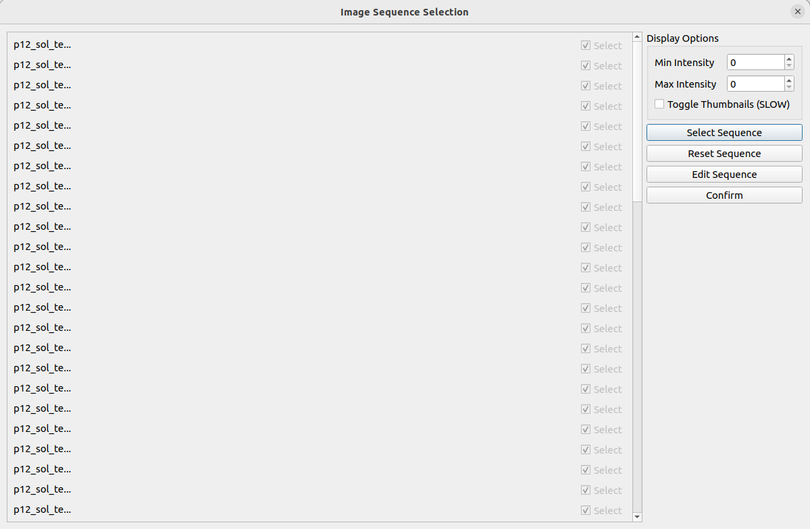
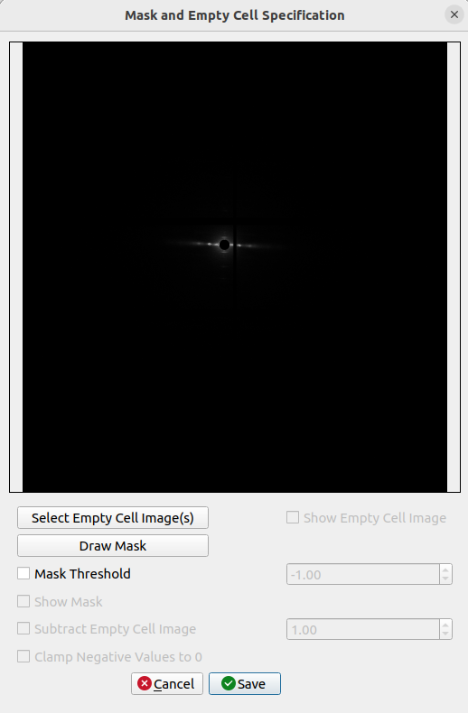
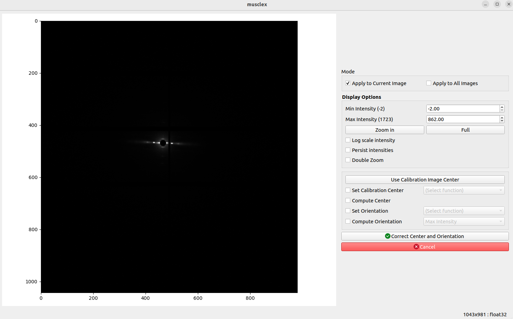
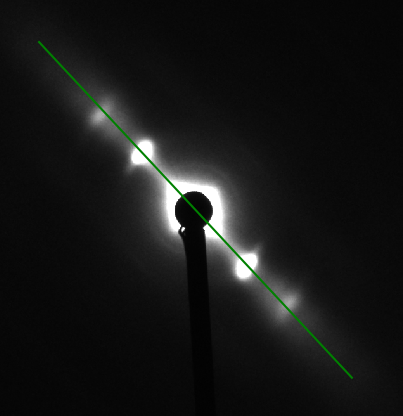
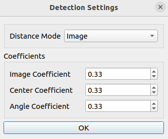

# How to use

Once the program runs, you will have to select a folder containing multiple images or an hdf5 file. The program will automatically, based on the files names, group the images following each other. You will see a new window as below:

The image you see on the screen is the first of the group. The result image of the first group is directly processed and saved into `aise_results`.

* Select an input directory by pressing "Select Folder" or an hdf5 file by pressing "Select an H5 file"

* What is displayed has been processed and is accessible in the `aise_results` folder. You can see the result in the 'Result' tab.

* You can change the display options in order to have visually better images (won't affect the true result).

* You can also change the processing options: the number of frames you want to add simultaneously, averaging the images instead of summing them, calibrating the center and the rotation of each image (can be done automatically or manually for each image). The groups are displayed in the terminal when a change is made.

* Use the 'Frame' arrows to go from one frame to the other inside a same group.

* Use the 'Group' arrows to go from one group of frames to the other and process the results groups by groups, use the spinbox `Images #` to jump to a specific group of exposures, or click on `Process Current Folder` to process everything.

## File Format

Unlike the AIME module, there is no particular file format. The images just need to be in a same folder or in a same h5 file to be added. They are sorted and added alphabetically.

## Display Options

All options in Display Options will not affect any processing. These options allow users to see more detail in the image by setting minimal intensity, maximum intensity, and zooming. You can also choose whether or not to see the meridional and equatorial axes. To zoom in, the user needs to simply press the Zoom in button, and select the zoom region by drawing a rectangle as shown below. Once 'Zoom in' or 'Full' button is clicked, the current zoom level is persisted when moved to the next image. The check box 'Persist intensities' is used to persist the max and the min intensities when we move to the next image.

##### Double Zoom
This feature is used to zoom into subpixel level accuracy. On checking this box, a new subplot is created on the top right of the image. As you move the mouse pointer into the image area, 20 x 20 pixels centered at the location of the mouse pointer is cropped from the image and scaled up to 10 times and plotted in the subplot mentioned earlier. This feature can be used with any calibration feature (Set Rotation, Set Center and Rotation...). Click the double zoom check box so that the subplot appears. Click on a calibration button, for example the Set Center and Rotation button. Drag your mouse pointer to the position you want to select the first point (or the first reflection peak as described earlier). Click the image to freeze the subplot region. A message appears, check do not show again box to not see this message again. Click on the exact point in the subplot region, which plots an equivalent point in the main image. Perform the previous two steps to select the second point. Uncheck the Double Zoom checkbox to hide the subplot window. 

## Image Operations

The following set of options will affect image processing. These options allow the user to modify the binning factor or select the images that they want to sum instead, specify a mask or a blank cell image to subtract, or correct the image(s) if the user sees that something is wrong with them. The final button is an algorithm that will compare all the images in the folder or file, and mark the ones they deem are misaligned based on parameters specified by the user.

#### Binning Factor

This option allows the user to modify the number of frames per bin they want to add. For example, if the user has a folder of 30 images, having a binning factor of 5 will mean that every 5 images will be summed/averaged together based on the user's selection, for a total of 6 bins. By default, the value of this is 2.

#### Sum Image Ranges

The other option to modify bins. Selecting this will disable the binning factor box and enable the button to Select Image Subsets. Clicking the button opens up the following menu.

By default, due to loading times, the images will be presented in a list format. We have given an option to toggle the images but they may take some time. Clicking on the image name will open up XV so that the user can view that specific image.

As per usual, we have provided display options so the user can edit the intensities of the image to view them better. This will not affect processing.

##### Select Sequence

This option prompts the user to select the first and last image of a single bin. Selecting the first and last checkbox of an image will mark the first bin, and the user can click this button to select another bin until they are done. Images that are already part of a bin will have their checkboxes checked and greyed out.

##### Reset Sequence

This option resets all the bins. The user will have to select their bins again after.

##### Edit Sequence

This options allows the user to edit the bins. Clicking this button enables all the checkboxes to be clicked again, and any images that haven't been checked when the user clicks on the "Finish Editing" button will be deleted from their respect bins.

##### Confirm

This option saves the bins and closes the dialog.

#### Specify Empty Cell and Mask Images

This button opens up another menu for the user to specify a mask or add an empty cell image to subtract.

The program will remember the min/max intensity values set by the user earlier and the image displayed in the menu will use the values.

##### Select Empty Cell Image(s)

This button opens up a dialog for the user to select an empty cell image to use.

##### Show Empty Cell Image

This toggleable checkbox will display the empty cell image instead of the current image.

##### Draw Mask

This button opens up a pyFAI menu for the user to draw a mask.

##### Mask Threshold

If the user checks this checkbox, the program will automatically create a mask based on the threshold specified next to this option. By default, the value is -1 so any pixel in the image that has a value that is equal or less than -1 will be added to the mask.

##### Show Mask

This toggleable checkbox will display the mask image instead of the current image. The option will only be enabled when a mask has been specified (either from a user or from the previous option)

##### Subtract Empty Cell Image

This toggleable checkbox will subtract the empty cell image from the current image and display it. This option is only enabled if an empty cell image has been specified. The weight of the empty cell image can be specified in the spinbox next to this option. By default, the value is 1 so all the values in the empty cell image will be multiplied by 1 when subtracting from the main image. Modifying the spinbox value will automatically update the image. If the program detects negative values in the image after subtraction, a bolded line will alert the user of the largest negative value.

##### Clamp Negative Values to 0

This toggleable checkbox will change all the negative pixel values in the image to 0, in case the user thinks the negative values are affecting the intensity data. This option is only enabled if an empty cell image has been specified **AND** subtracted from the image to which the program detects that negative values are present in the resulting image.

##### Save

Once the user is done, clicking the save button will save and close the dialog. If a mask has been specified, a mask image `mask.tif` will be created in the `settings` folder for the program to use. If an empty cell image has been specified and subtracted, a json file will be created with all the settings the user has specified. This json file will be used during the final processing. 

#### Correct Center and Orientation

This button becomes enabled when the previous checkbox **Align Images** has been checked. Clicking this button will open up the following menu:

This menu will be used to correct images if their center or orientation is misaligned. As per usual, we have provided display options so the user can edit the intensities of the image to view them better. This will not affect processing.

##### Mode

The user can choose to select whether they want the corrections that they are doing to be applied to the current image that the menu was launched with, or to apply to all the images in the folder.

##### Use Calibration Image Center

Clicking this button will open up a dialog to select a calibration image similar to other programs. Selecting the calibration image will open another dialog to where you can configure the calibration image to use.

##### Set Calibration Center

In the case of an inaccurate center, checking this option enables the nearby dropdown box. The dropdown box contains the methods that the user can pick and choose to set the center. The two methods that can be used are Set Center by Chords and Set Center by Perpendiculars. Choosing either of these options will start the function. 

###### Set Center By Chords
Before setting center by chords, it’s better to zoom the image to the area of the diffraction because it will be easier to set these parameters correctly. This method is used to find the diffraction center and uses the fact that "All perpendiculars to the chords in a circle intersect at the center". On clicking this button, you will be prompted to select points along the circumference of the diffraction patter. As you select these points, perpendicular lines to the chords formed using these points start to appear on the image in blue color.  Once you finish selecting the points, click the same button again to start processing. The diffraction center will then be calculated by taking the average of the intersection points of the perpendicular lines (blue lines in the figure). 

###### Set Center By Perpendiculars
Before setting center by perpendiculars, it’s better to zoom the image to the area of the diffraction because it will be easier to set these parameters correctly. This method finds the center of diffraction using intersection of perpendicular lines. On clicking this button, you are prompted to select multiple positions in the image. You can start by clicking the first reflection peak on one side of the equator and the second will be the corresponding (opposite) reflection peak on the other side of the equator. This forms one horizontal line. You can continue drawing as many horizontal lines using this process of selecting reflection peaks. Next, you can click the reflection peak vertically above the equator and the following point symmetrically below the equator. Again, you can draw multiple such lines. Once you finish selecting the points, click the same button (Set Center By Perpendiculars) again to start processing. The diffraction center will then be calculated by taking the average of the intersection points obtained by the horizontal and vertical lines plotted. 

##### Compute Center

Alternatively, the program itself can compute a center automatically without needing a user input. Selecting this option will trigger the program to compute the center, to which the center will be displayed. 

Note that the Compute Center and Set Calibration Center checkboxes are mutually exclusive, meaning that selecting one disables the other one.

##### Set Orientation

In the case of an image not being orientated properly, checking this checkbox enables the nearby dropdown box which contains the method that the user can use to correct the orientation. The two methods are Set Rotation Angle and Set Rotation Angle and Center. Choosing either of these options will start the function. 

###### Set Rotation Angle
This assumes that the center of diffraction is correct. After the button is clicked, the program will allow users to select an angle by moving a line. Clicking on image when the line is on the equator of the diffraction will set manual rotation angle. To cancel, press ESC. 

###### Set Rotation and Center
Before setting manual rotation and center, it’s better to zoom the image to the area of the diffraction because it will be easier to set these parameters correctly. To set the rotation and center, you need to click 2 positions of the image. The first one will be a reflection peak on one side of the equator, and the second one will be the corresponding (opposite) reflection peak on the other side of the equator. To cancel, press ESC. 

##### Compute Orientation

Alternatively, the program itself can compute the orientation. Checking this checkbox enables the dropdown for the user to select which specific method to use to calculate the orientation. Selecting any of the methods will trigger the program to calculate the orientation which will then be displayed to the user.

Note that just like Computer Center and Set Calibration Center, Set Orientation and Compute Orientation are mutually exclusive, so that selecting one will disable the other.

##### Save

Clicking the save button will create a `calibrationDialog.json` file in the `settings` folder to which the program will read from and apply the data inside during the final processing.

#### Detect Misaligned Images

Clicking this button will open up a popup with configurable options. The user can choose the method of which they want the algorithm to scan for misaligned images, and can edit the threshold values of the variables being used in the calculations. 

If any misaligned images are found, the user will be prompted to either review or ignore all the misaligned images. If the user selects to review the misaligned images, the Select Image Subset menu will open up, with all the misaligned images being marked in red. The user can use the menu to remove them from the bins as needed. If the user selects to ignore them, the program will just simply skip over them during final processing.

## Operation Options

The following options will affect processing at the end.

#### Compute Average Instead of Sum

Selecting this option will compute the average of all the images per bin instead of summing them together during the final processing

#### Compress the Resulting Images

Selecting this option will generate the files with a `_compressed` tag added to them as well as their reduced size to save space.

## Review Images

Here you can use buttons to switch between the images to view them and perform operations on them. There is a dropdown box that changes the behaviors of the arrows.

#### Step through Selected Images

This option will make the arrows go through all the images in the bins. Any images that are not found in the bins will skipped and therefore not be displayed.

#### Step through all images

This option will make the arrows go through all the images in the folder. 

#### Step through badly correlated images

This option will make the arrows go through all the images marked as badly correlated. The images will only be marked as badly correlated if the user has clicked on the Detect Misaligned Images button before. If no badly correlated images are found, a popup will display stating it and the option will remain the same.

<!-- ## Calibration options

The Mask Threshold is used for excluding certain pixel values when calculating the folded image. The program will ignore pixels with intensity below mask threshold. This can be used to remove the dark gaps in images resulting from the gaps between detector elements in Pilatus detectors, as well as other detector abnormalities.

To fix the center position to a user supplied value, you can check Fix Center check box, specify the coordinates of the beam center (before rotation). The image will be reprocessed when x, or y is changed. This will affect the next image if it’s still checked.

#### Set Region of Interest
This feature is used to select part of the image and perform AISE on that part. For example, we would want to ignore the artefacts on the edges of the image. On clicking this button, a default rectangle appears around the center of diffraction. As you move the mouse pointer into the image area, the vertical edges of the rectangle move to where the mouse pointer is located in a symmetrical fashion. Click on the image to accept the current width of the region. Next, as you move the pointer, the horizontal edges of the rectangle start moving to where the mouse pointer is located in a symmetrical fashion. Click on the image to accept the current height of the fitting region. Once the width and height is fixed, the resultant image will be cropped to the region selected by the rectangle following which we process AISE on the resultant image. Therefore, any artefacts present outside the selected region are ignored while adding or averaging. One can only select the region of interest about the center of diffraction.
 -->
