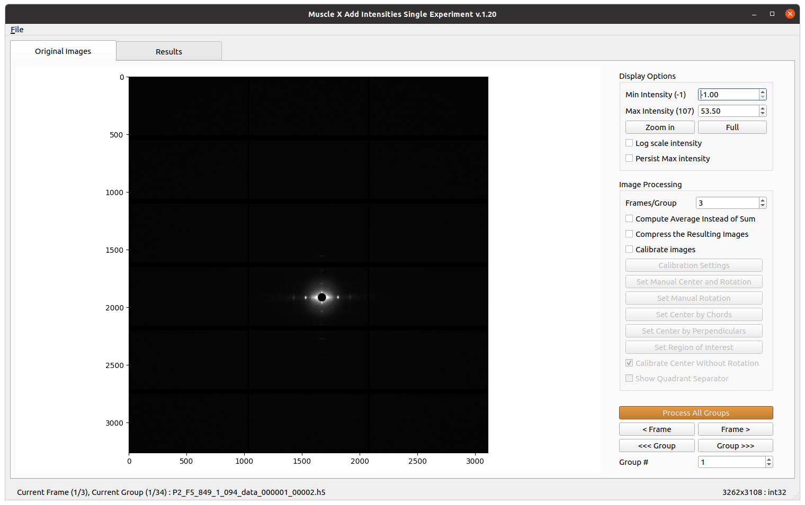

# How to use

Once the program runs, you will have to select a folder containing multiple images or an hdf5 file. The program will automatically, based on the files names, group the images following each other. You will see a new window as below:

The image you see on the screen is the first of the group. The result image of the first group is directly processed and saved into `aise_results`.

* Select an input directory by pressing "Select Folder" or an hdf5 file by pressing "Select an H5 file"

* What is displayed has been processed and is accessible in the `aise_results` folder. You can see the result in the 'Result' tab.

* You can change the display options in order to have visually better images (won't affect the true result).

* You can also change the processing options: the number of frames you want to add simultaneously, averaging the images instead of summing them, calibrating the common center and the rotation of each image (can be done automatically or manually for each image). The groups are displayed in the terminal when a change is made.

* Use the 'Frame' arrows to go from one frame to the other inside a same group.

* Use the 'Group' arrows to go from one group of frames to the other and process the results groups by groups, use the spinbox `Images #` to jump to a specific group of exposures, or click on `Process Current Folder` to process everything.

