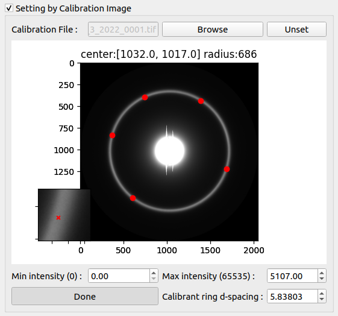

# Calibration Settings

A calibration image is a shot of a membrane sample that gives a ring in the diffraction pattern at a known spacing in inverse nm.
By fitting this ring to a circle you can refine a center and you can use the radius of the ring to convert spacings in pixels to spacings in nm.


## Setting by Calibration Image

When the box is selected, you can choose a calibration image and the program will try to fit a circle to the image. The center and radius will be shown on it if the circle can be fitted.


However, if the circle cannot be fitted or the circle is in the wrong position, you can also fit the circle manually by clicking on "Set manual calibration by point selections" button. Once the button clicked, you will see another image at the bottom left which is the zoom area of your cursor. To select a point on the ring, you need to click a first time on the image (approximate click), then a second time on the zoom area (precise click).



You will have to click at least 5 points on the ring position, and click Done when you finish. After setting appropriate calibrant ring d-spacing, and clicking OK, the image will be reprocessed with new calibration settings including center and d-spacing.

### Advanced Manual Calibration

```eval_rst
.. note:: **New in version 1.27.0**: The manual calibration dialog now includes advanced optimization methods for improved accuracy and robustness.
```

When you click "Set manual calibration by point selections", the Manual Calibration Dialog opens with several advanced features:

#### Point Selection and Refinement

1. **Two-Step Selection Process**:
   - First click: Approximate location on the main image
   - Second click: Precise location on the zoomed view (bottom left)
   - This two-step process ensures sub-pixel accuracy

2. **Point Refinement**: After selecting a point, the program automatically refines its position by:
   - Analyzing the local intensity gradient
   - Finding the exact peak or edge location
   - Adjusting the point to the optimal position

3. **Visual Feedback**: Selected points are displayed on both the main image and zoom view with clear markers

#### Optimization Methods

The manual calibration uses sophisticated optimization algorithms to fit the best circle through your selected points:

**Differential Evolution (Global Optimization)**:
- Escapes local minima to find the globally optimal solution
- Uses a population-based search strategy
- Configurable population size (default: larger populations for better results)
- Multiple generations to refine the solution

**MAD-Based Outlier Rejection**:
- MAD = Median Absolute Deviation
- Automatically identifies and removes outlier points
- Makes the fit robust against accidentally misplaced points
- Uses statistical thresholds to determine outliers

**Multi-Start Optimization**:
- Runs optimization from multiple initial guesses
- Selects the best result across all starts
- Increases confidence in the final solution

#### Calibration Dialog Features

**Results Display**:
- **Center Coordinates**: Shows the refined center position (x, y)
- **Radius**: Displays the fitted circle radius in pixels
- **Residuals**: Shows the fitting error for each point
- **Optimization History**: Track the convergence of the fitting algorithm

**Export Options**:
- **Export to CSV**: Save the optimization history for analysis
  - Includes all iterations and parameter values
  - Useful for troubleshooting or research purposes

**Interactive Adjustments**:
- **Add More Points**: Continue adding points to improve the fit
- **Remove Points**: Click on a point marker to remove it
- **Refit**: Run the optimization again with current points
- **Reset**: Clear all points and start over

#### Tips for Best Results

1. **Point Distribution**: Select points evenly around the entire ring for best accuracy
2. **Number of Points**: Use at least 5 points, but 8-12 points typically give excellent results
3. **Ring Quality**: Choose points on clear, well-defined parts of the ring
4. **Zoom Level**: Adjust the zoom level to see the ring edge clearly before selecting points
5. **Outlier Handling**: Don't worry too much about one or two imperfect points - the MAD-based rejection will handle them

#### Understanding the Optimization

The optimization process works by:
1. **Initial Guess**: Estimates a rough circle from your selected points
2. **Refinement**: Uses differential evolution to find the optimal center and radius
3. **Outlier Detection**: Identifies points that don't fit well (using MAD statistics)
4. **Re-optimization**: Refits without outliers for the final result
5. **Validation**: Checks that the solution is physically reasonable

The algorithm minimizes the sum of squared distances from each point to the fitted circle, while being robust to outliers.

#### Troubleshooting

**If the fit looks wrong**:
- Check that you selected points on the actual calibration ring
- Try adding more points around different parts of the ring
- Remove any obviously misplaced points
- Ensure the zoom view was used for precise clicking

**If optimization fails**:
- Make sure you have at least 5 points selected
- Check that points are reasonably distributed around the ring
- Try clicking "Refit" to run the optimization again
- Verify the calibration image has a clear, visible ring

## Setting by Parameters

You can also manually set the calibration parameters which are λ, Sdd and Pixel size.
These parameters are used to calculate d<sub>10</sub> by 

## Fixed Center
 
The center can also be fixed independently of the calibration image. The fixed center checked indicates that the specified center will be used when we move to the next image or process the current folder.

## Manually Select Detector

Having a detector corresponding to the images used might improve the results obtained with MuscleX.

You can manually select the detector used for the experiment. If you don't the detector will be selected automatically by using the size of the image. The list provided is from the pyFAI's Detectors registry (some name might be repetitive but they point to the same detector). However, if the detector you selected does not correspond to the image provided, the program will fall back to our default detector.

