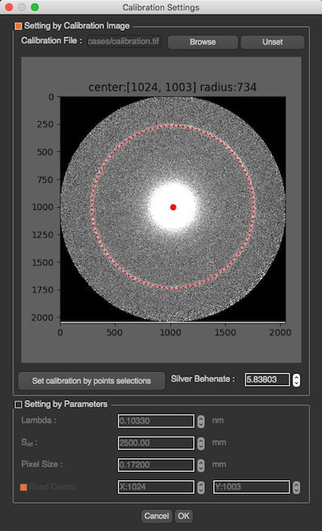
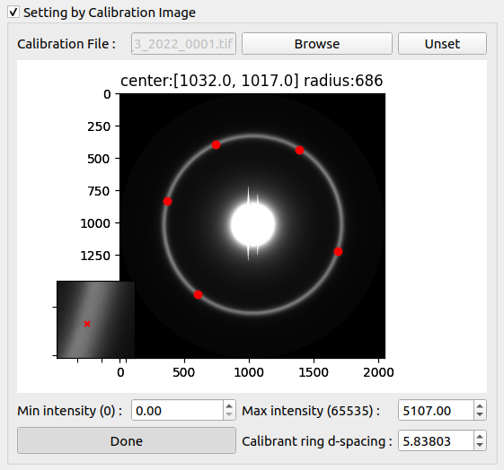
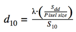
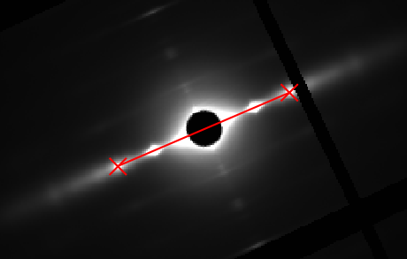
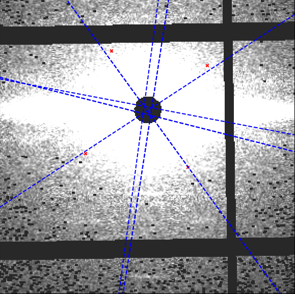
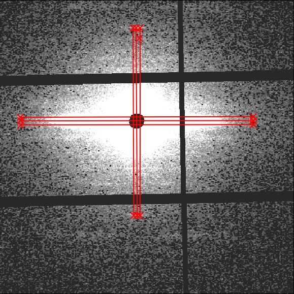
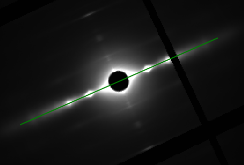
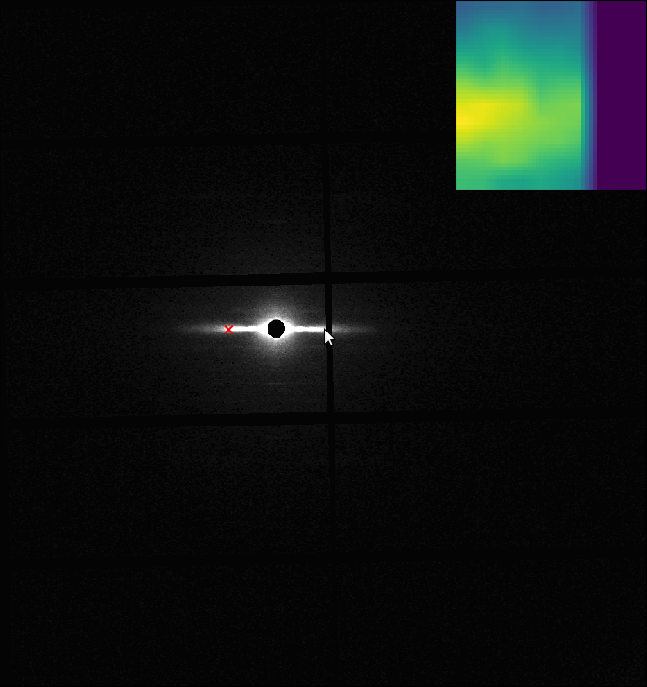

# Common Settings

Several configuration settings are shared across multiple MuscleX modules. Rather than repeating them in each module's documentation, they are described here once.

**Modules that use these settings:** Quadrant Folding (qf), Equator (eq), Projection Traces (pt), and X-Ray Viewer (xv, center tools only).

---

## Calibration Settings

A calibration image is a shot of a membrane sample that gives a ring in the diffraction pattern at a known spacing in inverse nm. By fitting this ring to a circle, MuscleX can refine the diffraction center and use the fitted radius to convert spacings in pixels to spacings in nm.

### Setting by Calibration Image

When calibration by image is selected, choose a calibration image and the program will try to fit a circle to the ring. The center and radius are shown on the image if the circle can be fitted.



If the circle cannot be fitted automatically, or if it is in the wrong position, click **Set manual calibration by point selections**. The manual calibration dialog shows the main image and a zoom view. To select a point on the ring, click once on the main image for the approximate location, then click in the zoom view for the precise location.



Select at least 5 points on the ring, then click **Done**. After setting the appropriate calibrant ring d-spacing and clicking **OK**, the image is reprocessed with the new calibration settings, including center and d-spacing conversion.

#### Advanced Manual Calibration

```eval_rst
.. note:: **New in version 1.27.0**: The manual calibration dialog includes advanced optimization methods for improved accuracy and robustness.
```

When you click **Set manual calibration by point selections**, the Manual Calibration Dialog opens with several advanced features:

**Point Selection and Refinement**

1. **Two-Step Selection Process**:
   - First click: Approximate location on the main image
   - Second click: Precise location on the zoomed view
   - This two-step process improves sub-pixel accuracy
2. **Point Refinement**: After selecting a point, the program analyzes the local intensity gradient, finds the best peak or edge location, and adjusts the point to the optimal position.
3. **Visual Feedback**: Selected points are displayed on both the main image and zoom view with clear markers.

**Optimization Methods**

- **Differential Evolution**: Escapes local minima to find a globally strong fit.
- **MAD-Based Outlier Rejection**: Identifies and removes outlier points using Median Absolute Deviation statistics.
- **Multi-Start Optimization**: Runs optimization from multiple initial guesses and selects the best result.

**Calibration Dialog Features**

- **Results Display**: Shows refined center position, fitted radius, residuals, and optimization history.
- **Export to CSV**: Saves the optimization history for analysis or troubleshooting.
- **Interactive Adjustments**: Add more points, remove points, refit, or reset the selection.

**Tips for Best Results**

1. Select points evenly around the ring.
2. Use at least 5 points; 8-12 points usually gives better robustness.
3. Choose points on clear, well-defined parts of the ring.
4. Adjust the zoom level before selecting precise points.
5. Do not worry too much about one or two imperfect points; outlier rejection can often handle them.

### Setting by Parameters

You can also manually set the calibration parameters: wavelength λ, sample-to-detector distance SDD, and pixel size. These parameters are used to calculate d<sub>10</sub>:



### Fixed Center

The center can also be fixed independently of the calibration image. When the fixed center option is checked, the specified center is used when moving to the next image or processing the current folder.

### Manually Select Detector

Selecting a detector corresponding to the images used may improve the results obtained with MuscleX.

You can manually select the detector used for the experiment. If no detector is selected, the detector is selected automatically from the image size. The list is provided by pyFAI's detector registry. If the selected detector does not match the image, the program falls back to the default detector.

---

## Diffraction Center and Rotation

The diffraction center is the point of zero scattering vector — the point where the direct beam hits the detector. The rotation angle aligns the equatorial axis of the diffraction pattern with the horizontal axis used by the processing algorithms.

Each module provides several tools for setting these values manually. All tools can be combined with [Double Zoom](#double-zoom) for sub-pixel accuracy.

### Quick Center and Rotation Angle

```eval_rst
.. note:: **New in version 1.27.0**: The "Quick Center and Rotation Angle" tool (formerly "Set Rotation and Center") provides a streamlined way to set both center and rotation simultaneously.
```

Before setting manual rotation and center, it is better to zoom the image to the area of the diffraction because it will be easier to set these parameters correctly. To set the rotation and center, you need to click 2 positions of the image. The first one will be a reflection peak on one side of the equator, and the second one will be the corresponding (opposite) reflection peak on the other side of the equator. To cancel, press ESC.

**Center and Rotation Mode Indicators**: The interface displays whether you are using automatic or manual center/rotation settings, making it easier to track your calibration state.



### Set Center By Chords

Before setting center by chords, it is better to zoom the image to the area of the diffraction. This method uses the fact that "All perpendiculars to the chords in a circle intersect at the center". On clicking this button, you will be prompted to select points along the circumference of the diffraction pattern. As you select these points, perpendicular lines to the chords formed using these points start to appear on the image in blue color. Once you finish selecting the points, click the same button again to start processing. The diffraction center will then be calculated by taking the average of the intersection points of the perpendicular lines (blue lines in the figure).



### Set Center By Perpendiculars

Before setting center by perpendiculars, it is better to zoom the image to the area of the diffraction. This method finds the center of diffraction using intersection of perpendicular lines. On clicking this button, you are prompted to select multiple positions in the image. You can start by clicking the first reflection peak on one side of the equator and the second will be the corresponding (opposite) reflection peak on the other side of the equator. This forms one horizontal line. You can continue drawing as many horizontal lines using this process. Next, you can click the reflection peak vertically above the equator and the following point symmetrically below the equator. Again, you can draw multiple such lines. Once you finish selecting the points, click the same button (Set Center By Perpendiculars) again to start processing. The diffraction center will then be calculated by taking the average of the intersection points obtained by the horizontal and vertical lines plotted.



### Set Rotation Angle

This assumes that the center of diffraction is correct. After the button is clicked, the program will allow users to select an angle by moving a line. Clicking on the image when the line is on the equator of the diffraction will set the manual rotation angle.

```eval_rst
.. note:: **New in version 1.27.0**: Negative rotation angles are now supported. The rotation angle dialog has been enhanced with improved visual feedback.
```

To cancel, press ESC.



### Fix Center

To fix the center position to a user-supplied value, check the **Fix Center** checkbox and specify the coordinates of the beam center (before rotation). The image will be reprocessed when x or y is changed. This setting will affect subsequent images if the box remains checked.

### Double Zoom

```eval_rst
.. note:: **Enhanced in version 1.27.0**: Double Zoom now features improved intensity normalization and dynamic crop radius adjustment for better visualization.
```

This feature provides sub-pixel accuracy when placing center/rotation control points. On checking this box, a new subplot is created on the top right of the image. As you move the mouse pointer into the image area, a 20×20 pixel region centered at the cursor is cropped from the image and scaled up 10× in the subplot.

To use Double Zoom with any calibration tool:

1. Enable the **Double Zoom** checkbox — the subplot appears.
2. Click a calibration button (e.g. Quick Center and Rotation Angle).
3. Move the mouse to the approximate position of the first point and click to freeze the subplot.
4. Click the exact location in the subplot; an equivalent point is placed on the main image.
5. Repeat for the second point.
6. Uncheck **Double Zoom** to hide the subplot.



### Restoring Automatic Settings

```eval_rst
.. note:: **New in version 1.27.0**: You can now restore automatic center and rotation detection with granular control.
```

If you have manually set the center or rotation angle and want to return to automatic detection:

1. **Restore Auto Center**: Click this button to return to automatic center detection.
   - Choose to apply to **current image only** or **all subsequent images**.
2. **Restore Auto Rotation**: Click this button to return to automatic rotation detection.
   - The program will automatically detect the optimal rotation angle.
3. **Apply Current Settings**: Once you have set a center or rotation manually, you can apply it to only the current image or to all subsequent images in the folder.

### Center and Rotation Management

**Configuration Fingerprinting**: The program uses configuration fingerprinting to validate cached results. When you change center or rotation settings, the cache is automatically invalidated, ensuring consistency across your processing workflow.

**Manual Settings Preservation**: Your manual center and rotation settings are preserved during cache operations, so you do not lose your calibration when the cache is updated.

---

## Empty Cell Image and Mask

This dialog provides two independent settings: **Empty Cell Image** (formerly called "blank image") and **Mask**. Both are configured through the **Apply Empty Cell Image and Mask** panel in the processing workspace. Each has its own button to open its respective dialog, and each can be independently enabled or disabled via a checkbox once its settings have been saved.

## Empty Cell Image

An empty cell image (also called a blank image) is a diffraction pattern recorded without a sample — only the sample holder, solvent, or beam path. A diffraction pattern from a muscle is the sum of the muscle signal and this empty cell background. Subtracting the empty cell image isolates the muscle diffraction alone, which is important for accurate peak fitting and intensity ratios.

### Opening the Dialog

Click **Set Empty Cell Image** in the processing workspace panel. This opens the Empty Cell Subtraction dialog.

### Selecting an Image

Click **Select Empty Cell Image** to browse and select a single empty cell image file. Any format supported by `fabio` is accepted (e.g., `.tif`, `.edf`, `.cbf`). Once loaded, a status indicator turns green confirming the image has been loaded.

> **Note:** Earlier versions of the software supported selecting multiple images that were averaged together. The current version accepts a single empty cell image file.

### Scale Factor

The **Empty Cell Image Scale** spin box (range 0–1000, default 1.0) scales the empty cell image before subtraction. Because the empty cell exposure may differ from the sample exposure in terms of beam intensity or collection time, you can use this factor to match the two. Setting it below 1.0 reduces the subtraction amount; above 1.0 increases it.

The difference image updates live as you change the scale.

### Compare Panel

Three radio buttons let you switch what is displayed in the viewer:

| Option | Description |
|---|---|
| **Difference Image (Original − Empty Cell)** | Shows the result of the subtraction at the current scale factor. This is the image that will actually be processed. |
| **Original Image** | Shows the raw sample image with no subtraction. |
| **Empty Cell Image** | Shows the empty cell image scaled by the current factor. |

The viewer also provides full intensity and display controls (vmin/vmax, log scale, colormap) via the Display Options panel on the right.

### Saving

Click **Save** to write the configuration to `blank_image_settings.json` in the settings folder. The **Apply Empty Cell Image** checkbox in the main panel will become enabled. Uncheck it at any time to temporarily disable subtraction without deleting the configuration.

---

## Mask

A mask is a binary image that marks which pixels should be ignored during processing. Masked pixels are excluded from histogram projection, peak fitting, and all downstream calculations. The mask dialog offers three complementary masking methods that can be combined.

### Opening the Dialog

Click **Set Mask** in the processing workspace panel. This opens the Set Image Mask dialog.

### Mask Options

All three methods live in the **Mask Options** group. Their combined result is previewed as a color overlay on the image in real time.

#### 1. Drawn Mask

Click **Draw Mask** to launch the `pyFAI-drawmask` tool. This opens an interactive drawing window where you can paint arbitrary regions to mask using geometric tools (polygon, rectangle, brush, etc.).

After closing `pyFAI-drawmask`, the mask is loaded automatically. The status line below the checkbox confirms whether a drawn mask file is available. Enable the **Drawn Mask** checkbox to include it in the combined mask.

> Drawn mask regions are shown as a **red** overlay.

#### 2. Low Mask Threshold

Enable the **Low Mask Threshold** checkbox to mask all pixels whose intensity is **below** the specified value. The default threshold is −0.01, which is appropriate for masking detector gaps or dead pixels that have been assigned a negative sentinel value.

The threshold spin box range is −50 to 10 000.

Optionally enable **Enable Mask Dilation** and choose a kernel size (3×3, 5×5, or 7×7) to expand the low-threshold mask outward by one pass of morphological erosion. This is useful for catching border pixels adjacent to sensor gaps that may be partially affected.

> Low-threshold masked regions are shown as a **green** overlay.

#### 3. High Mask Threshold

Enable the **High Mask Threshold** checkbox to mask all pixels whose intensity is **above** the specified value. The default is 64 000, which targets saturated pixels on typical 16-bit detectors.

The same optional dilation controls (3×3 / 5×5 / 7×7 kernel) are available.

> High-threshold masked regions are shown as a **blue** overlay.

### Color Legend

| Color | Meaning |
|---|---|
| Green | Low Mask Threshold |
| Blue | High Mask Threshold |
| Red | Drawn Mask |
| Purple | Rmin / Rmax mask (applied by the main processing window) |

### Saving

Click **Save** to write the mask configuration. The following files are created in the settings folder:

- `mask_config.json` — stores the threshold values and dilation kernel sizes.
- `drawn-mask.edf` — the raw output from `pyFAI-drawmask` (if a drawn mask was created).
- `mask.tif` — the final combined binary mask (all active methods merged). This is the file that is actually applied during processing.

If all three mask methods are disabled when you click Save, all mask files are removed and the mask is cleared entirely.

The **Apply Mask** checkbox in the main panel will become enabled once a `mask.tif` exists. Uncheck it to temporarily disable the mask without deleting the saved settings.

---

## Applying Settings During Processing

In the processing workspace, the **Apply Empty Cell Image and Mask** panel shows both checkboxes:

- **Apply Empty Cell Image** — enabled when `blank_image_settings.json` exists.
- **Apply Mask** — enabled when `mask.tif` exists.

Either or both can be checked/unchecked independently at any time. The program re-processes the current image immediately when a checkbox state changes.

## Persistent Storage

All files are saved under the `settings/` subdirectory that the program creates next to the image directory being processed. When you reopen the same directory, the saved empty cell image path, scale factor, and mask configuration are loaded automatically and the checkboxes are restored to their last saved state.

```eval_rst
.. note:: For module-specific details on how masked pixels affect the analysis pipeline (e.g. convex-hull background estimation in Equator), refer to each module's own documentation.
```
