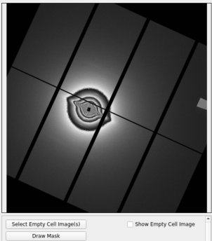
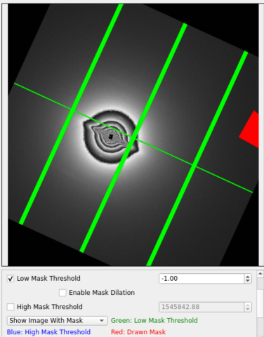

# Blank Image and Mask

There 2 settings you can set here, blank image and mask

## Blank Image
Once the window launches, you will see "Select Blank Image(s)" at the bottom. Then, you can select a blank image or multiple images. The program will average them all if you select multiple images. If the image is from Pilatus detector. The program will initial mask threshold, and paint the mask as orange color. You can change it in order to make correct mask.

It is also possible to change the scale factor (in percent) of the blank image. Indeed, a blank image can sometimes be more (or less) intense than the main image, so this scale factor helps to change the intensity of the blank image to avoid oversubtracting (or undersubtracting).

  

## Additional Mask
The mask threshold can create mask from the threshold value. If you have additional area which you want to ignore,  you can click "Draw Additional Mask". This button will available only when the blank image is selected. After the button is clicked, there will be a new window pops up. This dialog is a toolkit from [PyMca](http://pymca.sourceforge.net/)

Before drawing additional mask, you can zoom in by disable the arrow by just pressing it

You can also change color type or intensity range by pressing the palette icon, and flip the image vertically by pressing Mona Lisa icon. To draw the mask, there're several options.

1. Drawing by rectangle selection 
2. Drawing by brush 
3. Drawing by polygon selection 

To clear the mask, press 
To erase some mask, press  and erase them from the image

## Draw Mask using Base image
This feature allows user to draw custom mask without having to select a blank image. For example, the user could open the original image and draw a custom mask on it so that the corresponding region is ignored while fitting.

This button would open up a window asking the user to select a base image to draw on (user may also select the currently open image). Once an image is selected, a drawing panel toolkit as before pops up. Here, the user can draw the mask using rectangle selection, brush or polygon selection.  

## Save

After every thing is set, and OK is pressed, the blank image and mask will be saved to settings folder which is created under original selected image directory (not the blank image). When this settings is launched again, these images will be downloaded.
