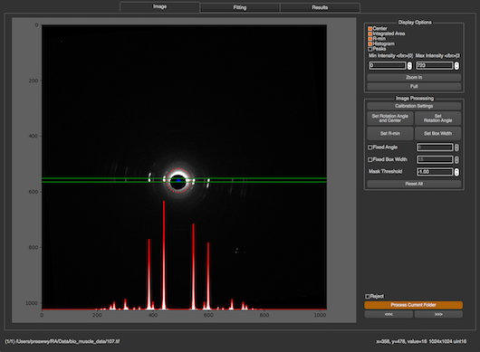

# Introduction

The purpose of the Equator program is to analyze the equatorial portion of muscle X-ray diffraction patterns. 

The Equator program is designed to:
* Determine the inter filament lattice spacing, d10
* Fit Voigt or Gaussian model functions to the diffraction peaks in order to estimate their integrated intensities
* Determine I11/I10 intensity ratios
* Obtain estimates for σd and σs from the peak widths

The program does this with as little user intervention as possible in order to improve reproducibility, reduce operator bias, and increase efficiency. It can operate on a whole directory of images and write results, cache files, and failed-case lists to a selected output directory. Not all patterns are amenable to this approach, however. Any failed cases are flagged for manual processing, either within the Equator program or using other manual approaches. Typically the program succeeds with ~90% of patterns showing diffraction.

### More Details
* [How it works](Equator--How-it-works.md)
* [How to use](Equator--How-to-use.md)
* [How to use — Output files](Equator--How-to-use.md#output-files)

---

## Background: The Equatorial Diffraction Pattern from Striated Muscle

A good introduction to X-ray diffraction of vertebrate muscle can be found in Chapter 2 of Squire, JM, *The Structural Basis of Muscular Contraction*, Plenum 1981. A treatment of X-ray diffraction from insect flight muscle can be found in Irving (2006) *X-ray Diffraction of Indirect Flight Muscle from Drosophila* (in *Nature's Versatile Engine: Insect Flight Muscle Inside and Out*, J Vigoreaux editor, Landes Biosciences, Georgetown, TX).

The equatorial pattern arises from the projected density of mass in the A-band of the sarcomere. The thick filaments are packed into a hexagonal lattice with thin filaments interdigitated between them either in the trigonal positions (vertebrate muscle — Figure 1A) or halfway between adjacent thin filaments (many insect flight muscles — Figure 1B). The density of the filaments projected onto a plane therefore represents a two-dimensional crystal with the hexagonal lattice points occupied by thick filaments. One can draw imaginary planes through the crystallographic unit cell corresponding to various values of the Miller indices h and k. In Figure 1A the lattice planes corresponding to h=1, k=0 (separated by d10) and h=1, k=1 (separated by d11) are shown. These lattice planes give rise to the two strongest pairs of X-ray reflections: the 1,0 and 1,1 reflections with intensities I1,0 and I1,1. In insect muscle the two strongest pairs are the 1,0 and 2,0 reflections because of its different lattice geometry (Figure 1B).

Figure 2 shows the geometry of a muscle diffraction experiment. The muscle sample is separated from the detector by a distance L. The spacing between thick filaments is ~40 nm, large compared to the wavelength of X-rays (~0.1 nm). Bragg's Law, nλ = 2d sinθ, describes the relationship between lattice spacing d and scattering angle 2θ. If d is large, θ will be small. L is therefore typically 2–3 m so that the distance S10 — from the center of the pattern to the 1,0 reflection — is of the order of a few mm. At small angles tan2θ ≅ sin2θ ≅ 2θ, which simplifies the expression to d10 = nλL/S10. The lattice spacing is therefore inversely proportional to S10.

In skinned cardiac muscle the 1,1 and 1,0 equatorial reflections are often the only reflections visible. In skeletal muscle, additional diffraction peaks are frequently visible corresponding to higher-order diffraction planes (larger h and k). In vertebrate muscle the first five equatorial reflections are the 1,0; 1,1; 2,0; 2,1; and 3,0. In insect flight muscle, as many as 20 equatorial reflections can be observed. In skeletal muscle there is also a peak between the 1,0 and 1,1 reflections from the insertion of thin filaments into the Z-band (the Z-band reflection), located at approximately 1.46 × S10 (Yu et al., 1977, *J. Mol. Biol.* 115:455–464). The positions of the A-band reflections (excluding the Z-band reflection) obey a hexagonal lattice selection rule: S(h,k) = √(h²+k²+hk) × S10. Thus d10 may be calculated from any equatorial reflection. The inter-thick-filament spacing is obtained by multiplying d10 by 2/√3.

The intensities of the 1,0 and 1,1 equatorial reflections may be determined from one-dimensional projections along the equator. When cross-bridges bind to thin filaments in vertebrate muscle there are radial and azimuthal movements of the cross-bridges, resulting in a loss of mass on the 1,0 planes (containing only thick filaments) and a gain of mass on the 1,1 planes (Huxley, 1968, *J. Mol. Biol.* 37:507–520; Haselgrove and Huxley, 1973, *J. Mol. Biol.* 77:549–568). As a consequence the intensity of the 1,0 reflection decreases and the 1,1 increases. I11/I10 intensity ratios can therefore be used to estimate shifts of mass from the region of the thick filament to the region of the thin filament.

There is additional information in the equatorial patterns in the form of the widths of the diffraction peaks. The width of the Gaussian or Voigtian function used to approximate the shape of a given peak σh,k may be expressed (Yu et al., 1985, *Biophys J* 47:311–321; Irving and Millman, 1989, *J. Muscle Res. Cell Motil.* 10:385–394) as √(σc²+σd²Shk²+σs²Shk²), where Shk = √(h²+k²+hk) × S10. σc is the known width of the X-ray beam; σd is related to the heterogeneity in inter-filament spacing among myofibrils; and σs is related to the amount of paracrystalline (liquid-like) disorder of the myofilaments in the hexagonal lattice (disorder of the second kind; Vainshtein, 1966, *Diffraction of X-rays by Chain Molecules*, Elsevier). σd can be expressed relative to Δd10/d10 as a measure of the width of the distribution of lattice spacings across myofibrils. σs can be expressed in terms of ΔX/d10 where ΔX is the standard deviation in the distribution of nearest-neighbor unit cell distances within a given myofibril. σs increases substantially during contraction in skeletal muscle (Yu et al., 1985). Because of the dependence of peak width on the square of the scattering angle, liquid-like disorder rapidly causes peaks to become indistinguishable from background at higher scattering angles. The muscle lattice can also exhibit disorder of the first kind — the tendency of objects to vibrate isotropically around lattice positions due to thermal energy, resulting in a linear decrease in diffracted intensities with increasing scattering angle (temperature factor type disorder). There is no direct way to estimate the degree of this kind of disorder without invoking a model structure.
