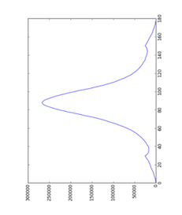
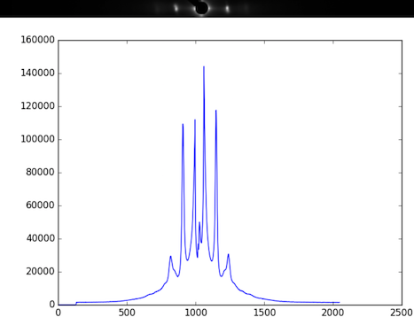
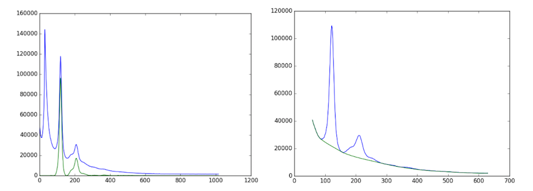
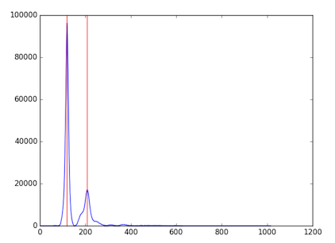

# How it works

When an image is selected, Equator loads it through the shared processing workspace, applies any configured calibration, center/rotation, empty cell image, and mask settings, and then processes it with the current Equator parameters. On the first load, the calibration dialog can be shown when calibration is available or needs confirmation. If the image has already been processed with the same MuscleX version and the same preprocessing settings, Equator loads the cache from `eq_cache` instead of recalculating the image.

## Image processing and fitting model
Before Equator-specific processing begins, the shared workspace resolves the diffraction center and rotation angle from automatic detection, calibration, manual overrides, or cached settings. For how those shared settings are configured, see [Common Settings — Diffraction Center and Rotation](../Common-Settings.html#diffraction-center-and-rotation).

Equator then processes the image in this order:

### 1. Calculate R-min
### 2. Calculate Box Width

For details on the shared R-min algorithm, see [Shared Settings — R-min](../Common-Settings.html#r-min).

The working image is rotated using the resolved rotation angle, and the area inside R-min is removed as in this image. If R-max is set, the area outside R-max will also be removed. The image's box width will be initially set by using R-min x 1.5. While rotating the image, it is ensured that the image is expanded appropriately so that it is not cropped. Rotation of both squared and non-squared images is handled.
 

Then, the program will find the horizontal histogram from this image, calculate the background assuming a convex hull function to the histogram, and the integrated area will be selected as between the start and end point of the histogram. From the image above, the horizontal histogram was
 

### 3. Get Intensity Histogram
When integrated area is calculated, the program will produce a histogram from the rotated image inside the integrated area. (If the blank image and mask is set, the original image will be subtracted by the blank image before rotation)

### 4. Apply Convex hull to intensity histogram
The original histogram will be split into left and right sides. Then, the convex hull to each half pattern will be calculated in order to remove the background by using R-min as a starting point.

  

Note: When producing the intensity histogram, Equator identifies columns with values below the mask threshold as ignored columns. Masked detector gaps are protected during convex-hull background estimation and interpolated before fitting. More details are available in [Empty Cell Image and Mask](Blank-Image-and-Mask.html).

### 5. Find Diffraction Peaks
The program will find peaks from left and right histograms which have had the convex hull background subtracted. This process will find all locations of the peaks. If the image is noisy, it is possible that the program will find too many peaks. ( In the image below, the program found only 2 peaks because the image was not noisy, so it worked very well )

### 6. Managing Diffraction Peaks
This process prepares and corrects the background-subtracted, intensity histogram before fitting a model. It is possible that the program found peaks from noise, misplaced peaks, or both false positive peaks and false negative peaks. Therefore, these peaks need to be re-positioned in case this process fails. The algorithm  will try to find first symmetric peaks, and find S10 which is the distance from center to the first peak on the equator. After that, all peak locations will be calculated by using S10 and theta(h,k). The number of peaks on each side to be fit needs to be specified by the user (default and minimum is 2)

### 7. Fit Model
The program will fit the model to the histogram by using the specified model (currently Gaussian and Voigtian models are supported), initial S10,and the area of the reflection peaks. Finally, we will obtain the new parameters we want from the fitting results. This will include the area of each peak, S10, sigma D, sigma S, gamma, and  I11/I10. However, if you see only 4 reflection from the pattern (Only I11 and I10 on each side), it will be overdetermined if you use Voigt as a fitting model. To solve this problem, sigma S or gamma should be fixed.

If there are some parameters that need to be configured manually to obtain good fits, the program will run these processes again, but it will not start from the beginning. Instead, it will start from the process after the manual one. For example, if the Box Width is set manually, the program will run processes from Get Intensity Histogram to Fit Model because the center, rotation angle and R-min do not need to be recalculated.
