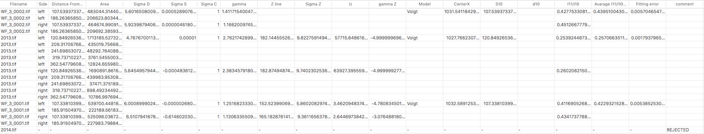

# Summary

Once an image is processed, Equator writes analysis results to `eq_results/summary.csv` under the selected output directory. If no separate output directory is selected, the output directory is the folder containing the selected image.

There is a second file created in `eq_results` named `summary2.csv`. This file shows the same results in a different layout: each image corresponds to one line, compared to `summary.csv` where each peak corresponds to one line (so multiple lines may be written for one image).

Equator also maintains `failedcases.txt` in the selected output directory. Images with no effective peaks, failed model fitting, high fitting error, or manual rejection are added to this list.

