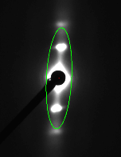

# Image Processing Functions

## Finding Center
To find the center, the image will be converted to an 8 bit image, Gaussian filter is applied to reduce noise, apply thresholding and find the circle by fitting an ellipse to the biggest contour of the threshold image. The center is the center of ellipse. 

  

If the circle cannot be determined this way, the center will be calculated by using the [moments](http://docs.opencv.org/2.4/modules/imgproc/doc/structural_analysis_and_shape_descriptors.html?highlight=moments#moments) method of OpenCV to find the center of the object.

## Calculate Rotation Angle
The program will first calculate the initial angle by fitting an ellipse to the pattern. However, another approach will be applied to find more accurate angle by using azimuthal integration histogram. To find the angle from azimuthal integration histogram is just getting the angle with highest intensity. If the angle from this method is not too different from the initial angle, the angle from this method will be returned. Otherwise, the initial angle will be returned.

See [Orientation Finding](Orientation-Finding.html) for more details.

## Calculate R-min
R-min is the minimum radius from the center to be analyzed in a given diffraction pattern. The program will create a radial histogram. The x-axis is radius, and the y-axis is the intensity. R-min is determined as the 50% of its maximum value. However, this radius should not be more than 150% of the maximum point location to prevent over removal. For example, if the maximum point is at 35, R-min should be between 36 - 59. If the program cannot find the 50% of the maximum value in this range, R-min will be 59.
