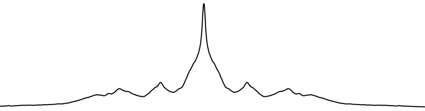
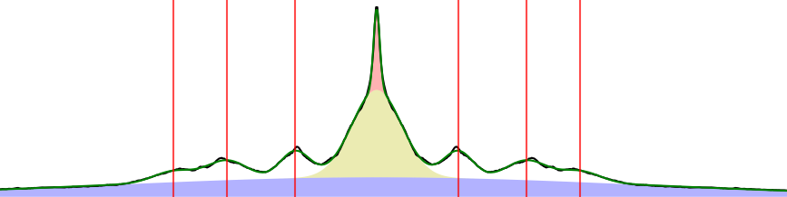
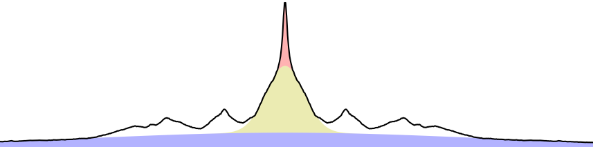
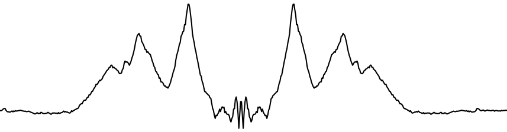
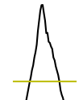

# How it works

Projection Traces (PT) reduces 2D diffraction patterns to 1D intensity projections inside user-defined boxes, fits a peak model to those projections, and extracts per-peak position, width, area, and centroid. Different boxes can use different background-subtraction strategies and different fit models.

## Prerequisites

Before the per-image pipeline runs, the following are resolved:

**Empty cell subtraction and masking** — if configured, the blank image is subtracted and invalid pixels are marked by `ImageData` before any PT processing. See [Common Settings — Empty Cell Image and Mask](../Common-Settings.md#empty-cell-image-and-mask). PT additionally uses a per-image **Mask Threshold** (default −999): histogram values at or below this threshold are excluded from convex-hull background estimation.

**Diffraction center and rotation angle** — resolved from automatic detection, calibration, manual overrides, or cached settings. The center is needed because most boxes are interpreted relative to it (peak mirroring, oriented-box rotation pivot). See [Common Settings — Diffraction Center and Rotation](../Common-Settings.md#diffraction-center-and-rotation).

**Quadrant Folded checkbox** — when checked, PT assumes the input is already quadrant-folded, so the diffraction center is at `(width/2, height/2)`. When unchecked, the center is taken from auto-detection or manual settings.

**Caching** — if the image has already been processed with the same settings, PT reloads the cached results instead of reprocessing. To force reprocessing, delete the `pt_cache` folder, or use the `-d` flag in headless mode.

**Boxes and peaks** — PT requires at least one box and at least one peak selection inside each box before it can produce results. Once boxes and peaks are configured on the first image, they are reused for every other image in the folder.

## Processing pipeline

The pipeline runs once per image and operates on each box independently.

### 1. Build the 1-D projection inside each box

For an **axis-aligned** box the program sums pixel intensities along the box's short axis: horizontal boxes sum along columns (giving a histogram across x), vertical boxes sum along rows (giving a histogram across y).

For an **oriented** box (including center-oriented boxes), the image is first rotated about the box's center by the box's tilt angle. The rotated image is then summed along the short axis of the (now axis-aligned) box.

The result is one 1-D intensity array per box.

### 2. Apply convex-hull background subtraction (per box, optional)

Each box has a **Background Subtraction** mode chosen when the box was created:

- **Fit model (mode 0, default)** — no convex-hull step; the background will be modeled by Gaussians in step 4.
- **Convex hull (mode 1)** — the convex hull of the projection is taken as the background and removed before fitting.
- **None (mode 2)** — no background subtraction.

When convex hull is selected, the projection is split at the diffraction-center column into a left and a right half. A 1-D convex hull is computed independently on each half within the hull range, with columns at or below the mask threshold protected (excluded from the hull computation). The hull range defaults to `[min(peaks) − 15, max(peaks) + 15]` and can be overridden by **Set Manual Convex Hull Range** in the box tab.

### 3. Choose a fit model

The model fitted to the (possibly hull-subtracted) projection depends on three flags:

| Background mode | Meridional peak checkbox | Model |
|---|---|---|
| Fit model (0) | on | Per-peak Gaussian + 3 central Gaussians (overall background, meridional background, meridional peak) |
| Fit model (0) | off | Per-peak Gaussian + 2 central Gaussians (overall background, meridional peak only) |
| Convex hull (1) | — | Per-peak Gaussian only (background already removed) |
| None (2) | — | Per-peak Gaussian only |

If **Select Peak Cluster (GMM)** is used in the box tab, the per-peak Gaussians additionally share a single `common_sigma` parameter ("GMM mode"). Otherwise every peak has an independent sigma.

The 3-Gaussian central block, when active, models:

- **Overall background** — wide Gaussian centered on the meridian.
- **Meridional background** — narrower Gaussian centered on the meridian (optional, controlled by **Meridional Peak** checkbox).
- **Meridional peak** — narrow Gaussian for the meridional reflection.

### 4. Fit the model with lmfit

The model is fitted with `lmfit.Model`. Initial values:

- Peak positions seeded from the user-selected approximate positions (mirrored across the box center).
- Peak amplitudes initialized to `sum(hist) / 10`.
- Per-peak sigma (or `common_sigma` in GMM mode) initialized to 5.

Bounds:

- **Peak position** — `±peak_tolerance` pixels around the seed value (Peak Tolerance spinbox in the box tab).
- **Peak sigma** — `5 × (1 ± sigma_tolerance%)` (Sigma Tolerance spinbox).
- **Hull range** (when convex hull is active) — peak positions are clamped to lie within the hull range.

Any of these bounds can be edited in the **Parameter Editor** dialog. Parameters can also be fixed (`vary=False`) per peak, which is how **Fix Centroid Baseline Value** and **Fix Gaussian Sigma Value** work.

The fit results dictionary is cached on the box and used by the remaining steps.

### 5. Build the background-subtracted projection

For boxes using the fit-model background (mode 0), the fitted central Gaussians are evaluated and subtracted from the projection:

The result is the "clean" peak signal:

For boxes using convex hull (mode 1), the hull is already gone from step 2, so no additional subtraction happens here. For mode 2 (None), the projection is passed through unchanged.

### 6. Calculate per-peak position, width, area, and centroid

For each peak position from the fit:

1. **Baseline** — half the peak height (the value of the background-subtracted projection at the fitted peak location, ÷ 2). This can be overridden per peak from the Other Results table in the box tab.
2. **Left and right intersections** — the program walks outward from the peak until the projection drops below the baseline. The first crossing on each side defines the integration range.

   

3. **Centroid** — `Σ x·y / Σ y` over the integration range (intensity-weighted mean position), expressed relative to the diffraction center.
4. **Width** — the distance between the two baseline crossings (used as an FWHM-like width measure).
5. **Area** — `Σ y` over the integration range.

These four values are written to the box's result tables and to the per-image CSV.

## Output to disk

After all boxes are processed:

- The full result dictionary (boxes, fit results, centroids, widths, areas, etc.) is pickled into `pt_cache/`.
- If **Export All 1-D Projections** is enabled, the original and background-subtracted 1-D arrays are written as text files under `pt_results/1d_projections/`.
- Per-box CSV rows are appended to `pt_results/summary*.csv` (see the [Output files](Projection-Traces--How-to-use.md#output-files) section in How to use).
