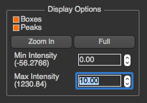
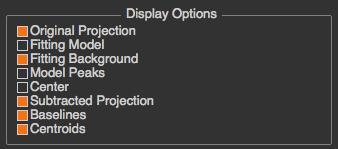
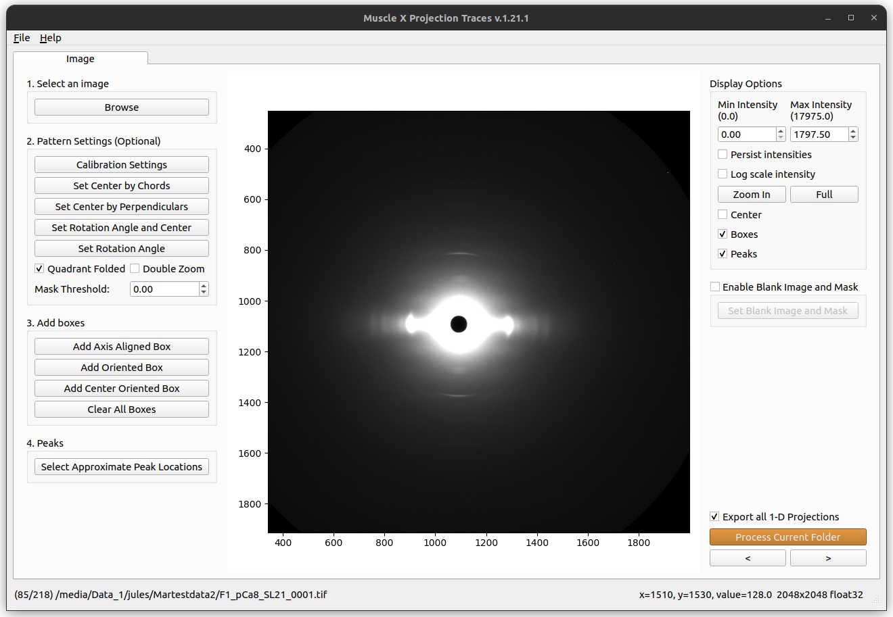
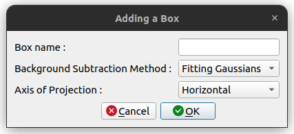
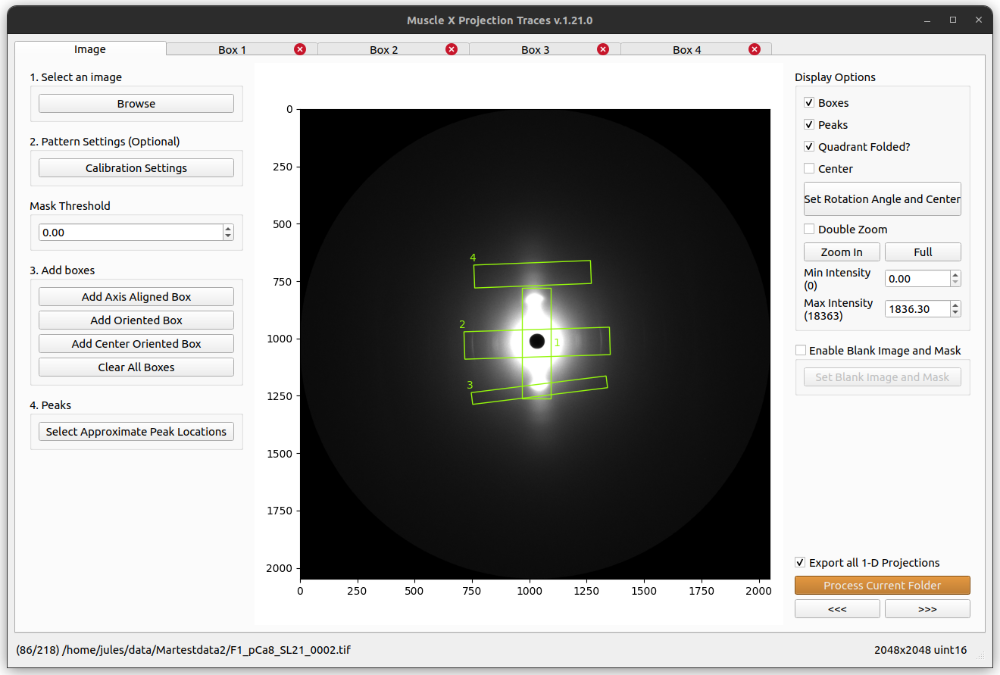
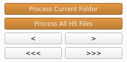

# How to use

Projection Traces (PT) provides two modes for users: [Interactive mode](#interactive-mode) and [Headless mode](#headless-mode).

## Interactive Mode

Once the program is run, you will see the steps 1 to 4 that you have to do on the left menu bar.


First, select an image to process. Second, configure calibration settings (optional). Third, add how many boxes you want. Finally, select peak locations in each box. For each folder, you just need to do it once on the first image. When another image in the same folder is processed, all these settings will be used.

In this page, you will know about ...
1. [Display Options](#display-options)
2. [Calibration Options](#calibration-options)
3. [Adding and removing boxes](#adding-boxes)
4. [Select Peaks](#select-approximate-peak-locations)
5. [Blank Image and Mask](#blank-image-and-mask)
6. [Navigation](#navigation)
7. [Other Options](#other-options)
8. [Box Tab](#box-tab)
9. [GMM Fitting Mode (Advanced)](#gmm-fitting-mode-advanced)

### Display options
In the image tab, there are display options shown on the right. These options will not affect any processing. You can check "Boxes", "Center" or "Peaks" to be displayed on the image. You can zoom-in by pressing "Zoom in" and select the zoom in area on the image by drawing a rectangle. (You can zoom-in or zoom-out by mouse wheeling too). Also, you can select min/max intensity to see the image clearly.

As of version 1.14.11, you can specify a rotation angle and center manually. This is done by specifying two reflection peaks in the diffraction. The image will be rotated according to the new angle.

The `Quadrant Folded?` option determines whether the center is assumed to be the half width and height of the image if it's been quadrant folded. If this box is unchecked, the center will be determined automatically. All peaks will be reflected over this center in any drawn boxes. Use the `Center` checkbox to see which center is used by Projection Traces.



In each box tab, you will see multiple check boxes in the section. You can check or uncheck whether you want to see it in the plot



### Calibration options

#### Set Rotation and Center
Before setting manual rotation and center, it’s better to zoom the image to the area of the diffraction because it will be easier to set these parameters correctly. To set the rotation and center, you need to click 2 positions of the image. The first one will be a reflection peak on one side of the equator, and the second one will be the corresponding (opposite) reflection peak on the other side of the equator. To cancel, press ESC.<br/>


#### Set Center By Chords
Before setting center by chords, it’s better to zoom the image to the area of the diffraction because it will be easier to set these parameters correctly. This method is used to find the diffraction center and uses the fact that "All perpendiculars to the chords in a circle intersect at the center". On clicking this button, you will be prompted to select points along the circumference of the diffraction patter. As you select these points, perpendicular lines to the chords formed using these points start to appear on the image in blue color.  Once you finish selecting the points, click the same button again to start processing. The diffraction center will then be calculated by taking the average of the intersection points of the perpendicular lines (blue lines in the figure).<br/>


#### Set Center By Perpendiculars
Before setting center by perpendiculars, it’s better to zoom the image to the area of the diffraction because it will be easier to set these parameters correctly. This method finds the center of diffraction using intersection of perpendicular lines. On clicking this button, you are prompted to select multiple positions in the image. You can start by clicking the first reflection peak on one side of the equator and the second will be the corresponding (opposite) reflection peak on the other side of the equator. This forms one horizontal line. You can continue drawing as many horizontal lines using this process of selecting reflection peaks. Next, you can click the reflection peak vertically above the equator and the following point symmetrically below the equator. Again, you can draw multiple such lines. Once you finish selecting the points, click the same button (Set Center By Perpendiculars) again to start processing. The diffraction center will then be calculated by taking the average of the intersection points obtained by the horizontal and vertical lines plotted.<br/>


#### Set Rotation Angle
This assumes that the center of diffraction is correct. After the button is clicked, the program will allow users to select an angle by moving a line. Clicking on image when the line is on the equator of the diffraction will set manual rotation angle. To cancel, press ESC.<br/>


#### Double Zoom
This feature is used to zoom into subpixel level accuracy. On checking this box, a new subplot is created on the top right of the image. As you move the mouse pointer into the image area, 20 x 20 pixels centered at the location of the mouse pointer is cropped from the image and scaled up to 10 times and plotted in the subplot mentioned earlier. This feature can be used with any calibration feature (Set Rotation, Set Center and Rotation...). Click the double zoom check box so that the subplot appears. Click on a calibration button, for example the Set Center and Rotation button. Drag your mouse pointer to the position you want to select the first point (or the first reflection peak as described earlier). Click the image to freeze the subplot region. A message appears, check do not show again box to not see this message again. Click on the exact point in the subplot region, which plots an equivalent point in the main image. Perform the previous two steps to select the second point. Uncheck the Double Zoom checkbox to hide the subplot window.<br/>


#### Mask Threshold

The mask threshold allows you to ignore pixels for processing the image. For example if you set-up a threshold of 0, every part of the histogram where the value is less than 0 will be ignored.

### Adding Boxes

There are three options for box selection: axis aligned, oriented, and center oriented boxes.

To add a box, you have to click on one of the box selection buttons, and draw the box on the image. Axis aligned boxes are drawn by selecting a corner and dragging to from a box. The axis of projection can be selected as either horizontal or vertical. Oriented boxes are drawn by select a box center, then the length of the axis of projection, and finally the width of the box. Center oriented boxes are equivalent to oriented boxes, but the pivot is fixed at the center of the image (either the diffraction center, image center (if quadrant folded), or a manually chosen center).



After a box is drawn, a box detail dialog will pop up. You need to specify box's name and background subtraction method along with the axis of projection for axis aligned boxes. This background subtraction will apply to the projection after peaks are selected. The axis of projection is assumed to be along the length of the box.



Once a box is added, there's a new tab created. You can add how many boxes you need by repeatedly adding a box. The box name will be written on the image and its information will be displayed in its tab.



#### Remove A Box
To remove a box, you can just close its tab.

### Select Approximate peak locations
To select the approximate peak locations, you can just click on the button, select them in the box and click "Done". When you select a peak, the program will automatically select the corresponding peak on the opposite site.


If there are multiple boxes, it's better to [select the peak locations in the box tab](#select-peaks).

When peaks in a box is selected, the program will process the image by following these [steps](Projection-Traces--How-it-works.html) to get the results.

### Blank Image and Mask
See the [Blank Image and Mask](Blank-Image-and-Mask.html) documentation for more information on how to use this option.


### Navigation

To navigate through a folder of TIF images or through an H5 file containing multiple images, you can use the simple arrows "<" and ">". 
Depending on if you are looking at an H5 file or not, another set of button will be displayed: the arrows "<<<" and ">>>" allow you to go to the previous/next H5 file in the same folder. The "Process Current H5 File" button will process only the opened H5 file, whereas the "Process All H5 Files" button will process all the H5 files available in the folder.
In the case of a simple TIF image, those buttons will be replaced by a simple "Process Current Folder" button that will process all the TIF images in the current folder.



### Other Options
There're several options on the bottom left in image tab.


* Export All 1-D Projections<br/>
If this checkbox is checked, and boxes are added, the program will save the original 1-D projection to a text file in 1d_projections folder under pt_results which is created under the image directory. If peaks are also specified, background subtracted projection will be saved in the same folder too.
* Process Current Folder<br/>
This will process the whole images in current directory with current settings (boxes and peaks)
* Previous and Next Buttons<br/>
This will make the program go to process the next or previous image with current settings

### Box Tab

For each box you created on the image, a tab will be added to the top of the window. Inside this tab, you will be able to visualize the integrated graph corresonding to the box. Depending on the type of box you created, you will have access to different options.

#### Select Convex Hull Range
If you select Convex Hull as background subtraction method for a box, and peaks are selected. The program will automatically select start and end points for Convex Hull. If you want to change this range, you can click "Set Manual Convex Hull Range" and select start and end points on the plot.


#### Select peaks
To select peaks in the box tab, you can press the "Select Peaks" button, then select them on the 1-D projection on the left and press "Done". The peaks are going to be created symmetrically around the defined center.


When peaks in a box is selected, the program will process the image by following these [steps](Projection-Traces--How-it-works.html) to get the results.

#### Modify Centroid Baseline Value
Inside the Other Results table on the bottom right of your screen, you can modify the baseline value of a peak. You can do so by double clicking on that value, modifying it, then pressing enter.

If the baseline value is higher than the height of the maximum peak, the program will roll back to the previous value entered.

#### Modify Gaussian Sigma Value
Inside the Fitting Results table on the bottom right of your screen, you can fix the Gaussian Sigma of a peak. You can do so by double clicking on that value, modifying it, then pressing enter.

### GMM Fitting Mode (Advanced)

```eval_rst
.. note:: **New in version 1.27.0**: Gaussian Mixture Model (GMM) fitting provides advanced peak fitting capabilities for complex diffraction patterns with multiple overlapping peaks.
```

#### What is GMM Fitting?

GMM (Gaussian Mixture Model) fitting is an advanced peak fitting method that allows you to fit multiple Gaussian peaks simultaneously. This is particularly useful when you have:
- Overlapping peaks that are difficult to separate
- Multiple peaks that should share the same width (sigma)
- Complex peak patterns requiring precise parameter control

#### Enabling GMM Mode

In the **Other Options** section at the bottom of the Image tab, you'll find GMM mode settings:

1. **Common Sigma**: Check this box to force all peaks in a box to share the same sigma (width) value. This is useful when you expect all peaks to have similar widths.

#### Using the Parameter Editor

Once you have selected peaks in a box, you can fine-tune the fitting parameters using the **Parameter Editor** button in the box tab.

##### Opening the Parameter Editor

1. Select peaks in your box (as described in [Select Peaks](#select-peaks))
2. Click the **"Parameter Editor"** button in the box tab
3. The GMM Parameter Editor dialog will open, showing:
   - Current histogram and fitted peaks
   - Parameter table with all peak parameters
   - Control options for fitting

##### Parameter Editor Features

**Parameter Table:**
- **Peak Position (μ)**: Center location of each peak
- **Peak Height (A)**: Amplitude/height of each peak  
- **Peak Width (σ)**: Standard deviation (width) of each peak
- **Fixed**: Check to lock a parameter during fitting
- **Min/Max Bounds**: Set constraints for each parameter

**Peak Management:**
- **Add Peak**: Manually add a new peak to the fit
- **Remove Peak**: Delete a selected peak
- **Edit Peak Details**: Double-click a row to edit individual peak parameters with tolerance settings

**Tolerance Settings:**
- **Peak Tolerance**: Maximum allowed movement of peak positions during fitting (in pixels or percentage)
- **Sigma Tolerance**: Maximum allowed change in peak width during fitting (percentage)

**Hull Range:**
- Adjust the convex hull range by dragging the vertical lines on the histogram
- Use **"Set Hull Range"** to manually specify start and end points
- The fitting will only consider data within this range

**Fitting Controls:**
- **Refit**: Run the fitting algorithm with current parameters
- **Apply**: Save the current fit results and close the dialog
- **Cancel**: Discard changes and revert to previous fit
- **Reset**: Restore parameters to their initial values

##### Workflow Tips

1. **Initial Peak Selection**: Start by selecting approximate peak locations using the standard peak selection tool
2. **Open Parameter Editor**: Fine-tune the fit using the Parameter Editor
3. **Set Bounds**: Define reasonable min/max bounds for each parameter to guide the fitting
4. **Fix Parameters**: Lock parameters that you know should not change (e.g., peak positions for known reflections)
5. **Adjust Tolerance**: Set appropriate tolerances to prevent peaks from drifting too far
6. **Refit Iteratively**: Click "Refit" multiple times to refine the fit
7. **Visual Inspection**: Check the overlay plot to ensure the fit matches your data
8. **Apply Changes**: Once satisfied, click "Apply" to save the results

##### Common Sigma Mode

When **Common Sigma** is enabled:
- All peaks in the box will share the same width (σ) value
- The parameter table will show the sigma value only once
- This constraint often improves fitting stability for similar peaks
- Useful for meridional reflections that should have the same width

##### Advanced Features

**Transactional Editing**: The Parameter Editor uses a transactional approach - changes are only saved when you click "Apply". You can experiment freely and use "Cancel" to discard unwanted changes.

**Snapshot Refresh**: The editor maintains a snapshot of the current fit. When you change hull range or other parameters, you can refresh the snapshot to see updated results.

**Auto-Zoom**: When you adjust the hull range, the plot automatically zooms to show the relevant region.

**Peak Bounds Synchronization**: When you edit peak positions or widths, the bounds are automatically updated to maintain consistency.

#### Editing Peak Details

For fine-grained control over individual peaks:

1. In the Parameter Editor, double-click on a peak row
2. The **Edit Peak Details** dialog opens
3. Adjust:
   - Peak position with tolerance (how far the peak can move)
   - Peak sigma with tolerance (how much the width can change)
   - Whether to fix the position or sigma during fitting
4. Click **OK** to apply changes

#### Viewing Results

After fitting, the box tab will display:
- **Fitted Peaks**: Overlaid on the histogram in the left plot
- **Fitting Results Table**: Shows final peak parameters (position, height, sigma, area)
- **Other Results Table**: Shows additional metrics (centroid, FWHM, etc.)
- **Peak Labels**: Visual labels on the plot for easy identification

The results are automatically saved and will be used for subsequent images in the folder.

## Headless Mode
Image processing performed in the terminal.
In the terminal, if the user types `musclex eq|qf|di|pt -h -i|-f <file.tif|testfolder> [-s config.json] [-d]`, MuscleX will run under headless mode.
For example: `musclex pt -h -i test.tif -s config.json`.

Arguments:
* -f \<foldername> or -i \<filename>
* -d (optional) delete existing cache
* -s (optional) \<input setting file>

```eval_rst
.. note:: To generate the settings file (containing both the calibration settings and the boxes and peaks saved), use the interactive musclex, set parameters in it, then select "Save current settings" in `File` (top left corner). This will create the necessary settings file. If a settings file is not provided, the program will not do anything as it needs boxes to produce results.
```

```eval_rst
.. note:: You can run the headless version in Windows using a CMD prompt by replacing `musclex` in the headless command by `musclex-main.exe` in `C:\Users\Program Files\BioCAT\MuscleX\musclex`.
```
### Multiprocessing on folders
In order to improve the processing speed when analyzing time-resolved experiments, the headless mode is processing one image on each processor available on your computer. For example, with a 24-cores computer, 24 images will be processed at the same time, and the results will be saved in the same file. To follow the execution thread of each processor (as the executions intersect), the process number has been added at the beginning of each line.

### Customization of the parameters
Since Headless mode is limited in terms of interactions and parameters to change, you can directly set your parameters in a json format inside `ptsettings.json`. You might need to look at the code and especially 'modules/ProjectionProcessor.py' and 'ui/ProjectionTracesh.py' to know exactly which parameters to set and how to set them. You can also generate the json using the GUI version and look at the parameters for each box/type of box.

