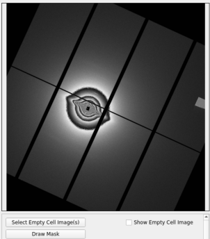
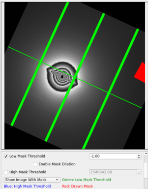

# Blank Image and Mask

There 2 settings you can set here, blank image and mask

The blank image is more properly called an empty cell image.  A diffraction pattern from a muscle will consist of the diffraction pattern from the muscle added to the empty cell X-ray pattern. When blank images are available, it is possible to subtract them. By subtracting the empty cell images you can see just the muscle diffraction. This is important for some calculations.

A mask is a binary pattern that can be computed or specified (drawn) to mask out certain regions in the image. Computing a mask is done using a threshold (e.g., -1) below which regions are masked out (e.g., in sensor gaps).

## Blank Image
Once the window launches, you will see "Select Blank Image(s)" at the bottom. Then, you can select a blank image or multiple images. The program will average them all if you select multiple images. If the image is from Pilatus detector. The program will initial mask threshold, and paint the mask as orange color. You can change it in order to make correct mask.

It is also possible to change the scale factor (in percent) of the blank image. Indeed, a blank image can sometimes be more (or less) intense than the main image, so this scale factor helps to change the intensity of the blank image to avoid oversubtracting (or undersubtracting).

 

## Additional Mask
The mask threshold can create mask from the threshold value.  You will have the option to create masks using an upper bound(all pixels above some value become a mask) or a lower bound(all pixels below some value become a mask).  You can choose to add dilation to either of these masks by checking the 'Enable Dilation' box corresponding to either the upper bound mask or lower bound mask.  You can choose to use a 3x3 kernel, a 5x5 kernel, or a 7x7 kernel.  A 3x3 kernel will mask every pixel that is next to a masked pixel, the 5x5 kernel will mask any pixel that is 2 positions away or closer to a masked pixel, and a 7x7 kernel will mask any pixel that is 3 positions away or closer to a masked pixel.

If you have additional area which you want to ignore,  you can click "Draw Additional Mask".  After the button is clicked, there will be a new window pops up. This dialog is a toolkit from [PyFai](https://pyfai.readthedocs.io/en/v2023.1/man/pyFAI-drawmask.html)

 

The PyFAI masking tool offers several other features:

1. Zoom in on mouse selection
2. Pan the view
3. Auto-scale the view
4. Change colormap
5. Toggle keep aspect ratio
6. Change Y-axis orientation
7. Show/Hide the colorbar
8. Copy a snapshot of the plot to the clipboard
9. Open save dialogue to save the plot
10. Open print dialogue to print the plot
11. Change profiling mode
12. Clear profile

 
 

1. Load mask from file
2. Save mask to file
3. Undo
4. Redo
5. Invert current mask
6. Clear current mask level
7. Set the transparency of the mask display

 
 

1. Pan the view
2. Rectangle selection tool (for selecting mask)
3. Circle seleection tool (for selecting mask)
4. Polygon selection tool (for selecting mask)
5. Freehand selection tool (for selecting mask)
6. Drawing masks with current level
7. Drawing unmasks with current level

 
 

 

PyFAI offers creating masks from a threshold as well, however this is redundant as the MuscleX threshold masking already discussed offers all of the same features and more.  It is also possible to use the 'Mask not finite values' button to mask Not a Number and infinite values.

Pressing the 'Save mask and quit' button saves your drawn mask and closes the popup.

Once you press the 'Okay' button, your drawn mask, threshold mask(s), and the mask created from the blank image will then be combined and applied to the image.  The masks will be saved and applied to other images in the same directory that are then processed, given that the 'Enable Blank Image and Mask' box is checked.
