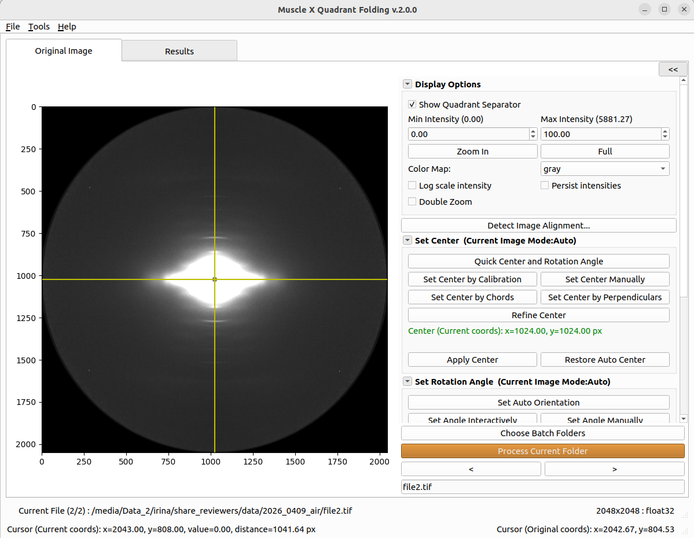

# Introduction

The equator and meridian divide a fiber diffraction pattern into four quadrants. Under Friedel symmetry, each quadrant contains equivalent information. Mapping the four quadrants into one orientation and averaging them improves the signal-to-noise ratio; the averaged quadrant can then be mirrored to regenerate a full diffraction pattern.

Quadrant Folding (QF) aligns each pattern around its center and rotation angle before averaging. The resulting image is generally easier to fit and gives more stable background estimates. Folding can also reduce the effect of detector gaps or local defects because valid pixels from unaffected quadrants contribute where another quadrant is masked. This is particularly useful for segmented detectors such as PILATUS.

QF supports interactive processing of one folder and ordered processing of selected folders. Its alignment dialog compares applied and automatically detected geometry, image differences, and fold-symmetry scores across all loaded images. Center and rotation can be set manually, derived from calibration, propagated across the batch, or refined from an existing estimate. Saved `calibration.info` files can be imported to reuse detector geometry and reciprocal-space calibration.

Optional solid-angle and polarization corrections can be applied before quadrant averaging when calibration provides sample-to-detector distance and pixel size. QF can then leave the folded average unchanged or estimate and remove diffuse background using one method, a radial transition between two methods, or automated parameter selection. It includes methods from the [CCP13 suite](https://github.com/scattering-central/CCP13), two-dimensional convex hull, and white top-hat filtering. Named background configurations can be reused or selected per image during batch processing.

## More Details

- [How to use](Quadrant-Folding--How-to-use.md)
- [How it works](Quadrant-Folding--How-it-works.md)
- [Background Subtraction](Quadrant-Folding--Background-Subtraction.md)
- [Common Settings](../Common-Settings.md) — calibration, center/rotation tools, refinement, empty-cell subtraction, and masking
* [Background Subtraction](Quadrant-Folding--Background-Subtraction.md)
* [Optimization Settings (Advanced Configuration)](Quadrant-Folding--Optimization-Settings.md)
* [Background Fitting (Parametric, Iterative 2D)](Quadrant-Folding--Background-Fitting.md)
