# Parametric Background Fitting

Parametric fitting models the diffuse background as an explicit 2D function and subtracts it, in contrast to the non-parametric methods (White-top-hats, 2D Convex Hull, etc.) documented on [Background Subtraction](Quadrant-Folding--Background-Subtraction.md), which estimate the background numerically. It targets the two structures that dominate a folded muscle pattern: the anisotropic **equatorial streak** near the beam and the broad, near-isotropic **general background**. Use it when you need to subtract the background on the whole pattern or when a smooth analytic background that does not follow the peaks is preferable.

Fitting runs in the **Iterative 2D Background Fitting** window, opened from the **Parametric Background Fitting** panel in the Results tab. It operates on the quadrant-folded image. When the result is applied, the residual (image minus fitted background) replaces the current result.

## Model

The fitted background is the sum of an equator component and a general component.

**Equator component** — a single elliptical-coordinate peak (Murthy et al., *Polymer* 1997), fit over an equatorial band with the beam and the equatorial Bragg peaks masked out. The pattern is remapped into elliptical coordinates (u, v) sharing a focal distance A; the peak is a modified Lorentzian (Pearson VII) along u — centered at u0 with radial width uw and shape exponent m — multiplied by the sum of four modified-Lorentzian lobes along v, replicated to the four quadrant-symmetric angular positions (v0, 180°−v0, 180°+v0, 360°−v0) with a common angular width vw. The fitted values are an amplitude, a radial (u) position and width, an angular (v) position and width, and a shape exponent, for example:

<pre style="font-size: 0.75em;">
EQUATOR (elliptical streak)
  Ellipticity A :      0.000 px
  Baseline      :     -0.019 counts
  Equatorial streak:
    Amplitude   :      1.875 counts
    u-position  :     13.317 px
    u-width     :    106.933 px (FWHM)
    v-position  :      0.838 deg
    v-width     :     10.824 deg (FWHM)
    m           :      2.622
</pre>

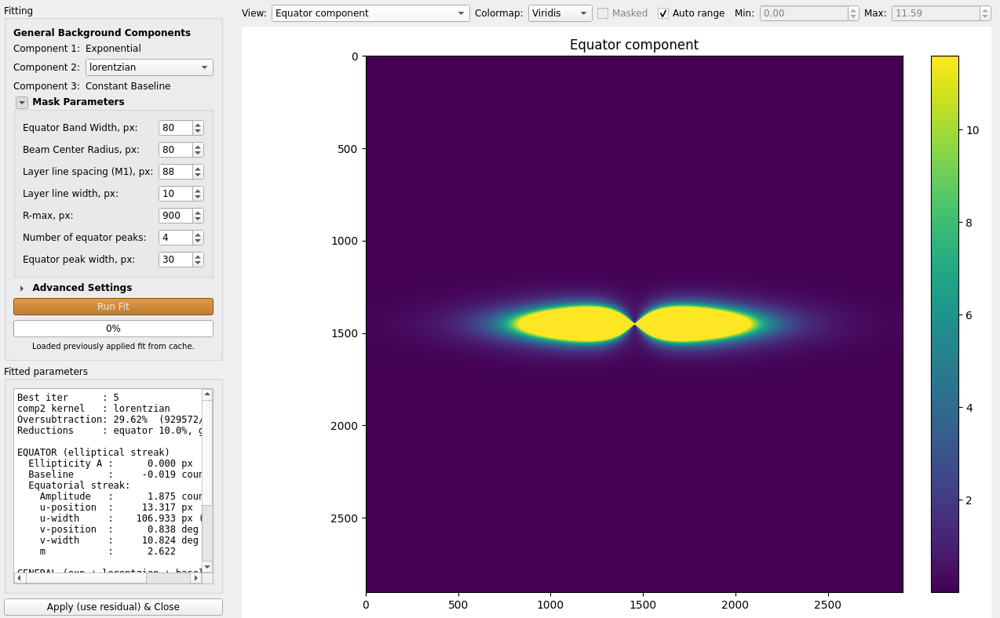  

**General component** — an isotropic, slightly elongated background of the form `exponential + component 2 + constant baseline`:

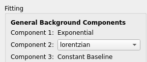 

- **Component 1** is a fixed exponential.
- **Component 2** is selectable: `lorentzian`, `powerlaw`, `stretched`, or `auto`. With `auto`, the first round tries all three kernels and keeps the one with the best anti-oversubtraction score, then pins it for the remaining rounds. The default is `lorentzian` as it works best in most cases; however, for some patterns with changed structure a different kernel may be better.
- **Component 3** is a constant baseline.

<pre style="font-size: 0.75em;">
GENERAL (exp + lorentzian + baseline)
  Baseline      :      0.019 counts
  Radial rmin   :     35.000 px
  Comp1 (exponential):
    amp         :      1.122 counts
    scale (eff) :      1.171 px
  Comp2 (lorentzian):
    amp         :     16.909 counts
    scale (eff) :      0.820 px
</pre>

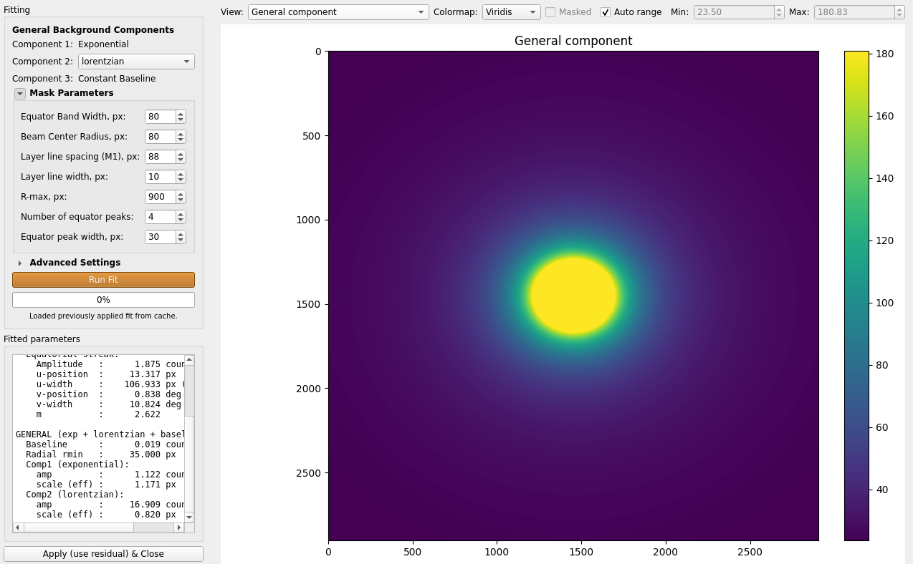 

## How the fit runs

Fitting is alternating block-coordinate descent. A hidden **step 0** seeds the first equator fit with a rough projection background (a per-sector cone-model). Each round then alternates:

1. Fit the equator to (image − current general background).
2. Fit the general background to (image − current equator).

The general fit penalizes oversubtraction (when the fit goes above the data, so the residual is negative). After the configured number of rounds, the fit selects the best iteration: the one with the fewest oversubtracted pixels among the rounds whose equator formed the expected two lobes. If no round forms two lobes, the fit falls back to the least-oversubtracted round and warns to inspect the fitted equator before applying.

Fitting is done on a center-crop of size `2 x fit size` and optionally downsampled for speed; the fitted background is reconstructed at full resolution. For faster processing is it recommended to use lower **Fit size**, as long as the crop still covers the data. 

## Masks

The fit uses a general mask and an equator mask, built from the same evaluation-mask parameters as the [non-parametric optimizer](Quadrant-Folding--Optimization-Settings.md#step-1-adjust-image-settings-and-process) and mirrored into the fitting window under **Mask parameters**. Editing a parameter here updates the matching Background Subtraction control and rebuilds the masks; select **General mask** or **Equator mask** in the View dropdown to inspect them before running.

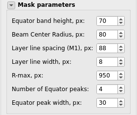 

- **Equator band height** — height of the equatorial band kept for the equator fit.
- **Beam Center Radius** — radius of the central beam removed from both masks.
- **Layer line spacing (M1)** and **Layer line width** — mask the Bragg layer lines so they do not bias the general fit.
- **R-max** — outer radius of the rmin-rmax annulus used for the masks and for every oversubtraction measurement.
- **Equator peaks** and **Equator peak width** — number and width of equatorial Bragg peaks detected and removed from the equator fit (local to this window).

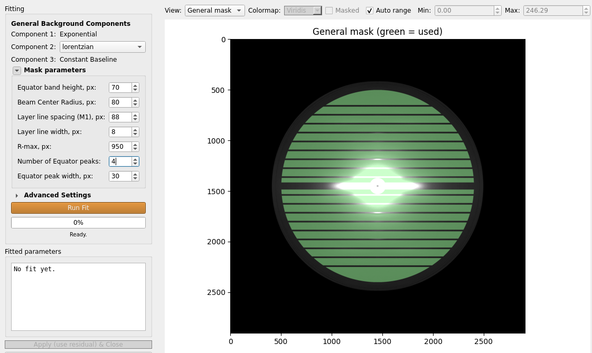 

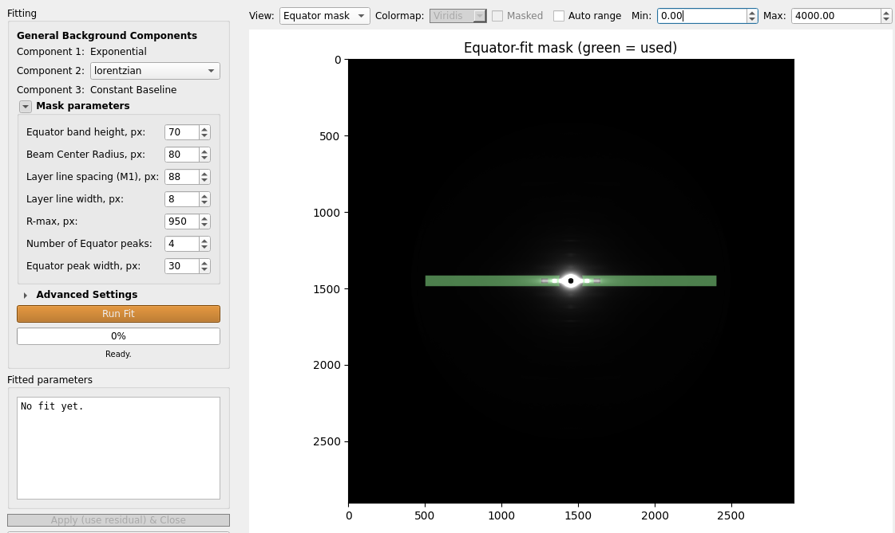 

## Advanced Settings

Under **Advanced Settings** (collapsed by default):

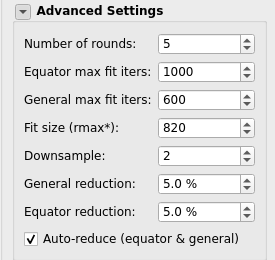  

- **Number of rounds** — equator/general alternating rounds.
- **Equator max fit iters** / **General max fit iters** — least-squares evaluation limits per stage.
- **Fit size (r-max\*)** — fit radius; the image is center cropped to twice this value. Lower is faster, as long as it still covers the data. Defaults to 0.8 × r-max.
- **Downsample** — downsample factor during fitting. Lower is faster, the default value of 2 is usually sufficient. The fitted background is reconstructed at full resolution.
- **General reduction** / **Equator reduction** — scale each fitted background down by this fraction before subtracting, to guard against oversubtraction. The general reduction is always applied (default 5%). Editing a reduction after a fit rebuilds the background and residual with no re-fit. It is recommended to increase these value if there is oversubtraction and apply a smooth non-parametric method on the residual, rather than trying to fit the background more aggressively.
- **Auto-reduce** — increase both reductions on top of the fixed values until the oversubtracted-pixel fraction stops improving. After a fit the reduction spinboxes show the values actually used.

## Views and fitted parameters

The View dropdown shows **Original**, **Fitted background (equator+general)**, **Equator component**, **General component**, **Residual (background removed)**, **Equator / Meridian profiles**, and the two mask overlays. Before a fit, only the mask overlays are available.

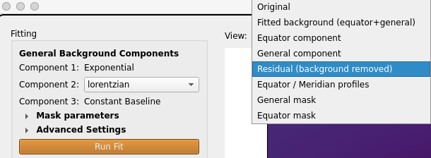 

The **Fitted parameters** panel reports the selected iteration, the component-2 kernel, the oversubtracted-pixel fraction over r-min/r-max, the reductions used, and the full equator and general parameter values.

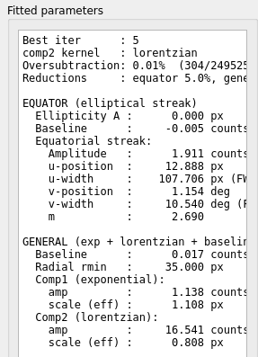 

## Applying and running for a folder

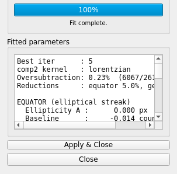 

- **Apply & Close** replaces the current result with the residual and enables the checkbox **Subtract fitted before non-parametric**, so a non-parametric method can then run on top of the fitted residual.

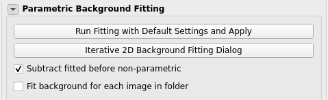 

- **Run Fitting with Default Settings and Apply** (Parametric Background Fitting panel) runs the fit headlessly with the current settings and applies it in one click, without opening the window.
- **Fit background for each image in folder** fits and subtracts the parametric background for every image during folder processing, using the current fitting parameters, instead of reusing a single applied fit.

Every applied fit is saved to `qf_results/bg_fit_params/`: the equator, general, and residual images as TIFFs, and the fit parameters as `<image>_bgfit_params.npz`. Fit parameters are also cached per image, so reopening the window on a processed image reloads the applied fit without re-running it.

## Headless mode

Parametric (iterative 2D) fitting is controlled by `bgfit_*` flags mirroring the fitting window: `bgfit_comp2`, `bgfit_iters`, `bgfit_eq_max_nfev`, `bgfit_gen_max_nfev`, `bgfit_fit_size` (the fit radius; doubled internally for the crop), `bgfit_downsample`, `bgfit_use_step0`, `bgfit_general_reduction`, `bgfit_equator_reduction`, and `bgfit_auto_reduce`. These are written when settings are saved from the GUI and are used for per-image fitting during batch runs when **Fit background for each image in folder** is enabled.

See [How to use — Headless Mode](Quadrant-Folding--How-to-use.html#headless-mode) for the general headless workflow.

## Related topics

- [Background Subtraction](Quadrant-Folding--Background-Subtraction.md) — Processing options, manual and transition modes, and the subtraction method reference.
- [Optimization Settings](Quadrant-Folding--Optimization-Settings.md) — Advanced Configuration dialog, including the evaluation-mask parameters shared with this fitting window.
- [How it works](Quadrant-Folding--How-it-works.md) — Full processing pipeline including merge and result image generation.
