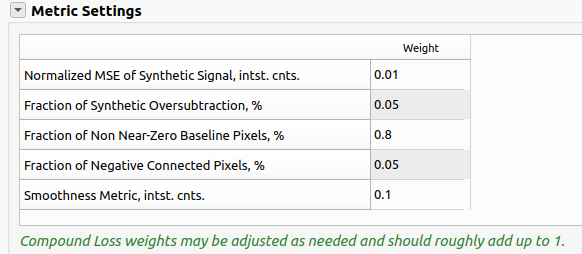
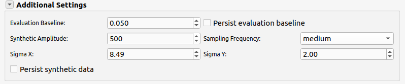
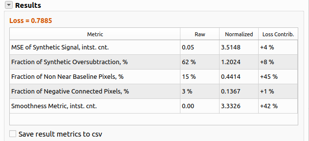
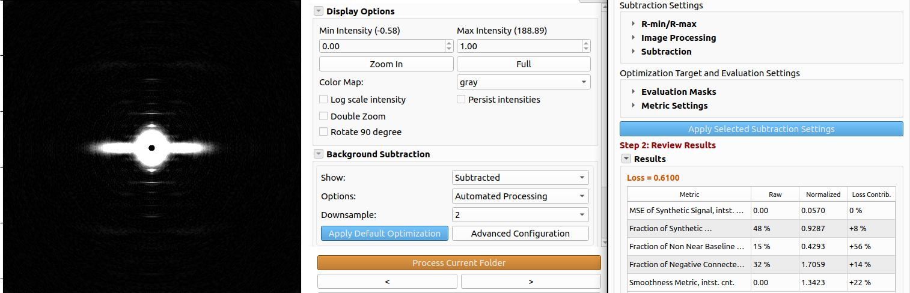

# Background Subtraction

Quadrant Folding estimates and removes diffuse background scattering from the quadrant-folded image. Several algorithms from the [CCP13 FibreFix](http://www.diamond.ac.uk/Beamlines/Soft-Condensed-Matter/small-angle/SAXS-Software/CCP13/FibreFix/FibreFix.html) suite are available, along with 2D convex hull and white top-hat methods. Methods can be used alone, combined across radius (inner/outer merge), or chosen automatically using a quantitative **loss** score.

For the algorithmic details of each method, see [How it works — Apply Background Subtraction](Quadrant-Folding--How-it-works.md#apply-background-subtraction). This page documents the **current GUI workflow** (Results tab and **Background Subtraction Settings** dialog).

## Introduction

Muscle diffraction patterns carry a diffuse background whose structure varies with radius and angle. The choice of subtraction method therefore depends on what you need from the analysis—display, peak fitting, or downstream normalization—and on which part of the pattern matters most.

In principle, background should be removed consistently across the entire folded image. In practice, no single algorithm performs equally well at all radii: some methods preserve low-angle equatorial features while others handle the high-angle region more reliably. **2D Convexhull** is currently the strongest option for revealing equatorial structure near the beam. At larger radii, where meridional layer lines dominate, **White-top-hats** and **Smoothed-Gaussian** typically give cleaner results; **Automated Processing** can search among these methods and select parameters using the compound **loss** metric.

To obtain plausible background removal over the full pattern today, use **Manual Setting | Transition**, which fits an inner method at small radii and an outer method at large radii, then merges the two estimates at a **Transition Radius**. A future release will add dedicated equator-streak fitting followed by general background removal on top of that estimate.

The integrated intensity of the estimated background image can be used to  normalize the measured  intensities of diffraction features in a series of images. To do this, select “Manual setting |One method” and set Rmin and Rmax to values that exclude unwanted portions of the pattern. Then apply it uniformly to every frame in a sequence. The summary csv file will contain the integrated background sum between rmin and rmax for each frame.

See [Examples](Quadrant-Folding--Background-Subtraction.md#examples) for more details.

## Where to find the controls

Background subtraction is configured from two places in the **Results** tab:

1. **Background Subtraction** panel (collapsible section on the right) — quick access to mode, method parameters, apply buttons, and current configuration summary.
2. **Advanced Configuration** — opens the **Background Subtraction Settings** dialog for R-min/R-max, image processing, automated optimization, evaluation metrics, saved configurations, and batch processing.

A link at the top of the dialog points back to this documentation.

## Processing options

Use the **Options** dropdown in the Results tab to choose how background is applied:

| Option | Description |
|--------|-------------|
| **Manual Setting \| One Method** | A single subtraction method on the full pattern (inner region). Method and parameters are set in the panel; click **Apply Selected Subtraction Settings** to reprocess. |
| **Manual Setting \| Transition** | One method for radii below the transition radius (inner) and another for radii above (outer). Results are merged using **Transition Radius** and **Transition Delta**. **2D Convexhull** is not available for the outer method. |
| **Automated Processing** | Parameter search and/or selection from saved configurations using the compound **loss** metric. Use **Apply Default Optimization** on the current image, then tune settings in **Advanced Configuration**. |

Manual controls are shown in the Results panel. **Apply Default Optimization** and **Advanced Configuration** are shown only when **Automated Processing** is selected.

## Manual Setting \| One Method
1. **Subtraction Method** — Select the background subtraction method to use.
2. **Method-specific parameters** — Set the method-specific parameters.
3. **Apply Selected Subtraction Settings** — Click to apply the selected subtraction settings.

Set the method and parameters to use for the background subtraction.

## Manual Setting \| Transition
1. **Inner background** — Method and parameters for radii inside the transition region (e.g. 2D Convexhull).
2. **Outer background** — Separate method and parameters for larger radii (e.g. Smoothed-Gaussian).
3. **Transition Radius** — Radius where inner and outer estimates are blended.
4. **Transition Delta** — Width of the linear blend zone.
5. **Show Transition Radius and Delta** — Overlay transition circles on the folded image.

Set the transition radius just outside the M3 meridional peak when possible.

## Automated Processing
**Apply Default Optimization** runs this search with default methods on the current image and can add a **Default Optimization** entry to the configuration table to be applied to subsequent images.
**Advanced Configuration** allows to adjust the settings for the optimization and add additional configurations to the configuration table.

## Recommended workflow using Automated Processing

### Step 0: Apply Default Optimization

Click **Apply Default Optimization** to run the optimization with the default settings. This will run the optimization with the default settings (**White-top-hats** and **Smoothed-Gaussian**) and pick the best performing method and parameters based on the default loss weights, and add a **Default Optimization** entry to the configuration table. This is a good starting point for most datasets. If the results are satisfactory, you may review the next image which will be applied the same settings and run **Process Folder** to process the entire folder. If the results are not satisfactory, you can always tune the settings in the **Advanced Configuration** dialog.

The **Background Subtraction Settings** dialog is organized in three steps:

### Step 1: Adjust image settings and process

- **R-min/R-max** — Define the radial range used for masking and fitting. R-min excludes the backstop; R-max limits the outer edge of the pattern. Use **Manual R-min/max** to set values on the image, **Show R-min/max** to overlay circles, and **Persist R-min/max** to reuse values when switching images.
- **Image Processing** — **Downsample** (1, 2, or 4) speeds optimization and smooths the background; **Smooth Image** optionally smooths the folded image before subtraction using an edge-preserving smoothing algorithm (OpenCV's guided filter). By default, the image is downsampled by 2 and the background is smoothed.
- **Subtraction** — In the dialog, choose **Manual** or **Automated** processing mode:
  - **Manual**: Select **Subtraction Method** and method-specific parameters (same methods as in the Results panel). 
  - **Automated**: Multi-select **BG Subtraction Methods**, set **Step Sizes** (comma-separated schedule, e.g. `100, 50, 25, 10, 5, 3, 1`), **Max Iterations** per parameter, and **Early Stop Loss Threshold**.
- **Evaluation Masks** - Adjust the evaluation masks to restrict scoring to physically meaningful regions:
  - **Equator Height** and **Equator Center Radius** — mask the equator and central beam.
  - **Layer line spacing** and **Layer line width** — mask Bragg layer lines so they do not dominate the loss.

.. warning:: Automatic detection of **Equator Height**, **Equator Center Radius**, **Layer line spacing**, and **Layer line width** is not implemented yet. Set these values manually in **Evaluation Masks** for each dataset.

To view the evaluation masks, click **Show** in the Results tab to inspect **Subtracted**, **Background**, **Folded**, **Evaluation Mask**, **Synthetic Signal**, or **Synthetic Mask**.
- **Metric Settings** - Adjust the relative importance of each metric and the normalization means. The weights should roughly add up to 1. The weights may depend on the dataset and are the most important settings to adjust to get the best results. Leave the default values for the first run and adjust after reviewing the results. The normalization means are hidden by default; double-click the metric table header to show/hide means. Usually, they don't need to be adjusted.

- **Additional Settings** - 
  - **Evaluation Baseline** sets the near-zero threshold; **Persist evaluation baseline** keeps it when changing images. **Evaluation Baseline** allows to adjust the near-zero threshold for the calculation of **Fraction of Non Near-Zero Baseline Pixels**. This is the threshold below which pixels are considered to be part of the background. Change this value if the noise level doesn't match the calculated value.
  - **Synthetic** amplitude and sigmas (and **Sampling Frequency**) define the reference pattern used in MSE and oversubtraction metrics.

- Click **Apply Selected Subtraction Settings** (dialog or Results panel) to run on the current image. During automated optimization the button becomes **Stop Optimization** which will stop the optimization and return the previous best performing method and parameters. This is useful when you want to tune the settings and rerun the optimization.

### Step 2: Review results

After processing, the **Results** section shows **Loss** and a table of metrics:

| Metric | Meaning | Purpose |
|--------|---------|---------|
| **Positive NMSE of Synthetic Signal** | Linearly scaled normalized mean squared error between the subtracted image and a synthetic meridional reference, inside the evaluation mask. | Measure the preservation of the synthetic signal. Lower is better. High when the synthetic signal is changed significantly. |
| **Fraction of Synthetic Oversubtraction** | Share of masked pixels where subtraction went below the synthetic reference. | Measure the amount of synthetic signal that is removed. Lower is better. High when the synthetic signal is removed significantly. |
| **Fraction of Non Near-Zero Baseline Pixels** | Share of masked pixels still above the evaluation baseline after subtraction. | Measure the amount of background that is not removed. Lower is better. High when the background is not removed significantly. |
| **Fraction of Negative Connected Pixels** | Share of connected negative regions (oversubtraction artifacts). | Measure the amount of oversubtraction artifacts. Lower is better. High when the oversubtraction artifacts are significant. |
| **Smoothness Metric** | Penalty for roughness in the estimated background. | Measure the smoothness of the estimated background. High when the background is rough. |

**Compound loss** is a weighted sum of normalized metrics. Adjust **Metric Settings** (weights and normalization means; double-click the metric table header to show/hide means). 

- **Save result metrics to csv** - Save the result metrics to a csv file. This is useful for further analysis. This will save the result metrics to a csv file in the `qf_results/bg` folder with name `background_metrics.csv`.

### Step 3: Batch processing

1. When satisfied with settings on a representative image, click **Add Background Configuration** to save the selected method and parameters under a configuration name. Loss is also added for information. Configurations are stored in `qf_cache/background_cache.json` for the folder.
2. Repeat for other parameter sets if needed (e.g. different muscle types).
3. Under **Folder Processing**:
   - **Choose best configuration for images automatically** — For each image in the folder, evaluate all saved configurations and apply the one with lowest loss (typical for heterogeneous datasets). This is the recommended option for most datasets.
   - **Manually assign configurations to images** — Open the assignment dialog to map specific configuration names to filenames (disabled while auto-select is on). This is useful for datasets with a clear separation between different types of images.
4. Click **Process Current Folder** (dialog or navigator) to batch-process with the chosen configuration logic.

The **Current Configuration** summary in both the dialog and Results panel shows the active method, parameters, and loss after each run.

## Subtraction methods and parameters

Six methods are available (plus **None**). Visible parameters depend on the selected method.

### Circularly-symmetric

- **Pixel Range** (min–max %): lowest-intensity pixels averaged per radial bin (e.g. 0–25% = lowest quarter).
- **Radial Bin** (pixels)
- **Smoothing factor** (spline smoothing)

### 2D Convexhull

- **Step Degree** (angular bin size for radial histograms)
- **R-min** (and **R-max** when set)

### Roving Window

- **Window Size** (X, Y) and **Window Separation** (X, Y)
- **Pixel Range** (%)
- **Smoothing factor** and **Tension factor**

### White-top-hats

- **Top-hat Disk Size**

### Smoothed-Gaussian

- **Gaussian FWHM**
- **Number of Cycles**

### Smoothed-BoxCar

- **Box Car Size** (X, Y)
- **Number of Cycles**

Default optimization searches **White-top-hats** and **Smoothed-Gaussian** unless you change the method list.

<!-- ## Region of interest (ROI)

**Set Region Of Interest (ROI)** limits background fitting to a rectangle on the folded image. **Persist ROI size** applies the same width/height to subsequent images. **Unset ROI** clears the constraint. -->

## Automated processing details

When **Automated Processing** is active and optimization runs:

1. For each selected method, the program searches parameter space using the configured step schedule and iteration limit. 
2. The optimization processes tunes each parameter in the selected method one at a time in the order of their importance.
3. Candidates are scored with the compound loss; search can stop early when loss drops below **Early Stop Loss Threshold**.
4. The best method/parameter set is written to **Current Configuration** and used for the result image.

**Apply Default Optimization** runs this search with default methods on the current image and can add a **Default Optimization** entry to the configuration table.

For batch runs with **Choose best configuration for images automatically**, optimization is not repeated per image; each saved configuration is evaluated once and the lowest-loss configuration is applied.

## Examples

### Example 1: High Angle Features with Automated Processing - Intact Mouse Skeletal Muscle - Faint pattern & faint background

The default weights are used for the optimization.

### Example 2: Whole Pattern Background Subtraction with Transition - 2D Convexhull for Inner and Smoothed Gaussian for Outer - Skinned Pig Cardiac Muscle - High intensity background

This example shows the use of transition mode to remove background on the whole pattern. This is preferable for visualization of patterns where the equatorial features are important. The transition radius and delta are shown in yellow and red.

## Headless mode

Background subtraction parameters can be set in `qfsettings.json`. Important keys include `bgsub`, `bgsub_out`, `transition_radius`, `transition_delta`, `fixed_rmin`, `fixed_rmax`, method-specific fields (`fwhm`, `cycles`, `win_size_x`, `win_sep_x`, etc.), and `bg_options` (0 = one method, 1 = transition, 2 = automated). For automated batch behavior, also pass saved configurations and flags such as `choose_configurations_auto` as produced by saving settings from the GUI (**File → Save current settings**).

See [How to use — Headless Mode](Quadrant-Folding--How-to-use.html#headless-mode) for the general headless workflow.

## Related topics

- [How it works](Quadrant-Folding--How-it-works.html) — Full processing pipeline including merge and result image generation.
- [Blank Image and Mask](Blank-Image-and-Mask.html) — Empty cell correction before folding.
