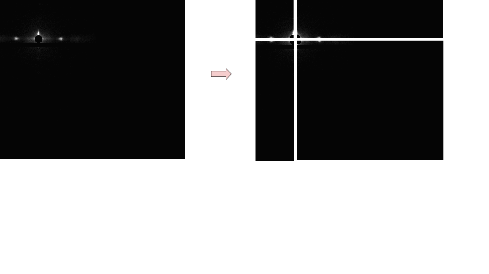
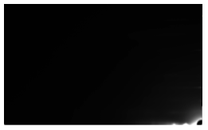
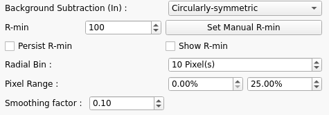
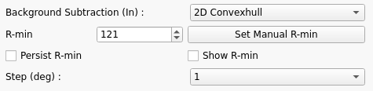
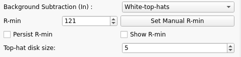
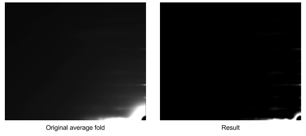
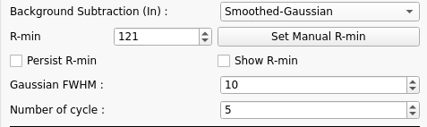
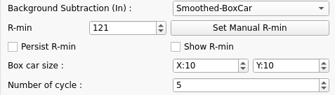
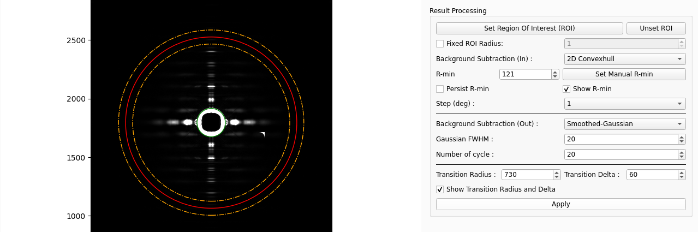

# How it works

When an image is selected, the program will immediately process the image automatically. The resulting image will be saved as [image_name].result.tif in the qf_results folder that is created as a subdirectory of the folder containing the selected file. The program will process an image by going through a series of processes in the order described below.

## Processes
### 1. [Find Center](../Image-Processing-Functions.html#finding-center)
### 2. [Calculate Rotation Angle](../Image-Processing-Functions.html#calculate-rotation-angle)
### 3. Centerize image (Image size increases)
The diffraction center is not always at the center of the image. Therefore, when we fold about the diffraction center, the four quadrants generated may not be of equal size which results in the quadrant folded image being cropped. The image below illustrates the same.

Hence, we enlarge the image such that the diffraction center lies at the center of the image. This results in all four quadrants having the same dimension and hence the folded image is not cropped.

  
### 4. Calculate Average Quadrant
To find the average fold, the image will be split into 4 quadrants, and each quadrant is flipped to be in the same orientation as below.

After all quadrants are flipped, a new image will be generated by averaging each pixel from all quadrants. The mask threshold will be used to determine if that pixel will be included in averaging process. In this case, the mask threshold is 0. That means if the pixel intensity is less than 0, the program will ignore that pixel.  Finally, the result image will look like the image on the right. The full 2D pattern can then be regenerated by rotations of this image. 

### 5. Calculate R-min
For the background subtraction algorithms to work, it is necessary to define a [minimum radius R-min](../Image-Processing-Functions.html#calculate-r-min) to minimize the effects of the backstop. 

To find R-min, the radial histogram is first computed from the average folded image. 
R-min (red line) is initialized as 10 pixels after backstop. The user may change it manually via GUI or the headless mode.

### 6. Apply Background Subtraction
Fiber diffraction patterns from muscle have a substantial diffuse background arising from non-crystalline parts of the muscle that do not diffract coherently including membranes and mitochondria as well as diffuse scattering from the myosin heads. Intact cardiac muscle, in particular has a very strong background. This background pattern has a complex structure making it hard to model and effectively remove.  Various algorithms exist that attempt to remove the background. No one technique so far can effectively remove background in all parts of the image without over subtraction in some parts of the pattern but some techniques work better than others depending on the muscle and specific preparation. Quadrant folding implements several different algorithms that can be used individually or in combination that can be used to background subtracted images for display or subsequent analysis.

Generally speaking, the “White Top-Hat” algorithm works well at large radii from the center and some other algorithm will work better than others, depending on the type of muscle generating the X-ray pattern,  at low radii. Two images will be produced from this process. The first image will be created using one of several  background subtraction approaches, and the second image will be created using the White-top-hat approach. These 2 images will be merged as described below. 

At present, there are several options for background subtraction in the first (low radius) image: Circularly symmetric, 2D Convexhull, and White-top-hat, Roving Window, Smoothed-Gaussian and Smoothed-BoxCar.

Since some algorithms perform better on lower intensities and vice versa, the program is able to first two background images and then merge them together at the user-specified transition radius and transition delta.

<!---
#### 5.1 Angular Background Subtraction
[[/images/QF/angular.png]]

The necessary parameters for this scheme for background subtraction are the pixel range in percentages, and the angular bin size for integration in degrees. In this method, the program will:

1. Obtain the 2D azimuthal integration from the average folded image. The x-axis represents radius, and y-axis represents angle. In this case, we need to do this integration for only one quadrant, so the angle range is from 0 to 90 °. 

2. obtain the estimated background line for each bin. For example, if the degree bin size is 30. There will be 3 background estimates lines for each of the degree ranges 0-30, 30-60, and 60-90. Each background estimate line is produced by going to  each radial position in the angular  bin range, sort all pixels at that radius by intensities, and the background value is chosen as the mean value of intensities between specified pixel ranges from the minimum value to the maximum value. The background  value for each radius is used to generate a 1d background estimate for the chosen angular bin range. Each line will have a 1d convex hull applied to define a surface and the pchip algorithm is used to interpolate between points in the convex hull in order to generate a smooth curve.

3. a two D background image is formed from the individual lines by assuming the same profile throughout the angular bin range that generated it. This 2D image can then be subtracted from the original image to generate a background-subtracted image

[[/images/QF/angular_img.png]]
-->

#### 6.1 Circularly Symmetric Background Subtraction

The necessary parameters for this scheme for background subtraction are:
- Pixel range (in percentages). The pixel range of 0-25% means 25% of the lowest value pixels.
- Radial bin size (in pixels).
- Smoothing factor for spline. Larger smoothing factor means more smoothing while smaller values indicate less smoothing.

In this method, the program will:
1. Go to each radius bin, sort all pixel in the bin, and calculate background value by averaging intensity of pixels in specified pixel range, i.e. the 25% of the lowest value pixels.
2. After the a background value is determined for each radius bin,  these values are combined by fitting a spline curve with specified smoothing parameter.
3. A 2D background is generated by spreading the spline curve through 360 degrees. This 2D image is then subtracted from the original image to generate a background-subtracted image.

This method is from [CCP13 FibreFix](http://www.diamond.ac.uk/Beamlines/Soft-Condensed-Matter/small-angle/SAXS-Software/CCP13/FibreFix/FibreFix.html) and their fortran codes are available on [GitHub](https://github.com/scattering-central/CCP13)

#### 6.2 2D Convexhull Background Subtraction

One of the necessary parameters is R-min. Initial value is provided by the program. See [Go to Section "5. Calculate R-min"](#5-calculate-r-min)
The users may change this parameter if necessary. 

The convex hull identifies the closest surface that contains all the points along the smoothly decaying background.  A 1D convex hull can be generated using the “shrink wrap” algorithm that follows the surface generating a series of of lowest points along the surface. 

The 2D convex hull surface is created by applying 1D convex hull background subtraction to radial intensity histograms produced by integrating over a 1 degree angle bin for each degree in the 90 degree summed quadrant using R-min as start point. There is an option to change the angle bin size, however, the default value of 1 degree is preferred.

Prior to calculating the convex hull, this intensity trace is smoothed to reduce the effect of noise. 
Then, convex hull is applied and the pchip algorithm is used to interpolate between points in each of the resulting 1D convex hulls. Resulting vectors are smoothed along the vector and then neighborhood weighted average is applied to the vectors to create a smooth background.

To create a background image, linear interpolation is applied to the points in each of the resulting 1D convex hulls. Gaussian filter is applied on top of the resulting background image.

Then, the background image is subtracted from the original image to get the background removed image.

 

#### 6.3 Roving Window Background Subtraction

The necessary parameters for background subtraction are:
 - R-min
 - Window size
 - Pixel range (in percentages). The pixel range of 0-25% means 25% of the lowest value pixels.
 - Smoothing factor. Used to create a Univariate Spline.
 - Tension factor. Used to create a Univariate Spline.
 
 The roving window background subtraction method of Paul Langan estimates the background by moving a window (of size input by the user) across the collected data. The pixel values within this window are sorted and those in the user-selected range are taken as background. The average pixel value within this range is then assigned to be the estimated background at the centre of the window. 
 
 Finally, a smoothing spline under tension is fitted to fill in the gaps between window centres. (From [FibreFix Document](http://www.diamond.ac.uk/Beamlines/Soft-Condensed-Matter/small-angle/SAXS-Software/CCP13/FibreFix/FibreFix.html))

#### 6.4 White-top-hat Background Subtraction

The white top-hat transform is an operation that extracts small elements and details from a given image.The white top-hat transform of f is given by Tw(f)= f – f°b where ° denotes the morphological [opening operation](https://en.wikipedia.org/wiki/Opening_%28morphology%29) by a structural element b which we will call a kernel. This will retain features that are "smaller" than the structuring element (i.e., places where the structuring element does not fit in), and are brighter than their surroundings. Thus, it is somewhat similar to the “rolling ball” background subtraction algorithm in ImageJ but more general. 

The only parameter that needs to be specified for this kind of background subtraction is the size of the applied kernel. The kernel will be created by using the [disk](http://scikit-image.org/docs/dev/api/skimage.morphology.html#skimage.morphology.disk) function from scikit-image, and applied to original image by using the [white_tophat](http://scikit-image.org/docs/dev/api/skimage.morphology.html#skimage.morphology.white_tophat) function.

#### 6.5 Smoothed Background Subtraction
 This method of background subtraction is based on that of M.I. Ivanova and L. Makowski (Acta Cryst. (1998) A54, 626-631). For more information please see [CCP13 FibreFix](http://www.diamond.ac.uk/Beamlines/Soft-Condensed-Matter/small-angle/SAXS-Software/CCP13/FibreFix/FibreFix.html)

 Two versions of this method are available: Gaussian and Boxcar.
##### 6.5.1 Gaussian
The necessary parameters are:
- R-min
- Number of cycles (repetitions)
- Gaussian FWHM (full width at half maximum)

##### 6.5.2 Boxcar

The necessary parameters are:
- R-min
- Number of cycles (repetitions)
- Box car size

### 7. Merge Images
If two background images are generated, one at high radius from the center, one at low, they are merged together using the values of transition radius and transition delta. The transition radius is the position at which the two background images are merged together while the transition delta defines the area where the two backgrounds are linearly merged. The general guideline is to set the transition radius outide and close to the M3 peak on the diffraction image.

 

### 8. Generate Result Image
To generate a result image, the program will just copy the background subtracted average folded image and flip them to correct their orientation for all 4 quadrants, and then combine them together.

