# How it works

When an image is selected, the program immediately processes it automatically. The resulting image is saved as `[image_name]_folded.tif` (or `[image_name]_folded_compressed.tif` when **Save Compressed Image** is enabled) in the `qf_results` folder under the output directory.

## Prerequisites

Before the pipeline runs, two things are resolved:

**Empty cell subtraction and masking** — if configured, the blank image is subtracted and invalid pixels are marked with a sentinel value of −1 by `ImageData`. This happens before any QF-specific processing. See [Common Settings — Empty Cell Image and Mask](../Common-Settings.md#empty-cell-image-and-mask).

**Diffraction center and rotation angle** — resolved from automatic detection, calibration, manual overrides, or cached settings. These are always resolved, even when the cached result is reloaded, because the GUI uses them for coordinate overlays and click handling. See [Common Settings — Diffraction Center and Rotation](../Common-Settings.md#diffraction-center-and-rotation).

**Caching** — if the image has already been processed with the same settings, the program reloads the saved result from disk instead of reprocessing. To force reprocessing, delete the `qf_cache` folder in the output directory before opening the image, or click **Process Current Folder** which reprocesses all images with the current settings.

## Processing pipeline

### 1. Transform image

The diffraction center is generally not at the pixel center of the image. If folding were done directly, the four quadrants would have unequal sizes and the folded image would be cropped.

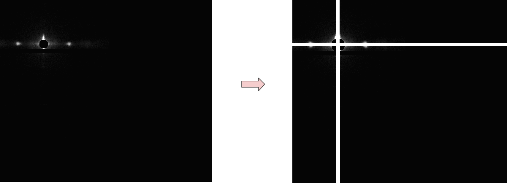

To fix this, the program applies a single composite affine transform that translates the diffraction center to the image center and rotates the image by the resolved rotation angle, both in one `warpAffine` call. After the transform the center is at `(width/2, height/2)` and the equatorial axis is horizontal.

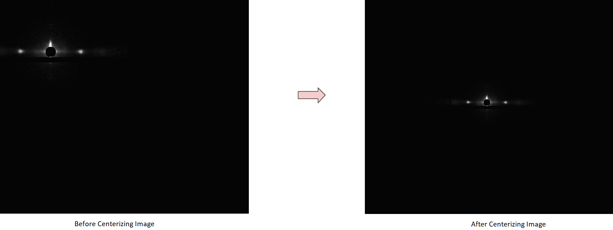

### 2. Calculate average quadrant fold

The transformed image is split into four quadrants about the (now-centered) diffraction center. Each quadrant is flipped to the same orientation as the top-left quadrant.

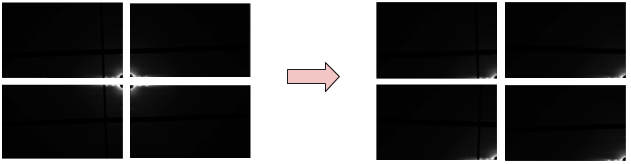

The four quadrants are then averaged pixel by pixel. Pixels with intensity ≤ −1 (detector gaps, masked regions) are excluded from the average at each position. Any quadrants the user has excluded via **Ignore Folds** are also skipped. The result is a single quarter-image (`avg_fold`) with improved signal-to-noise.

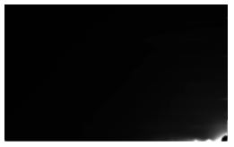

### 3. Calculate R-min and R-max

R-min and R-max define the radial range used for background subtraction.

A 1D azimuthal integration histogram is computed from `avg_fold` using pyFAI. The backstop shadow appears as the first peak in this histogram. R-min is set to that peak position + 5 pixels. R-max is set to the detector edge − 20 pixels. Both can be overridden manually.

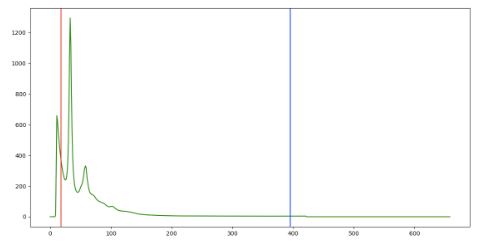

### 4. Create analysis mask

A composite mask is built from five components, combined by element-wise multiplication:

- **R-min / R-max annulus** — excludes pixels inside R-min (backstop region) and outside R-max (detector edge).
- **Equator band** — a horizontal strip centered on the equator, sized automatically from the FWHM of the meridional projection and the M1 layer-line position.
- **Equatorial peaks** — small box exclusions placed on the equator at the positions of the N most prominent equatorial peaks (and their mirror positions), sized from the peaks' average FWHM.
- **Beam exclusion** — a small circular exclusion at the center to remove residual direct beam.
- **Layer lines** — horizontal band exclusions at the expected layer-line positions (multiples of M1), sized from the meridional peak FWHM.

This mask is used by the background optimizer to evaluate subtraction quality on the diffraction features rather than on background regions.

For GUI workflow (manual, transition, and automated modes), saved configurations, and batch processing, see [Background Subtraction](Quadrant-Folding--Background-Subtraction.md).

### 5. Create synthetic data

A grid of 2D Gaussian blobs is generated and added to `avg_fold` to produce `avg_fold_with_syn`. The grid spacing and blob dimensions are derived from the I1,0 and M1 peak positions detected in the pattern. Three density presets are available (sparse / medium / dense).

This synthetic data gives the background optimizer a known signal to protect: a good background subtraction should preserve the synthetic peaks while removing diffuse background.

### 6. Smooth fold (optional)

If **Smooth Image** is enabled, a guided filter (radius = 7, ε = 1) is applied to `avg_fold` before background search. This reduces pixel-level noise without blurring diffraction features.

### 7. Downsample (optional)

If a downsample factor > 1 is set, `avg_fold` is resized with area interpolation before the background search. R-min, R-max, and the center coordinates are scaled accordingly. The full-resolution fold is used for the final subtraction; downsampling only speeds up the optimizer.

### 8. Search and apply background subtraction

The program selects a background subtraction method (either the one chosen by the user, or the best-scoring method found by the background optimizer) and applies it to `avg_fold` to produce `BgSubFold`.

The same method is applied in parallel to the synthetic data for optimizer scoring.

Six algorithms are available:

#### Circularly Symmetric

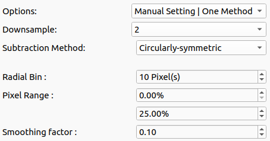

Parameters: pixel range (percentages), radial bin size (pixels), spline smoothing factor.

For each radial bin, pixels are sorted by intensity and the mean of the lowest N% is taken as the background value at that radius. The per-bin values are fitted with a smoothing spline and the resulting 1D curve is spread through 360° to produce a 2D background image.

From [CCP13 FibreFix](http://www.diamond.ac.uk/Beamlines/Soft-Condensed-Matter/small-angle/SAXS-Software/CCP13/FibreFix/FibreFix.html).

#### 2D Convex Hull

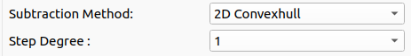

Parameters: R-min, angle bin size (default 1°).

A 1D radial intensity profile is computed by integrating over each 1° angular bin across the 90° quadrant. Each profile is smoothed, a 1D convex hull (shrink-wrap) is applied using R-min as the start point, and the hull points are interpolated with the pchip algorithm. The resulting vectors are smoothed and neighborhood-averaged to form a 2D background surface, which is then Gaussian-filtered before subtraction.

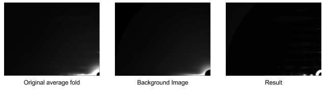

#### Roving Window

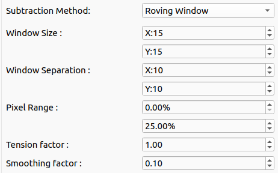

Parameters: R-min, window size, window separation, pixel range (percentages), smoothing factor, tension factor.

A window of the specified size is moved across the data. Within each window position, pixels are sorted and those in the user-selected intensity range are averaged to estimate the background at the window center. A smoothing spline under tension fills the gaps between window centers.

From [CCP13 FibreFix](http://www.diamond.ac.uk/Beamlines/Soft-Condensed-Matter/small-angle/SAXS-Software/CCP13/FibreFix/FibreFix.html).

#### White Top-Hat

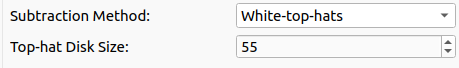

Parameter: kernel size.

The white top-hat transform `f − f∘b` extracts features smaller than the structuring element `b`. Features that are smaller than the disk kernel and brighter than their surroundings (i.e. diffraction peaks) are retained; the slowly varying background is removed. The kernel is a disk from scikit-image; the transform is applied with `skimage.morphology.white_tophat`.

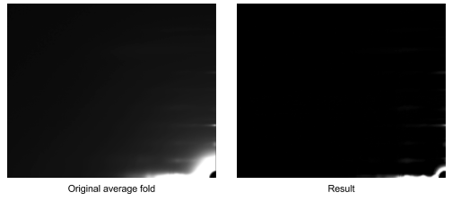

#### Smoothed — Gaussian and Boxcar

Parameters: R-min, number of cycles, FWHM (Gaussian) or box size (Boxcar).

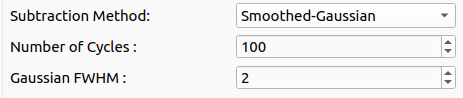

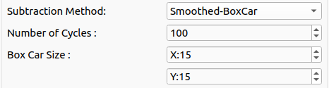

Based on Ivanova and Makowski (Acta Cryst. A54, 626–631, 1998). The image is repeatedly smoothed (Gaussian or boxcar filter) and the smoothed version is subtracted as the background estimate. Multiple cycles progressively refine the estimate.

#### Background Subtraction Modes

There are three modes for background subtraction: **Manual Setting**, **Transition**, and **Automated Processing**.

#### Manual Setting
In this mode, the user can select one background subtraction method and set the parameters for the background subtraction manually.
#### Transition
In this mode, the user can select one background subtraction method for the inner radii and another background subtraction method for the outer radii, and set the parameters for the two methods. The two background images are then merged at the **transition radius** and **transition delta** as described in [section 9](#9-merge-images-transition-mode-only).
#### Automated Processing
In this mode, the program will search for the best parameters for the background subtraction using the automated processing. The search for the optimal method is performed using a compound **loss** built from metrics that reflect pattern features: NMSE of synthetic signal, oversubtraction of synthetic signal, baseline residuals, connected negative pixels, and background smoothness. Automated processing also includes the "Advanced Configuration" feature, which allows the user to set the parameters for the optimization target and create background configurations to be reused for subsequent images. Saved **configurations** let you apply the best parameter set per image when processing a folder. See [Background Subtraction (GUI)](Quadrant-Folding--Background-Subtraction.md) for the full interactive workflow.

Generally speaking, the “White Top-Hat” and the “Smoothed-Gaussian” algorithms work well at large radii from the center and, at low radii, some other algorithm will work better than others, depending on the type of muscle generating the X-ray pattern.

### 9. Merge images (transition mode only)

If **Transition** mode is active, a second background subtraction method is applied to `avg_fold` independently (the outer method), producing a second background image (`BgFold_out`) alongside the inner one (`BgFold_in`).

The two **background images** are then linearly blended into a single merged background using `transition_radius` and `transition_delta`: the inner background dominates near the center, the outer dominates at large radii, and a linear ramp interpolates between them over a band of width `transition_delta` centered on `transition_radius`. The merged background is then subtracted from `avg_fold` to produce the final `BgSubFold`.

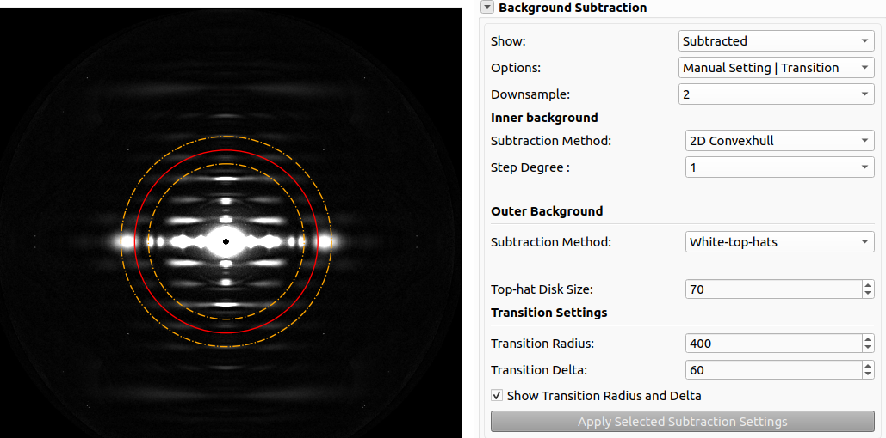

The guideline is to set the transition radius just outside the M3 meridional peak.

### 10. Generate result image

The background-subtracted quarter-image `BgSubFold` is expanded to a full 2D pattern by tiling the quarter and its three flipped copies (horizontal flip → top-right, vertical flip → bottom-left, both flips → bottom-right). The resulting full image is then post-processed: NaN values are zeroed; if **Rotate 90** is enabled the image is rotated 90°; if an ROI is set, the image is cropped symmetrically about the center.

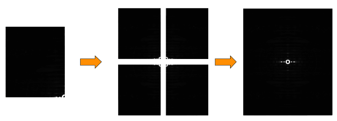

### 11. Evaluate result

Several quality metrics are computed and written to `summary.csv`:

- **loss** — weighted combination of five metrics: MSE between the result image and the synthetic-data ground truth (under the analysis mask), share of negative pixels around synthetic peaks, share of result pixels below the radial baseline, share of pixels in connected negative regions, and a smoothness penalty (sum of vertical gradients). Each metric is normalized by its running mean before being weighted. Lower loss is better.
- **bgSum** (stored internally as `intensity`) — `np.sum` of the estimated background image. Used for batch consistency checks and normalization.
- **symmetry** — normalized fold-symmetry score (`fold_std_norm`) computed on the pre-transform image by `_compute_fold_symmetry`. Lower means the four quadrants are more consistent.
