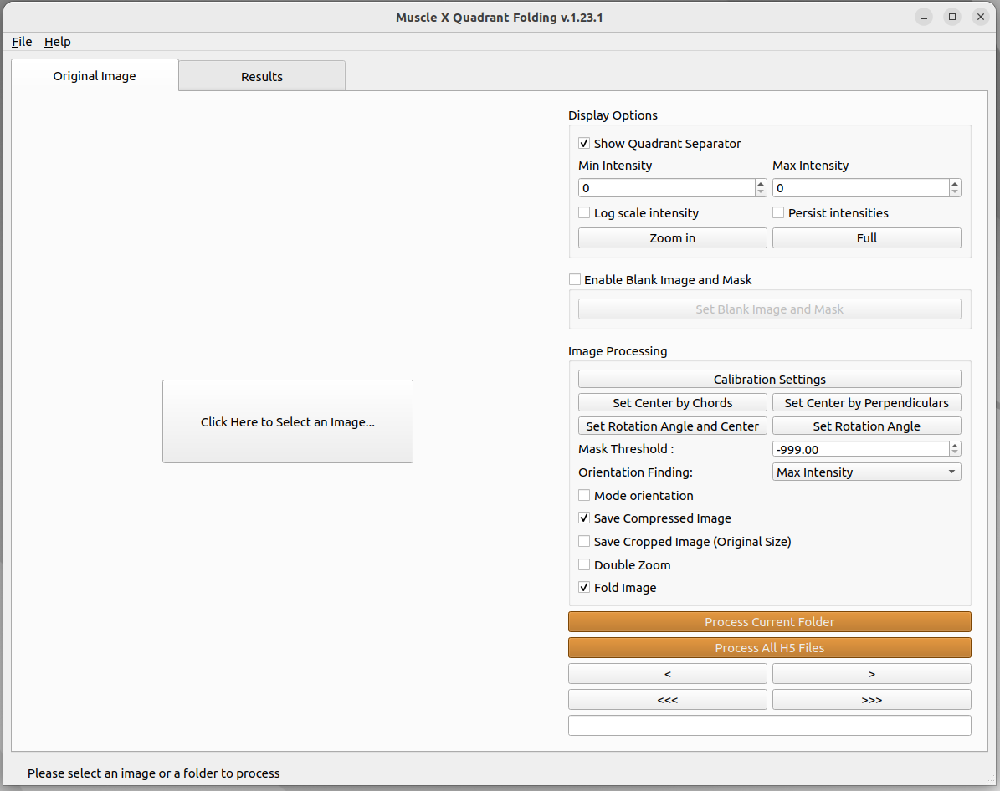
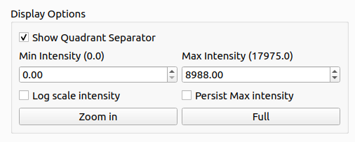
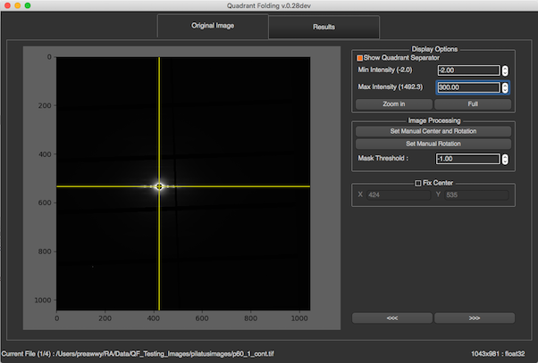
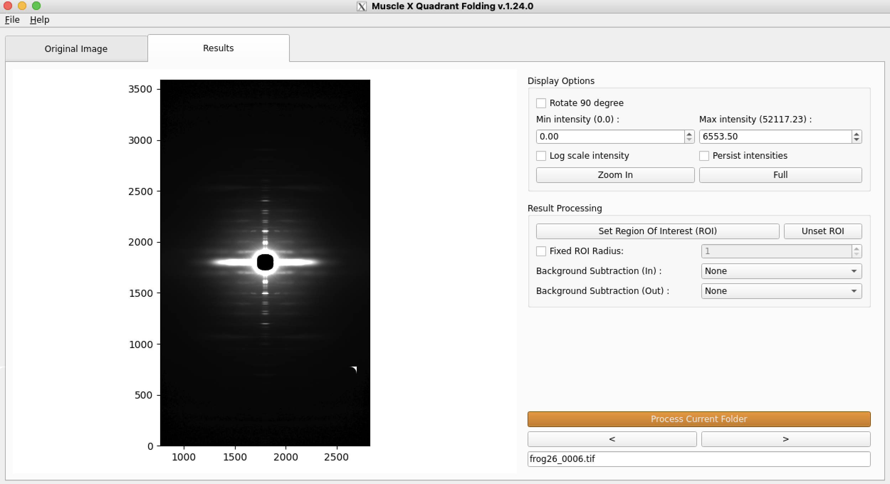
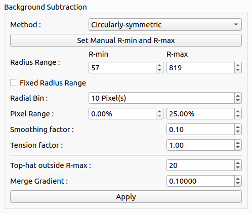
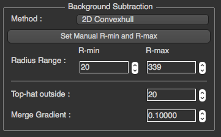
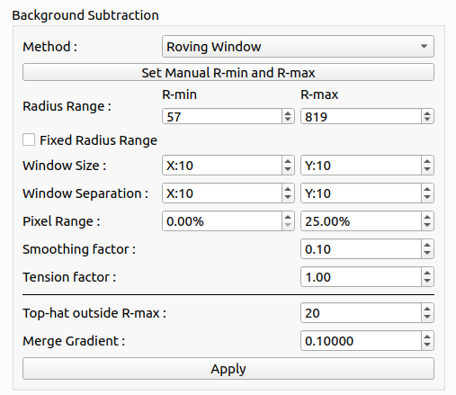
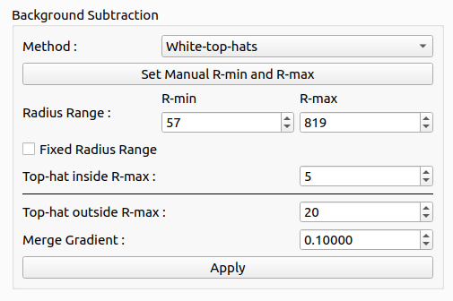

# How to use

Quadrant Folder (QF) provides two modes for users: [Interactive mode](#interactive-mode) and [Headless mode](#headless-mode).

## Interactive Mode 

After the program is opened, users will be able to select a file or a folder to process by pressing the button or select an option on the menu bar. 



## Navigation

To navigate through a folder of TIF images or through an H5 file containing multiple images, you can use the simple arrows "<" and ">". 
Depending on if you are looking at an H5 file or not, another set of button will be displayed: the arrows "<<<" and ">>>" allow you to go to the previous/next H5 file in the same folder. The "Process Current H5 File" button will process only the opened H5 file, whereas the "Process All H5 Files" button will process all the H5 files available in the folder.
In the case of a simple TIF image, those buttons will be replaced by a simple "Process Current Folder" button that will process all the TIF images in the current folder.


### Original Image
In this tab, the original image will be shown along with various options displayed on the right, Display Options, Image Processing, and Fix Center.

If it is the first time processing the images, the Next image button will process the following image using the current parameters (in the Image tab AND the Results tab). If you already processed the images, the program will use the cached files to load faster and avoid reprocessing. The display will adapt to each image depending on the cache if you click on Next or Previous image. If you want to reprocess all the images with the current settings, you can click on 'Process Current Folder', or delete the file named 'qf_cache' before launching Quadrant Folder.

#### Display Options



All options in Display Options will not affect any processing. These options allow users to see more detail in the image by setting minimal intensity, maximum intensity, and zooming. You can also choose whether or not to see the meridional and equatorial axes. To zoom in, the user needs to simply press the Zoom in button, and select the zoom region by drawing a rectangle as shown below. Once 'Zoom in' or 'Full' button is clicked, the current zoom level is persisted when moved to the next image. The check box 'Persist intensities' is used to persist the max and the min intensities when we move to the next image.



#### Empty Cell Image and Mask

```eval_rst
.. note:: **Terminology Update in version 1.27.0**: "Blank Image" has been renamed to "Empty Cell Image" for better clarity. This refers to an image of the empty sample cell (without sample) used for background subtraction.
```

See the [Blank Image and Mask](Blank-Image-and-Mask.html) documentation for more information on how to use this option.


#### Image Processing


##### Mode Orientation Checkbox
This checkox uses the mode of the orientation angles calculated from all the images in the folder as the rotation angle for fitting the images. All the images in the folder must be processed first before using this checkbox. Once processed, by checking this box, the program will gather all the angles in the folder and use the angle with the biggest number of occurrences as the new rotation angle.

##### Save Compressed Image Checkbox
Images can sometimes take a lot of storage, especially when doing time resolved experiments.
By selecting this option, the resulting quadrant folded image (which is saved in qf_results) is compressed using the tiff_lzw method in order to recude the storage used.

```eval_rst
.. note:: This compression format might create errors when you open the resulting Quadrant folded images through another software than MuscleX.
```

##### Save Cropped Image Checkbox
As discussed in the working of Quadrant Folding, we enlarge the image such that the diffraction center is at the center of the resulting image.
By selecting this option the resulting quadrant folded image (which is saved in qf_results) is cropped such that the size of the image is same as the original input image size.

##### Quick Center and Rotation Angle

```eval_rst
.. note:: **New in version 1.27.0**: The "Quick Center and Rotation Angle" tool (formerly "Set Rotation and Center") provides a streamlined way to set both center and rotation simultaneously.
```

Before setting manual rotation and center, it's better to zoom the image to the area of the diffraction because it will be easier to set these parameters correctly. To set the rotation and center, you need to click 2 positions of the image. The first one will be a reflection peak on one side of the equator, and the second one will be the corresponding (opposite) reflection peak on the other side of the equator. To cancel, press ESC.

**Center and Rotation Mode Indicators**: The interface now displays whether you're using automatic or manual center/rotation settings, making it easier to track your calibration state.


##### Set Center By Chords
Before setting center by chords, it’s better to zoom the image to the area of the diffraction because it will be easier to set these parameters correctly. This method is used to find the diffraction center and uses the fact that "All perpendiculars to the chords in a circle intersect at the center". On clicking this button, you will be prompted to select points along the circumference of the diffraction patter. As you select these points, perpendicular lines to the chords formed using these points start to appear on the image in blue color.  Once you finish selecting the points, click the same button again to start processing. The diffraction center will then be calculated by taking the average of the intersection points of the perpendicular lines (blue lines in the figure).<br/>


##### Set Center By Perpendiculars
Before setting center by perpendiculars, it’s better to zoom the image to the area of the diffraction because it will be easier to set these parameters correctly. This method finds the center of diffraction using intersection of perpendicular lines. On clicking this button, you are prompted to select multiple positions in the image. You can start by clicking the first reflection peak on one side of the equator and the second will be the corresponding (opposite) reflection peak on the other side of the equator. This forms one horizontal line. You can continue drawing as many horizontal lines using this process of selecting reflection peaks. Next, you can click the reflection peak vertically above the equator and the following point symmetrically below the equator. Again, you can draw multiple such lines. Once you finish selecting the points, click the same button (Set Center By Perpendiculars) again to start processing. The diffraction center will then be calculated by taking the average of the intersection points obtained by the horizontal and vertical lines plotted.<br/>


##### Set Rotation Angle
This assumes that the center of diffraction is correct. After the button is clicked, the program will allow users to select an angle by moving a line. Clicking on image when the line is on the equator of the diffraction will set manual rotation angle. 

```eval_rst
.. note:: **New in version 1.27.0**: Negative rotation angles are now supported. The rotation angle dialog has been enhanced with improved visual feedback.
```

To cancel, press ESC.<br/>


##### Restoring Automatic Settings

```eval_rst
.. note:: **New in version 1.27.0**: You can now restore automatic center and rotation detection with granular control.
```

If you have manually set the center or rotation angle and want to return to automatic detection:

1. **Restore Auto Center**: Click this button to return to automatic center detection
   - Choose to apply to **current image only** or **all subsequent images**
   - Useful when manual settings are no longer needed

2. **Restore Auto Rotation**: Click this button to return to automatic rotation detection
   - Choose to apply to **current image only** or **all subsequent images**
   - The program will automatically detect the optimal rotation angle

3. **Apply Current Settings**: Once you've set a center or rotation manually, you can apply it to:
   - Only the current image
   - All subsequent images in the folder

These options give you fine-grained control over when manual settings are used versus automatic detection.

##### Center and Rotation Management

**Configuration Fingerprinting**: The program now uses configuration fingerprinting to validate cached results. When you change center or rotation settings, the cache is automatically invalidated, ensuring consistency across your processing workflow.

**Manual Settings Preservation**: Your manual center and rotation settings are preserved during cache operations, so you don't lose your calibration when the cache is updated.

The Mask Threshold is used for excluding certain pixel values when calculating the folded image. The program will ignore pixels with intensity below mask threshold. This can be used to remove the dark gaps in images resulting from the gaps between detector elements in Pilatus detectors, as well as other detector abnormalities.

```eval_rst
.. note:: **Changed in version 1.27.0**: The mask threshold is now fixed at -1 for invalid pixels. Previous versions allowed user-adjustable thresholds, but this has been standardized for consistency.
```

To fix the center position to a user supplied value, you can check Fix Center check box, specify the coordinates of the beam center (before rotation). The image will be reprocessed when x, or y is changed. This will affect the next image if it's still checked.

##### Double Zoom

```eval_rst
.. note:: **Enhanced in version 1.27.0**: Double Zoom now features improved intensity normalization and dynamic crop radius adjustment for better visualization.
```

This feature is used to zoom into subpixel level accuracy. On checking this box, a new subplot is created on the top right of the image. As you move the mouse pointer into the image area, 20 x 20 pixels centered at the location of the mouse pointer is cropped from the image and scaled up to 10 times and plotted in the subplot mentioned earlier. 

This feature can be used with any calibration feature (Quick Center and Rotation Angle, Set Center By Chords, Set Center By Perpendiculars, Set Rotation Angle). Click the double zoom check box so that the subplot appears. Click on a calibration button, for example the Quick Center and Rotation Angle button. Drag your mouse pointer to the position you want to select the first point (or the first reflection peak as described earlier). Click the image to freeze the subplot region. A message appears, check do not show again box to not see this message again. Click on the exact point in the subplot region, which plots an equivalent point in the main image. Perform the previous two steps to select the second point. Uncheck the Double Zoom checkbox to hide the subplot window.<br/>


#### Fold Image
This function is used to tell the program to fold the image. By default, it is checked so the program folds the image during processing. If this options is unchecked, the program will reprocess the image without folding it. This is useful during cases when the images being processed have already been folded.

### UI Improvements in Version 1.27.0

```eval_rst
.. note:: **New in version 1.27.0**: The Quadrant Folding interface has been significantly enhanced with better organization and user experience improvements.
```

#### Collapsible Panels
The right-side panel now features collapsible group boxes, allowing you to:
- Expand/collapse sections to focus on relevant options
- Save screen space when working with multiple settings
- Better organize the various processing options

#### Enhanced Display Options
- **Persist Intensity Values**: The intensity range settings now persist across images when enabled
- **Improved Zoom Handling**: Zoom levels are maintained when navigating between images
- **Better Visual Feedback**: Group boxes now use bold fonts for better visual hierarchy
- **Green Labels**: Important information is highlighted with green labels for improved visibility

#### Improved Status Bar
The status bar now displays:
- Current file index and total file count
- Processing status information
- HDF5 processing progress (when applicable)

#### Better Navigation
- Clearer button text: "Process Current Folder" vs "Process Current H5 File"
- Confirmation dialog when closing with running tasks
- Improved progress tracking for batch operations

### Results
In this tab, the resulting image will be displayed along with options on the right. 

If it is the first time processing the images, the Next image button will process the following image using the current parameters (both, in the `Image` tab **and** the `Results` tab). If you already processed the images, the program will use the cached files to load faster and avoid reprocessing. 

The display will adapt to each image depending on the cache if you click on Next or Previous image. If you want to reprocess all the images with the current settings, you can click on `Process Current Folder`, or delete the file named 'qf_cache' before launching Quadrant Folder.



#### Display Options

Display Options will provide the same options as in Original Image tab. Users can specify min and max display intensity, and zooming.

#### Result Processing
##### Set Region of Interest (ROI)
This feature is used to select a part of the Quadrant folded image. For example, we would want to ignore the artefacts on the edges of the image. On clicking this button, a square appears around the center of diffraction. As you move the mouse pointer into the image area, the edges of the square move to where the mouse pointer is located in a symmetrical fashion. Click on the image to accept the current size of the region. Once the size is set, the resultant image will be cropped to the region selected by the square. Therefore, any artefacts present outside the selected region are ignored while quadrant folding. One can only select the region of interest about the center of diffraction.


##### Unset ROI

Use this button to remove the current region of interest and unfix it if the "Fixed ROI Radius" was set. The image will go back to its original shape.

##### Fixed ROI Radius

You can set and fix the value of the region of interest in order to propagate the results to the following images when you process a folder. This can also be useful when you want to crop images using the headless version as it is a parameter that will be saved in "qfsettings.json".

##### Background Subtraction

For the background subtraction section, by default, the program will not apply any background subtraction. To apply background subtraction, you can choose a method by method drop-down list. There are currently 6 options, [Circularly Symmetric](#circularly-symmetric), [2D Convex hull](#2d-convex-hull), [Roving Window](#roving-window), [White-top-hat](#white-top-hat), [Smoothed-Gaussian](#smoothed-gaussian), and [Smoothed-Boxcar](#smoothed-boxcar) all of which may be applied to the inner or the outter part of the image. 

For each method, users can select R-min manually by pressing the button `Set Manual R-min` and select R-min in the image as shown below


###### Circularly Symmetric

###### 2D convex hull

###### Roving Window

###### White top hat

###### Smoothed Gaussian

###### Smoothed Boxcar


You can change the parameters and click `Apply` to make the program re-process the background subtraction.

###### Merging
For the merging settings, they will be under the black line in the Background Subtraction section. There is the ability to select another background subtraction method for the outer part of the image and set transition radius and transition delta.


## Headless Mode  
Image processing performed in the terminal.
In the terminal, if the user types `musclex eq|qf|di|pt -h -i|-f <file.tif|testfolder> [-s config.json] [-d]`, MuscleX will run under headless mode.
For example: `musclex qf -h -i test.tif -s config.json`.

Arguments:
* -f \<foldername> or -i \<filename>
* -d (optional) delete existing cache
* -s (optional) \<input setting file>

```eval_rst
.. note:: To generate the settings file, use the interactive musclex, set parameters in it, then select save the current settings in `File` (top left corner). This will create the necessary settings file. If a settings file is not provided, default settings will be used.
```

```eval_rst
.. note:: You can run the headless version in Windows using a CMD prompt by replacing `musclex` in the headless command by `musclex-main.exe` in `C:\Users\Program Files\BioCAT\MuscleX\musclex`.
```
### Multiprocessing on Folders
In order to improve the processing speed when analyzing time-resolved experiments, the headless mode is processing one image on each processor available on your computer. For example, with a 24-cores computer, 24 images will be processed at the same time, and the results will be saved in the same file. To follow the execution thread of each processor (as the executions intersect), the process number has been added at the beginning of each line.

### Customization of Parameters
In Headless mode, the user may directly set the parameters in a json format inside the `qfsettings.json` file. Some of the parameters are shown in the list below. You might need to look at the code and especially 'modules/QuadrantFolder.py' to know exactly which parameters to set and how to set them. 


```json
{
    # Image settigns
    "mask_thres": 170, # 0 to 255
    "fix_center": true, # true, false
    "center_x": 1024, # 0 to 4096
    "center_y": 1024, # 0 to 4096
    "rotation": 0, # 0 to 360
    "roi_rad": 100,

    # Inner background subtraction
    "bgsub": "None", # None, 2D Convexhull, Circularly-symmetric, White-top-hats, Roving Window, Smoothed-Gaussian, Smoothed-BoxCar
    "fixed_rmin": 100, # in pixels

    ## Convex hull settings (inner)
    "degree": 1, # 0.5, 1, 2, 3, 5, 9, 10, 15, 18
    
    ## Circularly symmetric settings (inner)
    "radial_bin": 1, # in pixels
    "cirmin": 10, # in pixels
    "cirmax": 100, # in pixels
    "smooth": 1, 

    ## Roving window settings (inner)
    "tension": 1,
    "win_size_x": 11, # in pixels
    "win_size_y": 11, # in pixels

    ## Smoothed Gaussian / Smoothed Boxcar settings (inner)
    "fwhm": 20, # in pixels
    "boxcar_x": 20, # in pixels
    "boxcar_y": 15, # in pixels
    "cycles": 1, 

    # Outer background subtraction    
    "bgsub2": "None", # None, 2D Convexhull, Circularly-symmetric, White-top-hats, Roving Window, Smoothed-Gaussian, Smoothed-BoxCar

    ## Convex hull settings (outer)
    "deg2": 1, # 0.5, 1, 2, 3, 5, 9, 10, 15, 18

    ## Circularly symmetric settings (outer)
    "smooth2": 1,

    ## Roving window settings (outer)
    "tension2": 1,
    "win_size_x2": 11, # in pixels
    "win_size_y2": 11, # in pixels

    ## Smoothed Gaussian / Smoothed Boxcar settings (outer)
    "fwhm2": 20, # in pixels
    "boxcar_x2": 20, # in pixels
    "boxcar_y2": 15, # in pixels
    "cycles2": 1, 
    
    # Transition settings
    "transition_radius": 730, # 1 to 4096
    "transition_delta": 60, # 1 to 4096
}
```

