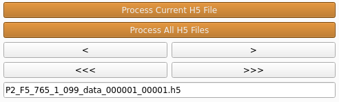

# How to use

This page walks through the recommended workflow for processing a folder of images with Quadrant Folding (QF), then describes the secondary features and the headless mode.

## Workflow at a glance

1. [Open an image (or folder)](#step-1-open-an-image-or-folder)
2. [Choose an output directory](#step-2-choose-an-output-directory)
3. [Set center and rotation on a reference image](#step-3-set-center-and-rotation-on-a-reference-image)
4. [Detect alignment across the folder](#step-4-detect-alignment-across-the-folder)
5. [Fix individual misaligned images](#step-5-fix-individual-misaligned-images)
6. [Inspect the result and switch display modes](#step-6-inspect-the-result-and-switch-display-modes)
7. [Configure background subtraction (optional)](#step-7-configure-background-subtraction-optional)
8. [Process the whole folder and collect output files](#step-8-process-the-whole-folder-and-collect-output-files)

---

## Step 1 — Open an image or folder

Use **File > Select an Image...** (`Ctrl+I`) and pick any TIF/CBF/HDF5 file. QF loads the file, discovers all sibling images in that directory, and immediately processes the selected image with the default settings.

Once a folder is loaded, use the navigation arrows on the bottom strip to move through images:

- **<** / **>** — previous / next image
- **<<<** / **>>>** — previous / next HDF5 file (only for HDF5 input)
- **Process Current Folder** — reprocess every image in the folder with the current settings
- **Process Current H5 File** / **Process All H5 Files** — same for HDF5 frames

Already-processed images are reloaded from the cache rather than reprocessed, so navigation is fast. To force reprocessing, click **Process Current Folder** or delete the `qf_cache` folder under the output directory.

## Step 2 — Choose an output directory

By default QF writes `qf_results/`, `qf_cache/`, and CSV files into the **same folder as the input images**. If the input directory is read-only, or you want to keep input and output separate, use **File > Change Output Directory...** before processing.

The output directory applies to:
- `qf_results/<name>_folded.tif` — the folded image
- `qf_results/bg/<name>.bg.tif` — the estimated background (when subtraction is on)
- `summary.csv`, `summary2.csv`, `failedcases.txt` — batch summaries
- `qf_cache/` — processing fingerprints used for fast reload

## Step 3 — Set center and rotation on a reference image

Pick a clean, well-aligned frame as your reference. The right-hand panel **Center** and **Set Rotation Angle** groups contain everything needed.

### Center tools

| Button | When to use |
|---|---|
| **Quick Center and Rotation Angle** | Auto-detect both center and rotation from the diffraction pattern. Good first attempt. |
| **Set Center by Chords** | Click 3 points on a strong ring; the center is fitted from the perpendicular bisectors of the chords. |
| **Set Center by Perpendiculars** | Draw two perpendicular lines through pairs of symmetric reflections. |
| **Set Center by Calibration** | Use a calibrant ring to derive both center and pixel-to-nm scale. |
| **Set Center Manually** | Click a single pixel to use as the center. Fast but least accurate. |
| **Apply Center** | Copy the current center to a chosen scope (this image / next N / whole folder). |
| **Restore Auto Center** | Discard the manual center and revert to auto-detection. |

### Rotation tools

| Button | When to use |
|---|---|
| **Set Auto Orientation** | Open a dialog to pick the rotation-detection algorithm and whether to use **Mode Orientation** (use the most common angle across the folder). |
| **Set Angle Interactively** | Click two points to define the meridional axis. |
| **Set Angle Manually** | Type the angle in degrees. |
| **Apply Rotation** | Copy the current angle to a chosen scope. |
| **Restore Auto Rotation** | Revert to auto-detected angle. |

For full details on all shared tools (Double Zoom, fingerprinting, calibration dialog), see [Common Settings — Diffraction Center and Rotation](../Common-Settings.md#diffraction-center-and-rotation).

Once the reference image looks right, use **Apply Center** and **Apply Rotation** (scope = whole folder) to propagate the values to every image.

## Step 4 — Detect alignment across the folder

After propagating, most images will be correctly aligned, but some may have shifted center or rotation and need individual correction. Open **Tools > Detect Image Alignment...** (`Ctrl+D`) to identify outliers.



The dialog shows one row per image with columns for:

- **Original Center** and **Auto Center** (with the distance between them)
- **Rotation** and **Auto Rotation** (with the difference)
- **Center Mode** / **Rotation Mode** — whether the values were set manually or auto-detected
- **Dist from Base** / **Rot Diff from Base** — how far each image is from the chosen *base* image
- **Size** and **Image Difference** — pixel-difference between this image and the base
- **Fold Std (sum)** and **Fold Std (norm)** — fold-symmetry scores when **Run symmetry test on detection** is enabled (lower = more symmetric)

Click **Run Detection** to populate the columns. Sort by any column to surface outliers — for example, sort by **Auto Center Difference** to find images where the auto-detected center disagrees with the manually-applied one, or by **Fold Std (norm)** to find images that fold poorly.

The dialog is **non-modal**: leave it open and switch between it and the main window freely. Changes you make in the main window update the table automatically.

## Step 5 — Fix individual misaligned images

For each outlier in the alignment table:

1. **Click the row** — the main window navigates to that image.
2. **Adjust center / rotation** using the Step 3 tools on the main window.
3. The table row updates as soon as you change the values.

Right-clicking a row offers:

- **Set Center and Rotation** — switches focus to the main window with a hint dialog.
- **Set Global Base** — promote this image as the reference for the `Dist from Base` columns.
- **Ignore** — exclude this image from subsequent batch operations.

Repeat until all images are within an acceptable tolerance.

## Step 6 — Inspect the result and switch display modes

Switch to the **Results** tab to see the folded, background-subtracted output. The display panel on the right has a **Show** dropdown that switches between several views without reprocessing:

| Mode | What it shows |
|---|---|
| **Subtracted** | Final result: average fold with background removed, mirrored to full 2D pattern. This is the default. |
| **Background** | The estimated background image. Useful for sanity-checking the subtraction. |
| **Folded** | The plain average fold *without* background subtraction. |
| **Evaluation Mask** | The composite mask used by the background optimizer (R-min/R-max annulus, equator band, peak/beam exclusions, layer lines). |
| **Synthetic Signal** | The synthetic Gaussian-blob grid added to the fold during optimizer scoring. |
| **Synthetic Mask** | The mask region of the synthetic data. |

Other Results-tab controls:

- **Rotate 90 degree** — rotate the displayed result by 90° (also rotates the saved tif).
- **Show Quadrant Separator** — draw the horizontal/vertical lines separating the four mirrored quadrants.
- **Set Region Of Interest (ROI)** — drag a rectangle on the result to crop the output. The ROI is symmetric about the center.
- **Unset ROI** — remove the ROI.
- **Persist ROI size** — keep the same W/H ROI when moving to the next image.
- **Persist intensity** — keep the min/max intensity range across images.

## Step 7 — Configure background subtraction (optional)

Background subtraction is not required for quadrant folding itself. If you only need the folded image (higher signal-to-noise, no diffuse background removed), leave the method as **None** and skip to Step 8. Use this step when you want to remove the diffuse muscle background before saving or downstream analysis.

The **Background Subtraction** group on the right panel is the central control. It has two entry points:

### Quick path — Apply Default Optimization

Click the blue **Apply Default Optimization** button. QF runs the automated optimizer on the current image using the default method set and writes the chosen method and parameters back to the Current Configuration display. This is the recommended first step on a new dataset.

### Custom path — Advanced Configuration

Click **Advanced Configuration** to open the full Background Subtraction dialog. The dialog is organised as three steps:

**Step 1 — Adjust Image Setting and Process**

- **R-min/R-max** group — see and override the automatic values; **Manual R-min/max** lets you click on the image; **Persist R-min/max** keeps the same values across images.
- **Image Processing** group — **Downsample** (speeds up the optimizer) and **Smooth Image** (guided-filter pre-smoothing).
- **Subtraction** group — pick **Processing Mode**:
  - **Manual** — choose one of the six methods (`2D Convexhull`, `Circularly-symmetric`, `White-top-hats`, `Roving Window`, `Smoothed-Gaussian`, `Smoothed-BoxCar`) and tune its parameters by hand. See the [Methods Reference](#methods-reference) below.
  - **Automated** — pick which methods to try, the step schedule, max iterations, and an early-stop loss threshold.
- **Optimization Target and Evaluation Settings** group — configure the [evaluation mask](#step-6-inspect-the-result-and-switch-display-modes) (equator height, equator centre radius, layer-line spacing, layer-line width), the loss metric weights, and the synthetic-signal parameters.
- **Apply Selected Subtraction Settings** — run the subtraction with these settings.

**Step 2 — Review Results**

After applying, the **Results** panel inside the dialog shows the Loss value and a per-metric breakdown table (MSE, oversubtraction share, non-baseline share, negative-connected share, smoothness — each shown as raw, normalized, and weighted contribution). Tick **Save result metrics to csv** to also write these into `qf_results/bg/background_metrics.csv`.

**Step 3 — Adjust Batch Processing Settings and Launch**

- **Configurations** table — save the current method+parameters as a named configuration. You can build up several configurations (e.g. one for low-angle, one for high-angle) and apply them to different images.
- **Choose best configuration for images automatically** — for each image, pick whichever saved configuration scores the lowest loss.
- **Automatically create new configurations for outlier images** — when an image scores poorly with all existing configurations, derive a new one for it.
- **Manually assign configurations to images** — open a per-image picker.
- **Process Current Folder** — run the batch with these settings.

### Transition mode

If a single method does not work well across all radii, switch the right-panel **Options** dropdown to `Manual Setting | Transition`. Two method choices and parameter sets appear; configure each independently and set:

- **Transition radius** — where the two backgrounds are blended (typical guideline: just outside the M3 meridional peak).
- **Transition delta** — width of the linear blend region.

See [How it works — Step 9](Quadrant-Folding--How-it-works.md#9-merge-images-transition-mode-only) for the algorithmic detail.

## Step 8 — Process the whole folder and collect output files

When the settings look right on representative images, click **Process Current Folder** (either the navigation button or the one inside the Background Subtraction dialog). QF writes the following under the output directory:

### `qf_results/`

| File | Description |
|---|---|
| `<name>_folded.tif` | The folded, background-subtracted result image (32-bit float TIFF). When **Save Compressed Image** is checked, written as `<name>_folded_compressed.tif` with LZW compression — smaller files but may not load in non-MuscleX software. |
| `summary.csv` | One row per processed image. Key columns: `Filename`, `centerX`/`centerY`, `rotationAngle`, `backgroundMethod`, `backgroundConfigName`, `parameters`, `downsampled`, `loss`, `bgSum` (total background intensity), `symmetry` (lower = more symmetric). |
| `summary2.csv` | Same data, transposed for easier spreadsheet analysis. |
| `failedcases.txt` | Images that could not be processed automatically (no peaks, fitting failed, high error, or manually rejected). |

### `qf_results/bg/`

Written when a background-subtraction method other than `None` is active.

| File | Description |
|---|---|
| `<name>.bg.tif` | The estimated background image (32-bit float TIFF). |
| `background_sum.csv` | `Name`, `Sum` per image. `Sum` equals `bgSum` in `summary.csv`. In batch/headless mode this file is aggregated after all images finish; in interactive mode it is updated incrementally. |
| `background_metrics.csv` | Per-image raw and normalized evaluation metrics with their weights and running means. Written only when **Save result metrics to csv** is enabled. |

For the meaning of `loss`, `bgSum`, and `symmetry`, see [How it works — Step 11](Quadrant-Folding--How-it-works.md#11-evaluate-result).

---

## Methods Reference

These six methods are available in the Background Subtraction dialog. The algorithms are described in detail in [How it works — Step 8](Quadrant-Folding--How-it-works.md#8-search-and-apply-background-subtraction). Here is the parameter cheat-sheet:

| Method | Key parameters |
|---|---|
| **Circularly-symmetric** | Pixel range %, radial bin size, smoothing factor |
| **2D Convexhull** | R-min, angle bin (default 1°) |
| **Roving Window** | R-min, window size (X/Y), pixel range %, smoothing, tension |
| **White-top-hats** | Top-hat disk size |
| **Smoothed-Gaussian** | R-min, number of cycles, Gaussian FWHM |
| **Smoothed-BoxCar** | R-min, number of cycles, box car size (X/Y) |

In **Transition** mode each method has a separate outer-parameter set (suffix `_out` in the JSON).

---

## Other features

### Right-click — Ignore a quadrant

Right-click on any quadrant in the Original Image tab and choose **Ignore This Quadrant**. The selected quadrant is excluded from the averaging step (useful when one quadrant has a detector defect or shadow). Use **Unignore This Quadrant** to re-include it.

### Save and load settings

- **File > Save Current Settings** (`Ctrl+S`) — write current parameters to `qfsettings.json`. Per-image state (center, rotation, ROI per image) is **not** included.
- **File > Load Settings...** (`Ctrl+Shift+S`) — load a settings file and reprocess.

### Fold Image checkbox

Unchecking **Fold Image** processes the original (unfolded) image as if it were already folded. Useful when the input is already a quadrant-folded result from a previous run.

---

## Headless Mode

For batch processing without a GUI, run from the terminal:

```bash
musclex qf -h -i <file.tif> [-s qfsettings.json] [-d]
musclex qf -h -f <folder>   [-s qfsettings.json] [-d]
```

Arguments:

- `-i <file>` — process a single file.
- `-f <folder>` — process every image in the folder.
- `-s <settings.json>` — load a settings file (generated by **File > Save Current Settings** in the GUI). Without this, defaults are used.
- `-d` — delete the existing cache before processing.

```eval_rst
.. note:: On Windows, replace ``musclex`` with ``musclex-main.exe`` (typically under ``C:\Program Files\BioCAT\MuscleX\musclex``).
```

### Multiprocessing

The headless runner processes one image per CPU core. Output for each worker is prefixed with the process index so interleaved log lines can be untangled.

### `qfsettings.json` reference

A representative settings file. Names ending in `_out` are the outer-radius counterparts used in Transition mode. For the full set of accepted keys, see `musclex/modules/QuadrantFolder.py`.

```json
{
    "fix_center": true,
    "center_x": 1024,
    "center_y": 1024,
    "rotation": 0,
    "roi_w": 2048, "roi_h": 2048,

    "downsample": 2,
    "smooth_image": true,

    "bg_options": 0,
    "bgsub": "Circularly-symmetric",
    "fixed_rmin": 100,
    "fixed_rmax": 900,

    "degree": 1,
    "radial_bin": 1,
    "cirmin": 10, "cirmax": 100,
    "smooth": 1,
    "tension": 1,
    "win_size_x": 11, "win_size_y": 11,
    "fwhm": 20,
    "boxcar_x": 20, "boxcar_y": 15,
    "cycles": 1,

    "bgsub_out": "None",
    "deg2": 1,
    "smooth2": 1,
    "tension2": 1,
    "win_size_x_out": 11, "win_size_y_out": 11,
    "fwhm_out": 20,
    "boxcar_x_out": 20, "boxcar_y_out": 15,
    "cycles_out": 1,

    "transition_radius": 730,
    "transition_delta": 60,

    "optimize": false,
    "methods": ["Circularly-symmetric", "2D Convexhull"],
    "max_iterations": 200,
    "early_stop": 0.005,

    "equator_mask_height": 60,
    "equator_center_beam_width": 20,
    "m1": 50,
    "layer_line_width": 8,

    "freq": "medium"
}
```

- `bg_options`: `0` = single method, `1` = Transition (uses `bgsub_out` outside `transition_radius`).
- `optimize`: when true, ignores `bgsub` and runs the automated optimizer over `methods`.
- `mask_thres` is no longer user-configurable; invalid pixels are detected at the value −1 set by the empty-cell-and-mask preprocessing stage.
