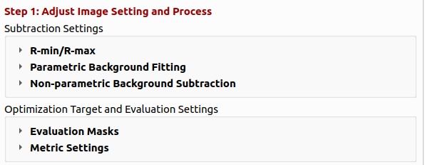
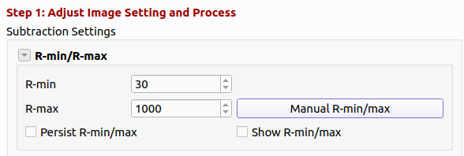
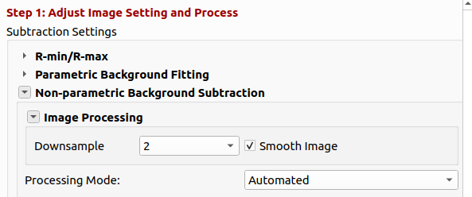
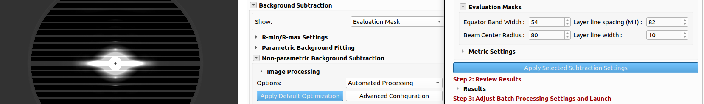
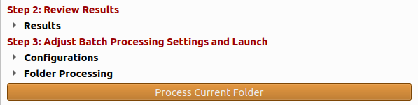

# Optimization Settings (Advanced Configuration)

The **Background Subtraction Settings** dialog is the **Advanced Configuration** screen for **Automated Processing**. It controls the parameter search, the evaluation masks and metrics used to score candidate backgrounds, saved configurations, and folder batch processing. Open it from **Advanced Configuration** in the Results tab **Background Subtraction** panel (shown only when **Options** is set to `Automated Processing`).

  

This page documents every setting in that dialog. For the higher-level workflow (modes, manual and transition subtraction, method parameters), see [Background Subtraction](Quadrant-Folding--Background-Subtraction.md).

## Recommended workflow using Automated Processing

### Step 0: Apply Default Optimization

Click **Apply Default Optimization** to run the optimization with the default settings. This runs the search with the default methods (**White-top-hats**, **Smoothed-Gaussian**, **None**), picks the best performing method and parameters based on the default loss weights, and adds a **Default Optimization** entry to the configuration table. This is a good starting point for most datasets. If the results are satisfactory, review the next image (the same settings apply) and run **Process Folder** to process the entire folder. If not, tune the settings in **Advanced Configuration**.

The dialog itself is organized in three steps, described below.

### Step 1: Adjust image settings and process

  

- **R-min/R-max** — Define the radial range used for masking and fitting. R-min excludes the backstop; R-max limits the outer edge of the pattern. Use **Manual R-min/max** to set values on the image, **Show R-min/max** to overlay circles, and **Persist R-min/max** to reuse values when switching images.

  

- **Non-parametric BackgroundSubtraction** 
  - **Image Processing** — **Downsample** (1, 2, or 4) speeds optimization and smooths the background; **Smooth Image** optionally smooths the folded image before subtraction using an edge-preserving smoothing algorithm (OpenCV's guided filter). By default, the image is downsampled by 2 and the background is smoothed.

    

    - In the **"Processing Mode"**, choose **Manual** or leave **Automated** processing mode:
      - **Manual**: Select **Subtraction Method** and method-specific parameters (same methods as in the Results panel).
      - **Automated**: Multi-select **BG Subtraction Methods**, set **Step Sizes** (comma-separated schedule, e.g. `100, 50, 25, 10, 5, 3, 1`), **Max Iterations** per parameter, and **Early Stop Loss Threshold**.
- **Evaluation Masks** — Adjust the evaluation masks to restrict scoring to physically meaningful regions:
  - **Equator band height** and **Beam Center Radius** — mask the equator and central beam.
  - **Layer line spacing** and **Layer line width** — mask Bragg layer lines so they do not dominate the loss.

  .. warning:: Automatic detection of **Equator band height**, **Beam Center Radius**, **Layer line spacing**, and **Layer line width** doesn't always work correctly for all datasets. Set these values manually in **Evaluation Masks** for each dataset.

  To view the evaluation masks, click **Show** in the Results tab to inspect **Evaluation Mask**.

     

- **Metric Settings** — Adjust the relative importance of each metric and the normalization means. The weights should roughly add up to 1. Leave the default values for the first run and adjust after reviewing the results. The normalization means are hidden by default; double-click the metric table header to show/hide means.

- **Advanced Settings**
  - **Evaluation Baseline** sets the near-zero threshold; **Persist evaluation baseline** keeps it when changing images. **Evaluation Baseline** allows adjusting the near-zero threshold for the calculation of **Fraction of Non Near-Zero Baseline Pixels** — the threshold below which pixels are considered part of the background. Change this value if the noise level doesn't match the calculated value.
  - **Synthetic** amplitude and sigmas (and **Sampling Frequency**) define the reference pattern used in MSE and oversubtraction metrics.

- Click **Apply Selected Subtraction Settings** (dialog or Results panel) to run on the current image. During automated optimization the button becomes **Stop Optimization**, which stops the search and returns the previous best performing method and parameters. This is useful when you want to tune the settings and rerun the optimization.

### Step 2: Review results

    

After processing, the **Results** section shows **Loss** and a table of metrics.

    

| Metric | Meaning | Purpose |
|--------|---------|---------|
| **Positive NMSE of Synthetic Signal** | Linearly scaled normalized mean squared error between the subtracted image and a synthetic meridional reference, inside the evaluation mask. | Measure the preservation of the synthetic signal. Lower is better. High when the synthetic signal is changed significantly. |
| **Fraction of Synthetic Oversubtraction** | Share of masked pixels where subtraction went below the synthetic reference. | Measure the amount of synthetic signal that is removed. Lower is better. High when the synthetic signal is removed significantly. |
| **Fraction of Non Near-Zero Baseline Pixels** | Share of masked pixels still above the evaluation baseline after subtraction. | Measure the amount of background that is not removed. Lower is better. High when the background is not removed significantly. |
| **Fraction of Negative Connected Pixels** | Share of connected negative regions (oversubtraction artifacts). | Measure the amount of oversubtraction artifacts. Lower is better. High when the oversubtraction artifacts are significant. |
| **Smoothness Metric** | Penalty for roughness in the estimated background. | Measure the smoothness of the estimated background. High when the background is rough. |

**Compound loss** is a weighted sum of normalized metrics. Adjust **Metric Settings** (weights and normalization means; double-click the metric table header to show/hide means).

- **Save result metrics to csv** — Save the result metrics to a csv file, useful for further analysis. This saves the result metrics to `qf_results/bg/background_metrics.csv`.

### Step 3: Batch processing

   

1. When satisfied with settings on a representative image, click **Add Background Configuration** to save the selected method and parameters under a configuration name. Loss is also added for information. Configurations are stored in `qf_cache/background_cache.json` for the folder.
2. Repeat for other parameter sets if needed (e.g. different muscle types).
3. Under **Folder Processing**:
   - **Choose best configuration for images automatically** — For each image in the folder, evaluate all saved configurations and apply the one with lowest loss (typical for heterogeneous datasets). This is the recommended option for most datasets.
   - **Automatically create new configurations for outlier images** — When an image scores poorly against every saved configuration (based on the background metrics), derive a new configuration for it and add it to the table.
   - **Manually assign configurations to images** — Open the assignment dialog to map specific configuration names to filenames (disabled while auto-select is on). This is useful for datasets with a clear separation between different types of images.
4. Click **Process Current Folder** (dialog or navigator) to batch-process with the chosen configuration logic.

The **Current Configuration** summary in both the dialog and Results panel shows the active method, parameters, and loss after each run.

## Automated processing details

When **Automated Processing** is active and optimization runs:

1. For each selected method, the program searches parameter space using the configured step schedule and iteration limit.
2. The optimization process tunes each parameter in the selected method one at a time, in order of importance.
3. Candidates are scored with the compound loss; search can stop early when loss drops below **Early Stop Loss Threshold**.
4. The best method/parameter set is written to **Current Configuration** and used for the result image.

**Apply Default Optimization** runs this search with default methods on the current image and can add a **Default Optimization** entry to the configuration table.

For batch runs with **Choose best configuration for images automatically**, optimization is not repeated per image; each saved configuration is evaluated once and the lowest-loss configuration is applied.

## Related topics

- [Background Subtraction](Quadrant-Folding--Background-Subtraction.md) — Processing options, manual and transition modes, and the subtraction method reference.
- [Background Fitting](Quadrant-Folding--Background-Fitting.md) — Parametric (iterative 2D) equator + general background model, which shares the evaluation-mask parameters used here.
- [How it works](Quadrant-Folding--How-it-works.html) — Full processing pipeline including merge and result image generation.
