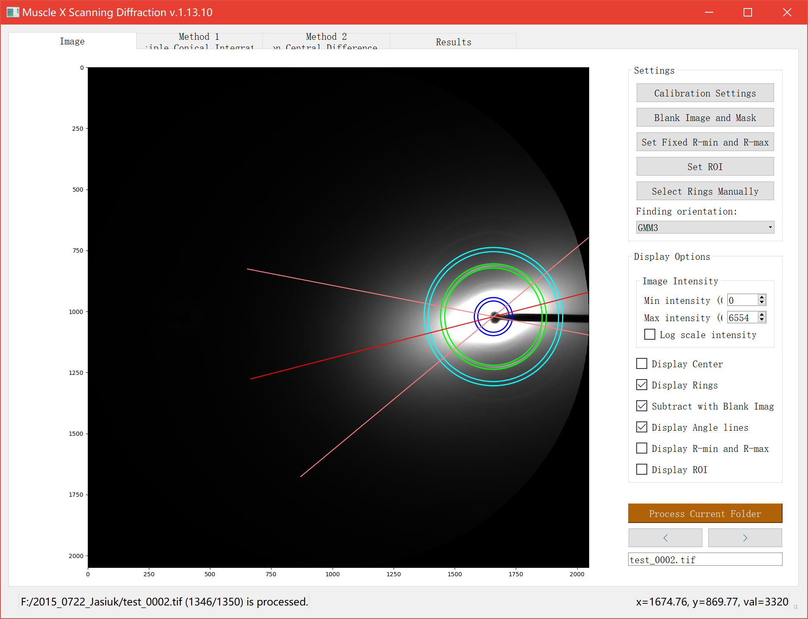
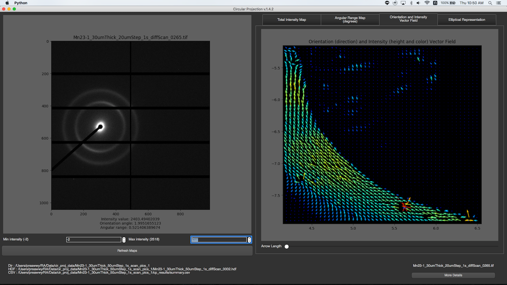
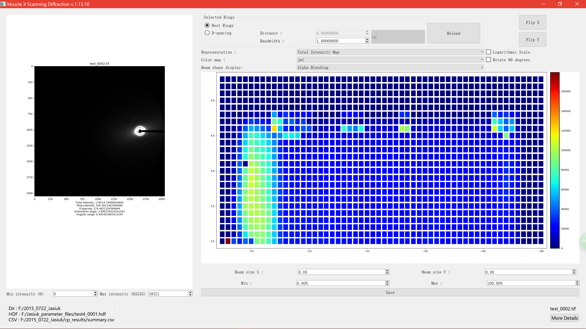

# How to use

Scanning Diffraction (DI) provides two modes for users: Interactive mode and Headless mode

## Interactive Mode 

Once the program is run, you will see these 2 buttons for [Individual Image Mode](#individual-image-mode) and [Folder Mode/Batch Mode](#folder-mode)

### Individual Image Mode
After an image is selected, the program will process it, and display all information in 4 tabs, Image, Method 1, Method 2, and Results

#### Image 

There are several options on the right bar. In Settings section, you can do [Calibration Settings](../Calibration-Settings.html) and ring selections. Several methods of finding orientation based on **GMM** or **Herman Orientation Factor (HoF)** are provided. **Region of Interest (ROI)** is shown as a semitransparent red ring. It is used as the integration area for **HoF** method and only rings in it are considered when performing **GMM** fitting.

To do the ring selection, you have to click the button, pick rings on the image, and click Done. Setting ROI, R-min and R-max can be done in the same way.

Another section is Display Options. You can set max intensity and min intensity to see the rings clearly. Also, there are some check boxes that allow you to see ring locations and their properties.

#### Method 1
This method is the first method of finding rings process. [Click Here](Scanning-Diffraction--How-it-works.html#3-find-rings-by-partial-integration-method) to see how it works

In this tab, you will see the image on the left along with its partial radial integrations, and its 1D integration on the right. 

The partial radial integrations are displayed in the graph on the top. This represents 1D radial integration for specific angle range. The title of the graph will tell you what the current range is and what peaks are found. In the image above, the current range is 0-90 degrees. The image on the left will cover this range with red color. To see other ranges, you can click left or right arrow. You can also change angle size by changing Range Angle value. _This requires program to re-calculate everything._

The 1D radial integration for all 360 degrees will be display at the bottom with final peaks as its title

#### Method 2
This method is the second method of finding rings process. [Click Here](Scanning-Diffraction--How-it-works.html#4-find-rings-by-log-central-differences-method) to see how it works

There is a drop down list on the top that you can select what to see. There are original 2D integration, Central Differences, and log of central differences. You can also see runs and rings by just checking the box. Runs will be displayed in red and rings will be displayed in white.

#### Results
In this tab, you will see all fitting results on both radial integration, and angle projection. 

You can select fitting graph that you want to see by selecting the drop down list on the top. You can select peaks manually by pressing "Select Peaks Manually", select peaks in the graph, and click "Done". 

For fitting results, there are 2 text boxes at the bottom of this tab. 

The box on the left will display total intensity and fitting results of peaks in 1D radial integration. For each peak, you will see ... 
* Center of the peak : Distance from the ring to center of the diffraction. 
* Alpha : Area underneath the peak.
* Sigma d : Standard deviation of the ring distribution in radial direction.

 

The box on the right will display fitting results of ring orientation in angular projection. For each ring, you will see ...
* Angle : Orientation angle of the ring
* Range : Angle +- Sigma
* Sigma : Standard deviation of the orientation angle
* Intensity : Area underneath the fitting gaussian
* Fitting Error : fitting error for orientation fitting ( the acceptable error should be less than 1 )

### Folder Mode
After a folder is selected, and all images in the folder are processed, the program will read summary.csv and rings.csv to produce several maps. You can choose diffrent map display in *Representation* dropdown menu. The maps will be displayed on the right. To see the image of a particular pixel, you can just simply click on that pixel in the maps. If the image exists, it will be shown on the left. You can change min or max intensity of the image by spin boxes under the image. To see more detail about the image, you can click "More Details" button at the bottom right corner. Then, there is a new window with individual image mode pops up, and you will see all the detail about the image.

#### Total Intensity Map

You can change min or max intensity for the maps by spin boxes under the maps.

#### Ring Intensity Map

You can change min or max intensity for the maps by spin boxes under the maps.

#### Orientation and Intensity Vector Field

You can change the length of vector by dragging the slide bar under the maps.

#### Elliptical Representation

#### Displaying Beam Shape
- None
  - Adjacent images are shown conterminal on the map.
- RBF Interpolation

  

- Alpha Blending
  - Beam width and height can be adjusted using the spinboxex.
  - Beam size can be either larger or less than step size.

  

If you think there might be some mistakes about fitting results at a pixel, you can fix it by ..
1. Click on that pixel
2. Click More Details
3. Fix it in the individual image mode (You can close the window after fixing)
4. Go back to Batch mode window, and click "Refresh Maps"

## Headless Mode
Image processing performed in the terminal.
In the terminal, if the user types `musclex eq|qf|di -h -i|-f <file.tif|testfolder> [-s config.json] [-d]`, MuscleX will run under headless mode.
For example: `musclex di -h -i test.tif -s config.json`.

Arguments:
* -f \<foldername> or -i \<filename>
* -d (optional) delete existing cache
* -s (optional) \<input setting file>

Note: To generate the settings file, use the interactive musclex, set parameters in it, then select save the current settings in `File` (top left corner). This will create the necessary settings file. If a settings file is not provided, default settings will be used.

### Multiprocessing on folders
In order to improve the processing speed when analyzing time-resolved experiments, the headless mode is processing one image on each processor available on your computer. For example, with a 24-cores computer, 24 images will be processed at the same time, and the results will be saved in the same file. To follow the execution thread of each processor (as the executions intersect), the process number has been added at the beginning of each line.

### Customization of the parameters
Since Headless mode is limited in terms of interactions and parameters to change, you can directly set your parameters in a json format inside `disettings.json`. You might need to look at the code and especially 'modules/ScanningDiffraction.py' to know exactly which parameters to set and how to set them.

