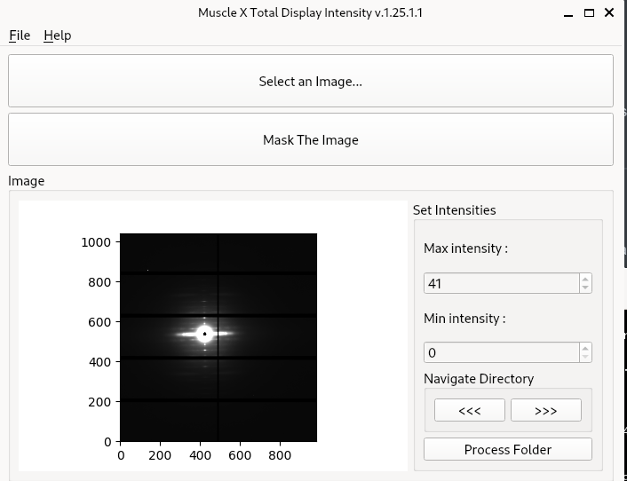
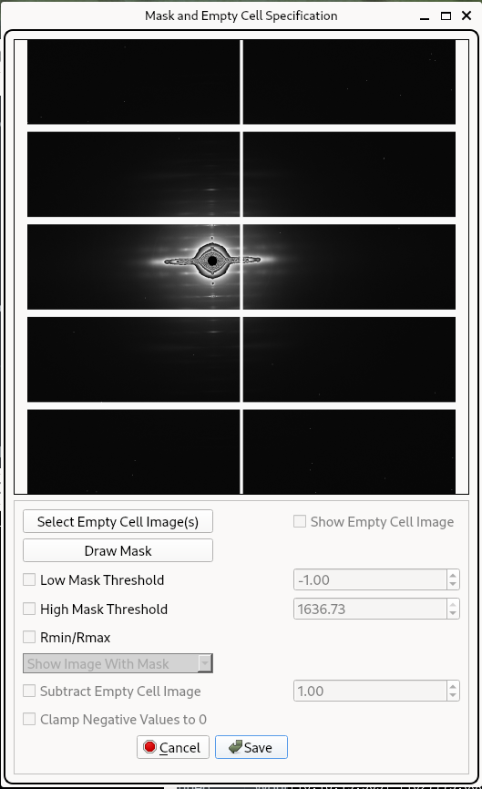
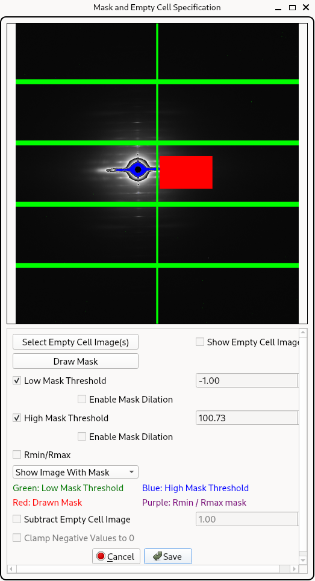
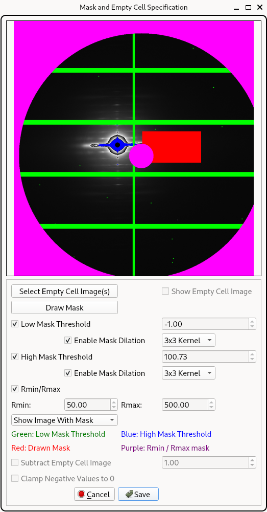
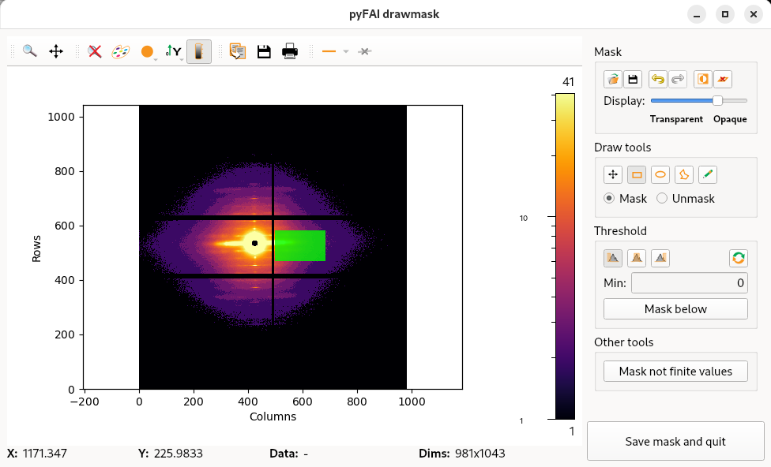

# Total Diffracted Intensity


## Introduction

The Total Diffracted Intensity (TDI) tool is part of the [MuscleX](https://github.com/biocatiit/musclex) suite developed for analyzing X-ray diffraction images of biological samples, such as muscle fibers. In diffraction experiments, total diffraction intensity is a key quantitative measure - it reflects the overall scattering power of the sample, which is proportional to properties like sample mass, density, or structural order.

This tool allows users to:

- Define and apply custom masks to isolate regions of interest (e.g., remove background, beamstop artifacts).
- Compute and export total and average intensity values from each image in a folder for downstream analysis.

These metrics are valuable for comparing conditions (e.g., relaxed vs. contracted muscle), normalizing datasets, or identifying outliers during high-throughput imaging workflows.


## How to Use

### Launching the Program

- If MuscleX is installed:

  ```bash
  musclex tdi
  ```

- From source (developer mode):

  ```bash
  python3 -m musclex.ui.TotalDisplayIntensity
  ```

> Required Python packages: `PyQt5`, `matplotlib`, `fabio`, `numpy`, `pandas`.
>
> Note that the class `TotalDisplayIntensity` will be named in a future resale to `TotalDiffractedIntensity`.


### User Interface Overview

1. Select an Image
   - Click "Select an Image..." to open a diffraction image (TIFF or HDF5).
   - The image will appear in grayscale using the default intensity range.
2. Set Intensity Display Range
   - Adjust Min intensity and Max intensity values to control the display range.
   - This helps highlight weaker features or saturate bright spots for better contrast.
3. Mask the Image
   - Click "Mask The Image" to launch an interactive masking tool.
   - You can define regions to exclude from analysis (e.g., noisy borders).
   - The mask is saved as `tdi_mask.tif` and will be applied to all images.
4. Navigate Images
   - Use the `<<<` and `>>>` buttons to browse through the images in the same folder.
5. Process Folder
   - Click "Process Folder" to compute and export results for all images:
     - A CSV file is generated containing total and average intensity values.
     - Results are saved in the `tdi_results/` subfolder.


**Figure 1.** TDI GUI



## How It Works

1. Image and Mask Loading

   - The program reads the image data using the `fabio` library.
   - If a mask is defined, it is applied as a binary filter (`1` = valid, `0` = excluded).

2. Total Intensity Calculation

   ```python
   total_intensity = np.sum(masked_image)
   ```

   - The image is multiplied by the mask to zero out unwanted pixels.
   - The pixel values in the valid region are summed to compute Total Intensity.

3. Average Intensity Calculation

   ```python
   unmasked_pixels = masked_image.size - np.sum(1 - mask)
   avg_intensity = total_intensity / unmasked_pixels
   ```

   - The number of valid pixels is determined by subtracting the count of masked pixels.
   - Average Intensity is then the total intensity divided by the number of unmasked pixels.

4. Export

   - Results are saved to `tdi_results/summary.csv` with the following columns:
     - `ImageName`: image filename
     - `MaskFileName`: typically `tdi_mask.tif`
     - `TotalIntensity`: sum of all unmasked pixel values
     - `AvgIntensity`: average value over unmasked pixels


## Mask Definition and Usage

### Overview

The Mask and Empty Cell Specification window in MuscleX provides a unified interface for defining masks that exclude undesired regions from X-ray diffraction images. It allows manual drawing, intensity-based masking, radial cropping, and subtraction of empty cell (blank) images. These masks ensure cleaner data and more reliable intensity quantification.


### Masking Window Features

| Feature                        | Description                                                                                    |
| ------------------------------ | ---------------------------------------------------------------------------------------------- |
| Select Empty Cell Image(s) | Load one or more background/blank images to subtract static artifacts like beamstops           |
| Draw Mask                  | Open a drawing interface to manually exclude regions using polygon, rectangle, or brush        |
| Low Mask Threshold         | Excludes pixels below this intensity (e.g. detector gaps, shadowed areas)                  |
| High Mask Threshold        | Excludes pixels above this intensity (e.g. beam center, saturation artifacts)              |
| Enable Mask Dilation       | Optional. Expands the mask area around low/high threshold regions using morphological dilation |
| Rmin / Rmax                | Masks all pixels outside the selected radial range from the image center                   |
| Subtract Empty Cell Image  | Applies scaled subtraction of selected empty cell image(s) before applying thresholds          |
| Clamp Negative Values to 0 | Replaces negative values after subtraction with 0                                              |
| Show Image With Mask       | Dropdown view to preview the mask overlay with current settings applied                        |


### Example Workflow

1. Start in TDI or other MuscleX tool and click “Mask The Image”.
2. In the mask window:

   * Optionally select a blank image for subtraction.
   * Enable Low and/or High Mask Threshold and set values.
   * (Optional) Check Enable Mask Dilation for either threshold.
   * (Optional) Enable Rmin/Rmax and specify radial bounds.
   * (Optional) Click Draw Mask to manually mask areas.
3. Use “Show Image With Mask” dropdown to inspect the result.
4. Click Save to generate and store the combined mask.


### Mask Visualizations

* Green = Low threshold mask
* Blue = High threshold mask
* Red = Manually drawn mask
* Purple = Rmin/Rmax radial mask

These masks are visually overlaid in the preview window:

**Figure 2.** Default Mask Window


**Figure 3.** Low and High Threshold Mask with Drawn Region


**Figure 4.** Full Mask: Thresholds, Dilation, Radial Mask


**Figure 5.** Manual Mask Drawing Interface (pyFAI tool)



### How Masks Are Combined

After configuration, the following masks are combined via binary AND:

```python
final_mask =
  manual_mask *
  low_threshold_mask *
  high_threshold_mask *
  low_dilation_mask *
  high_dilation_mask *
  radial_mask *
  blank_subtraction_mask
```

This mask is then used in downstream image analysis and intensity extraction.


## Developer Reference

| Component                     | File                                                  | Description                                                                                      |
| ----------------------------- | ----------------------------------------------------- | ------------------------------------------------------------------------------------------------ |
| TDI integration               | `musclex/ui/TotalDisplayIntensity.py`                 | `maskButtonClicked()` launches the tool; `buildMask()` loads masks                               |
| Masking UI & logic            | `musclex/ui/ImageMaskTool.py`                         | `ImageMaskerWindow` handles threshold sliders, dilation checkboxes, Rmin/Rmax, subtraction logic |
| Manual mask drawing interface | Called via `Draw Mask` (uses built-in or pyFAI tools) |                                                                                                  |
| File handling                 | `musclex/utils/file_manager.py`                       | `getBlankImageAndMask`, `getMaskOnly` parse files from disk                                      |


