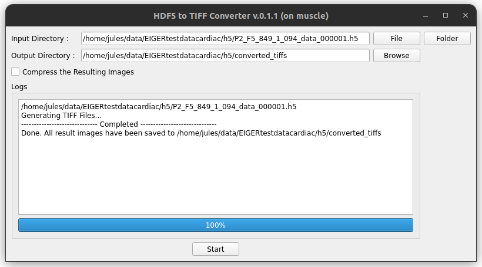

# HDF5 to TIFF Converter

There are currently two versions of the program: a standalone program and the code execution program.

## Standalone program

The standalone program can be run in Interactive mode or in Headless mode. As its name suggests, this program is NOT part of MuscleX, and can be found on the [Utilities page](../../utilities.md).

### Interactive mode

The interactive mode displays a window where you can choose an input file or a folder (for a folder, it will convert all the h5 files inside of it) and an output folder. You can then press 'Start' to convert the images. You can stop the process at any moment by clicking on 'Stop'.

### Headless mode

The headless mode works exactly as the Code Execution program: just run `hdf5-to-tiff` followed by the commands described in the next part.

## Code Execution program

The code execution program is composed of a script located inside the MuscleX code. You need access to the source code to be able to run this version of the converter. The file is located in the "utils" folder of the MuscleX code.

### Convert HDF5 file to TIFF files
The script will generate the tiff files from the hdf5 file. The Metadata are read from the metadata file and added as an ImageDescription tag in all the tiff files. It is possible to generate a compressed version of the file to save space.

- Source Code: [https://github.com/biocatiit/musclex/blob/master/musclex/utils/hdf5_to_tiffs.py](https://github.com/biocatiit/musclex/blob/master/musclex/utils/hdf5_to_tiffs.py)

#### How to use

Execute the following command:

`python3 hdf5_to_tiffs.py`

Note: You can run multiple conversions by including multiple h5 files after the `-h5` tag.

### View TIFF file metadata

The Script prints the metadata of the TIFF file.

- Source Code: [https://github.com/biocatiit/musclex/blob/master/musclex/utils/tiff_metadata.py](https://github.com/biocatiit/musclex/blob/master/musclex/utils/tiff_metadata.py)

#### How to use 

Execute the following command:

`python3 tiff_metadata.py`

