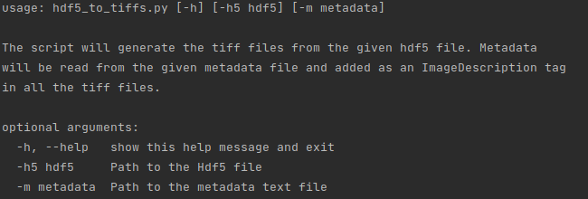
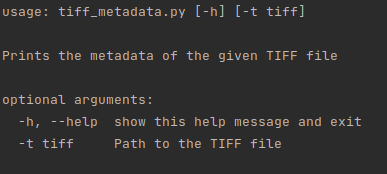

### Convert HDF5 file to TIFF files
The script will generate the tiff files from the hdf5 file. The Metadata are read from the metadata file and added as an ImageDescription tag in all the tiff files.

- Source Code: https://github.com/biocatiit/musclex/blob/master/musclex/utils/hdf5_to_tiffs.py

#### How to use

Execute the following command:

`python3 hdf5_to_tiffs.py`

### View TIFF file metadata

The Script prints the metadata of the TIFF file.

- Source Code: https://github.com/biocatiit/musclex/blob/master/musclex/utils/tiff_metadata.py

#### How to use 

Execute the following command:

`python3 tiff_metadata.py`

