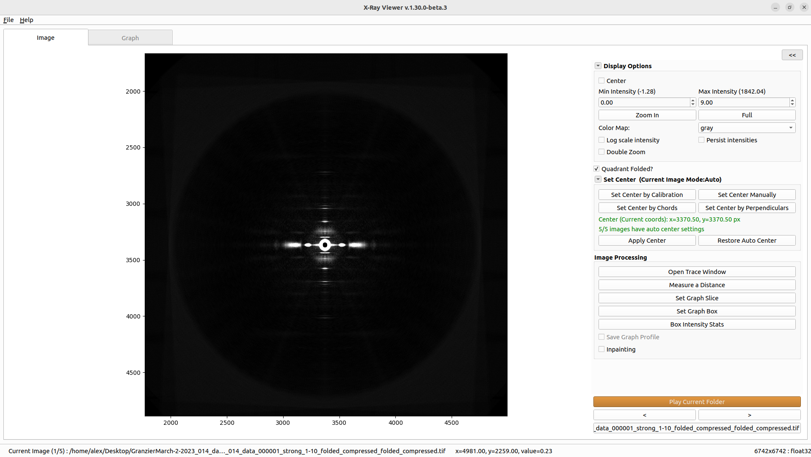

# Introduction

During an experiment, it is often useful to quickly inspect the resulting images or HDF5 frames to make sure that diffraction is working properly. Opening every image one by one can be slow, so X-Ray Viewer provides a lightweight way to browse a folder or HDF5 file, play through frames like a video, and inspect intensity profiles while data is being collected.

X-Ray Viewer can display TIFF images and HDF5 datasets, including quadrant-folded images. It includes common display controls such as intensity limits, log scale, colormap selection, zooming, persistent intensity settings, center display, and calibrated cursor readout when calibration is available.

The image tab contains interactive tools for measuring distances, defining graph slices and graph boxes, computing rectangular box intensity statistics, opening trace data, and optionally applying inpainting to detector gaps or dead pixels. The graph tab displays the selected slice or integrated box profile and provides graph zooming and distance measurement.

When "Save Graph Profile" is enabled, graph profiles are saved automatically to `xv_results/summary.csv` under the selected output directory. Manual graph text exports and PNG image exports are saved to the path chosen in the file dialog, not automatically to `xv_results`.

*This program is available on MuscleX version 1.21.0 or later.*

### More Details
* [How to use](XRay-Viewer-How-to-use.html)
