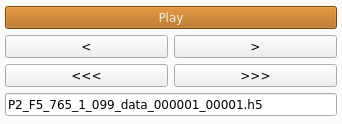

# How to use

Once the program runs, you will have to select an image in a folder containing multiple images or an hdf5 file. The program will automatically display the selected item. You will see a new window as below:


You can see the index of the image displayed in the bottom left corner of the window. The result tab is empty at first.

* Click on "Set Graph Slice" to set the graph. This function will allow you to draw a line on the image that will be displayed in the result tab. The length of the line doesn't matter, the slice will follow the line but will display the entire length of the image (you can use a graph box without witdh if you want only a selected length).

* Click on "Set Graph Box" to set the graph. This function will allow you to draw a line on the image, then select a width, and will display in the result tab the integrated slice (sum of the rows). The length of the line matters, the slice will follow the line and will only display the selected part.


* You can save the graphs displayed by checking the "Save Graph Profile" box. It will be saved as a single csv file named `summary.csv` in `xv_results`. To save a graph, you need to go to the next/previous one with the arrows, or with the "Play" button

* Use the arrows to go from one image/graph to the other. Use the "Play" button to display each image/graph one by one like a short video.

* Use the "Open Trace Window" to dislay a new window. This window allows you to select the log file associated to the h5 file opened in the main window in order to see the force applied on the muscle, its length in and its length out during the experiment. A vertical red line is displayed to show where you are in the experiment (which image is displayed).


```eval_rst
.. note:: For now, the log file needs to be a simple text file (.txt, .log, etc...). The lines ignored need to start with a `#` and the data lines need to be in the same order as the images. For each data line, the fields are separated by a tabulation, with length_out at position 7, length_in at position 8 and force at position 9 (first column is position 0).
```
For example:

\#Filename, start_time, exposure_time, I0, I1, Beam_current, Detector_Enable, Length_Out, Length_In, Force

P1_F2_1350_1_014_000001, 0.0, 0.0179993, 931990.04530322, 1755.92892531, 102.44832854999918, 3.283979566710928, 0.018878511942131086, 0.0016222853110954315, 0.14441117154556013

## Navigation

To navigate through a folder of TIF images or through an H5 file containing multiple images, you can use the simple arrows "<" and ">". 
Depending on if you are looking at an H5 file or not, another set of buttons will be displayed: the arrows "<<<" and ">>>" allow you to go to the previous/next H5 file in the same folder. The "Process Current H5 File" button will process only the opened H5 file, whereas the "Process All H5 Files" button will process all the H5 files available in the folder.
In the case of a simple TIF image, those buttons will be replaced by a simple "Process Current Folder" button that will process all the TIF images in the current folder.



## Display Options

All options in Display Options will not affect any processing. These options allow users to see more detail in the image by setting minimal intensity, maximum intensity, and zooming. You can also choose whether or not to see the meridional and equatorial axes. To zoom in, the user needs to simply press the Zoom in button, and select the zoom region by drawing a rectangle as shown below. Once 'Zoom in' or 'Full' button is clicked, the current zoom level is persisted when moved to the next image. The check box 'Persist intensities' is used to persist the max and the min intensities when we move to the next image.
