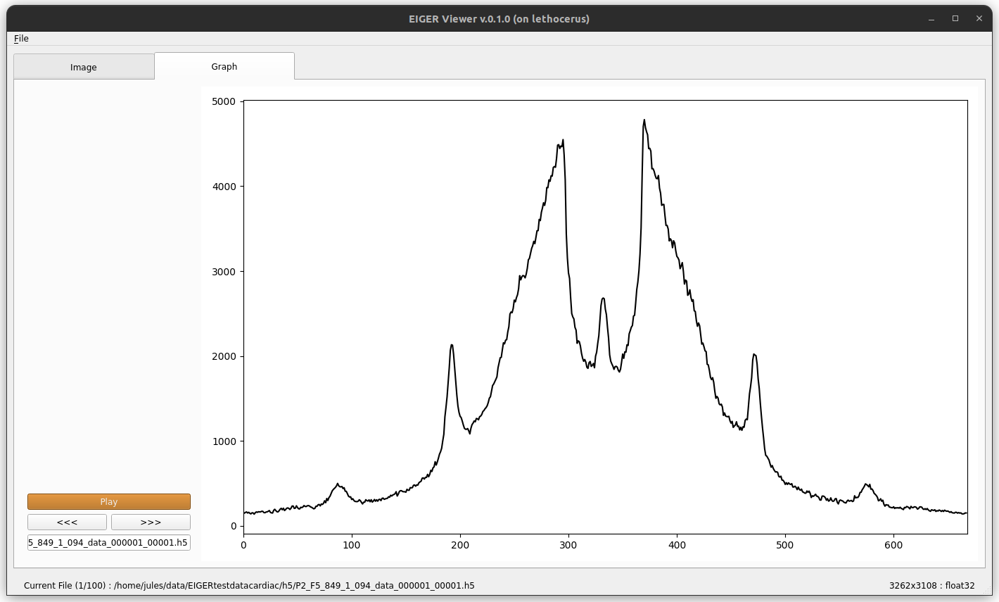
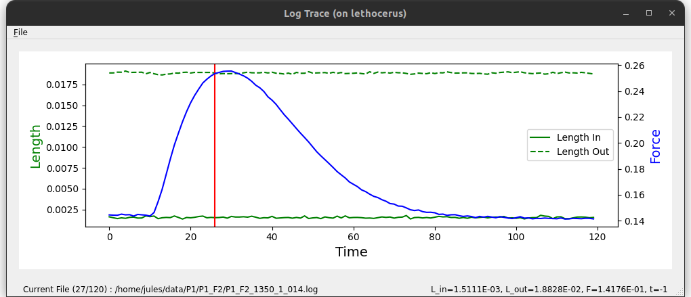
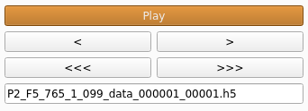

# How to use

Once the program runs, select an image in a folder containing multiple images, or select an HDF5 file. The program automatically displays the selected item and prepares the image navigator for the rest of the folder or HDF5 frames. You will see a new window as below:


The status bar shows the current image index, frame index for HDF5 data, cursor coordinates, pixel intensity, and the current file path. If calibration information is available, the cursor readout can also show calibrated distance information.

## File and output options

Use **File > Select an Image...** or `Ctrl+I` to open another image or HDF5 file.

Use **File > Change Output Directory...** if results should be written somewhere other than the input data directory. This is useful when the input directory is read-only or when you want to keep analysis results separate from raw data.

Use **File > Export Current View to PNG...** or `Ctrl+E` to save the current image view as a clean PNG. The export uses the current zoom, intensity limits, log scale, and colormap, but removes axes and temporary overlays.

Use **File > Export Graph Data to Text File...** or `Ctrl+Shift+E` after creating a graph slice or graph box. The exported file contains two columns, pixel index and intensity, plus header metadata such as MuscleX version, source image, and graph mode.

## Image tools

* Click on "Set Graph Slice" to set the graph. This function will allow you to draw a line on the image that will be displayed in the result tab. The length of the line doesn't matter, the slice will follow the line but will display the entire length of the image (you can use a graph box without width if you want only a selected length).

* Click on "Set Graph Box" to set the graph. This function will allow you to draw a line on the image, then select a width, and will display in the result tab the integrated slice (sum of the rows). The length of the line matters, the slice will follow the line and will only display the selected part.



* Click on "Measure a Distance" to draw one or more two-point measurements on the image. The measurement popup reports the distance in pixels. If calibration is available, calibrated distance information is included in the readout.

* Click on "Box Intensity Stats" to draw a rectangular ROI on the image. A non-modal popup displays live statistics for the selected box, including sum, mean, standard deviation, minimum, maximum, median, and pixel count. Use the rectangle handles to adjust the box, click "Done" to freeze it, and click "Edit" to modify a frozen box. Multiple boxes can be reviewed during the same tool session.

* Check "Save Graph Profile" to save graph profiles automatically. Profiles are written to a single CSV file named `summary.csv` in `xv_results`. To save a profile, move to the next or previous image with the arrows, or use the play button.

* Check "Inpainting" to fill masked or dead detector pixels from surrounding pixel values before display and graph extraction. Toggle it off to return to the original loaded image data.

* Use the "Open Trace Window" to display a new window. This window allows you to select the log file associated with the HDF5 file opened in the main window in order to see the force applied on the muscle, its length in, and its length out during the experiment. A vertical red line is displayed to show where you are in the experiment (which image is displayed).



```eval_rst
.. note:: For now, the log file needs to be a simple text file (.txt, .log, etc...). The ignored lines need to start with a `#` and the data lines need to be in the same order as the images. For each data line, the fields are separated by a tab, with length_out at position 7, length_in at position 8, and force at position 9 (first column is position 0).
```
For example:

\#Filename, start_time, exposure_time, I0, I1, Beam_current, Detector_Enable, Length_Out, Length_In, Force

P1_F2_1350_1_014_000001, 0.0, 0.0179993, 931990.04530322, 1755.92892531, 102.44832854999918, 3.283979566710928, 0.018878511942131086, 0.0016222853110954315, 0.14441117154556013

## Navigation

To navigate through a folder of TIF images or through an H5 file containing multiple images, you can use the simple arrows "<" and ">". 
Depending on whether you are looking at an H5 file or not, another set of buttons will be displayed. The arrows "<<<" and ">>>" allow you to go to the previous or next H5 file in the same folder. The "Play Current H5 File" button plays the opened H5 file. In the case of simple TIF images, the H5 play button is replaced by "Play Current Folder", which plays all TIF images in the current folder.

Playback starts from the current image and returns to that image when playback finishes.



## Display Options

Display Options do not affect the original data. These options allow users to see more detail in the image by setting minimum intensity, maximum intensity, log scaling, colormap, and zoom. You can also choose whether to show the meridional and equatorial axes, show the center marker, or mark the image as quadrant folded.

To zoom in, press the "Zoom in" button and select the zoom region by drawing a rectangle. Once "Zoom in" or "Full" is clicked, the current zoom level is persisted when moving to the next image. The "Persist intensities" checkbox keeps the current minimum and maximum intensity values when moving between images.

If calibration settings are available, use the cursor readout selector to display calibrated values as `d (nm)` or `q (nm^-1)`.

## Center and calibration

The center settings panel can display and adjust the beam center using the same workspace controls as other MuscleX modules. You can use automatic center detection, manual center entry, chord/perpendicular tools, calibration settings, and restore/apply controls from this panel. Enable the "Center" checkbox to display the center marker on the image.

For quadrant-folded images, X-Ray Viewer can use the geometric center instead of running the usual center detection. Use the "Quadrant Folded" checkbox when you need to override the automatic folded-image detection.

## Graph tab

There are also three ways to adjust zoom on the graph tab:
1. Use the scroll wheel to zoom in and out while the mouse is on the graph.
2. Click the 'Zoom In' button, then draw a zoom region on the graph; the graph will resize to display the region you selected.
3. Press the 'Reset Zoom' button.  This will reset the zoom and the graph will be displayed at its original size.

The graph tab also includes "Measure a Distance" for measuring distances directly on the plotted profile. Navigation controls move with the active tab, so you can step through images while viewing either the image or the graph.