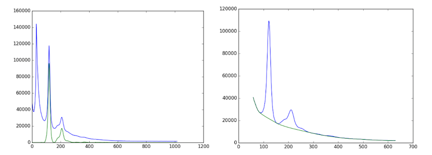

# How it works

When an image is selected, if there is an image in the same folder named “calibration.tif”, the calibration settings window will pop up (How to set calibration settings will be explained in the next section). If there’s no calibration image or it’s set already, the image will be processed automatically with the default parameters. However, if the image has ever been processed with the same version of the program, the cache will be downloaded, so the image won’t be processed again.

## Image processing and fitting model
The program will process an image by going through multiple processes in the order 
### 1. [Find Center](../Image-Processing-Functions.html#finding-center)
### 2. [Calculate Rotation Angle](../Image-Processing-Functions.html#calculate-rotation-angle)
### 3. [Calculate R-min](../Image-Processing-Functions.html#calculate-r-min)
### 4. Calculate Box Width
The image will be rotated by the rotation angle determined above, and the area inside R-min removed as in this image. The image will be cropped by using R-min x 1.5.
 

Then, the program will find the horizontal histogram from this image, calculate the background assuming a convex hull function to the histogram, and the integrated area will be selected as between the start and end point of the histogram. From the image above, the horizontal histogram was
 

### 5. Get Intensity Histogram
When integrated area is calculated, the program will produce a histogram from the rotated image inside the integrated area. (If the blank image and mask is set, the original image will be subtracted by the blank image before rotation)

### 6. Apply Convex hull to intensity histogram
The original histogram will be split into left and right sides. Then, the convex hull to each half pattern will be calculated in order to remove the background by using R-min as a starting point.

### 7. Find Diffraction Peaks
The program will find peaks from left and right histograms which have had the convex hull background subtracted. This process will find all locations of the peaks. If the image is noisy, it is possible that the program will find too many peaks. ( In the image below, the program found only 2 peaks because the image was not noisy, so it worked very well )

### 8. Managing Diffraction Peaks
This process prepares and corrects the background-subtracted, intensity histogram before fitting a model. It is possible that the program found peaks from noise, misplaced peaks, or both false positive peaks and false negative peaks. Therefore, these peaks need to be re-positioned in case this process fails. The algorithm  will try to find first symmetric peaks, and find S10 which is the distance from center to the first peak on the equator. After that, all peak locations will be calculated by using S10 and theta(h,k). The number of peaks on each side to be fit needs to be specified by the user (default and minimum is 2)

### 9. Fit Model
The program will fit the model to the histogram by using the specified model (currently Gaussian and Voigtian models are supported), initial S10,and the area of the reflection peaks. Finally, we will obtain the new parameters we want from the fitting results. This will include the area of each peak, S10, sigma D, sigma S, gamma, and  I11/I10. However, if you see only 4 reflection from the pattern (Only I11 and I10 on each side), it will be overdetermined if you use Voigt as a fitting model. To solve this problem, sigma S or gamma should be fixed.

If there are some parameters that need to be configured manually to obtain good fits, the program will run these processes again, but it will not start from the beginning. Instead, it will start from the process after the manual one. For example, if the Box Width is set manually, the program will run processes from Get Intensity Histogram to Fit Model because the center, rotation angle and r-min do not need to be recalculated.