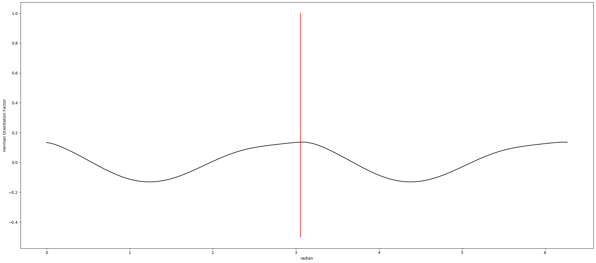

# Orientation Finding

## Azimuthal Integration
See [Calculate Rotation Angle](Image-Processing-Functions.html#calculate-rotation-angle) for more details.
Following methods are all based on the histogram gotten in this step.

## Gaussian Mixture Model (GMM)
See [Scanning Diffraction](ScanningDiffraction/Scanning-Diffraction--How-it-works.html#finding-other-properties-of-each-ring) for details.

## Herman Orientation Factor


After getting the circular histogram from azimuthal integration, we can calculate Herman Orientation Factor for each degree. The formula is
```eval_rst
:math:`HoF = \frac{3\langle\cos^2\phi\rangle-1}{2}`, where 
:math:`\langle\cos^2\phi\rangle = \frac{\sum_{i=0}^{i=x}I_i\cos^2\phi_i\sin\phi_i}{\sum_{i=0}^{i=x}I_i\sin\phi_i}`
```
*x* is either equal to 180 or 90 degrees.


We can get the same number of Herman Factors as the length of the histogram. (See [Page 7](http://www.personal.psu.edu/irh1/PDF/Orientation.pdf) for properties of Herman Factor.) Following two figures seperately show results of integration on 90 and 180 degrees.




```eval_rst
.. note:: In *Scanning Diffraction* program, the area of azimuthal integration is set by ROI. In other programs, the area of azimuthal integration is fixed where the inner radius is 0 and the outer radius is 1/3 max radial length.
```