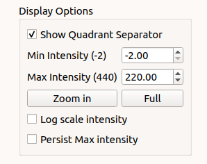

# How to use

After the program is opened, users will be able to select a file or a folder to process by pressing the button or select an option on the menu bar. 

When an image is selected, the program will automatically process the image if it has not been processed before. There are 2 tabs in the program, [Original image](#original-image), and [Results](#results).

## Original Image
In this tab, the original image will be shown along with various options displayed on the right, Display Options, Image Processing, and Fix Center. 

### Display Options

All options in Display Options will not affect any processing. These options allow users to see more detail in the image by setting minimal intensity, maximum intensity, and zooming. You can also choose whether or not to see the meridional and equatorial axes. To zoom in, the user needs to simply press the Zoom in button, and select the zoom region by drawing a rectangle as shown below. Once 'Zoom in' or 'Full' button is clicked, the current zoom level is persisted when moved to the next image. The check box Persist max intensity is used to persist the max intensity when we move to the next image.

### Image Processing

#### Set Rotation and Center
Before setting manual rotation and center, it’s better to zoom the image to the area of the diffraction because it will be easier to set these parameters correctly. To set the rotation and center, you need to click 2 positions of the image. The first one will be a reflection peak on one side of the equator, and the second one will be the corresponding (opposite) reflection peak on the other side of the equator. To cancel, press ESC. 

#### Set Rotation Angle
This assumes that the center of diffraction is correct. After the button is clicked, the program will allow users to select an angle by moving a line. Clicking on image when the line is on the equator of the diffraction will set manual rotation angle. To cancel, press ESC. 

The Mask Threshold is used for excluding certain pixel values when calculating the folded image. The program will ignore pixels with intensity below mask threshold. This can be used to remove the dark gaps in images resulting from the gaps between detector elements in Pilatus detectors, as well as other detector abnormalities.

To fix the center position to a user supplied value, you can check Fix Center check box, specify the coordinates of the beam center (before rotation). The image will be reprocessed when x, or y is changed. This will affect the next image if it’s still checked.

## Results
In this tab, the resulting image will be displayed along with options on the right. Display Options will provide the same options as in Original Image tab. Users can specify min and max display intensity, and zooming.  

For the background subtraction section, by default, the program will not apply any background subtraction. To apply background subtraction, you can choose a method by method drop-down list. There are currently 6 options, [Circularly Symmetric](#circularly-symmetric), [2D Convex hull](#2d-convex-hull), [Roving Window](#roving-window), [White-top-hat](#white-top-hat), [Smoothed-Gaussian](#smoothed-gaussian), and [Smoothed-Boxcar](#smoothed-boxcar)

For each method, users can select R-min and R-max manually by pressing the button and select R-min and R-max in the image as shown below

#### Circularly Symmetric

#### 2D convex hull

#### Roving Window

#### White top hat

#### Smoothed Gaussian

#### Smoothed Boxcar

You can change the parameters and click Apply to make the program re-process the background subtraction

### Merging
For the merging settings, they will be under the white line in the Background Subtraction section. There is the ability to set also another top hat parameter for regions of the image outside the R-max so the top hat parameter can be different inside and outside the merge radius if desired. 

To set the merge gradient, simply change the value in the Merge Gradient spinbox
