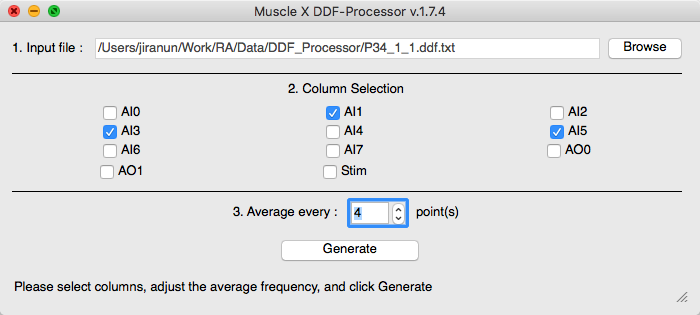
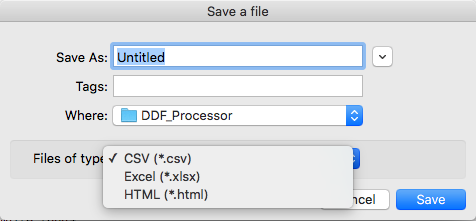

# How to use

Once the program runs, you will see a new window as below

In order to perform generate result file,
1. Select an input ddf file by pressing "Browse". After the file is selected, the program might take few seconds to process the file. 

2. When the file is processed, all available columns will be displayed as check boxes. You can select columns that will be in the result file, and number of point to average.

3. Press Generate button to generate the result file. After the button is pressed, the save dialog will pop up. You can set location, name of the result file, and output file type (csv, html, or xlsx). 

