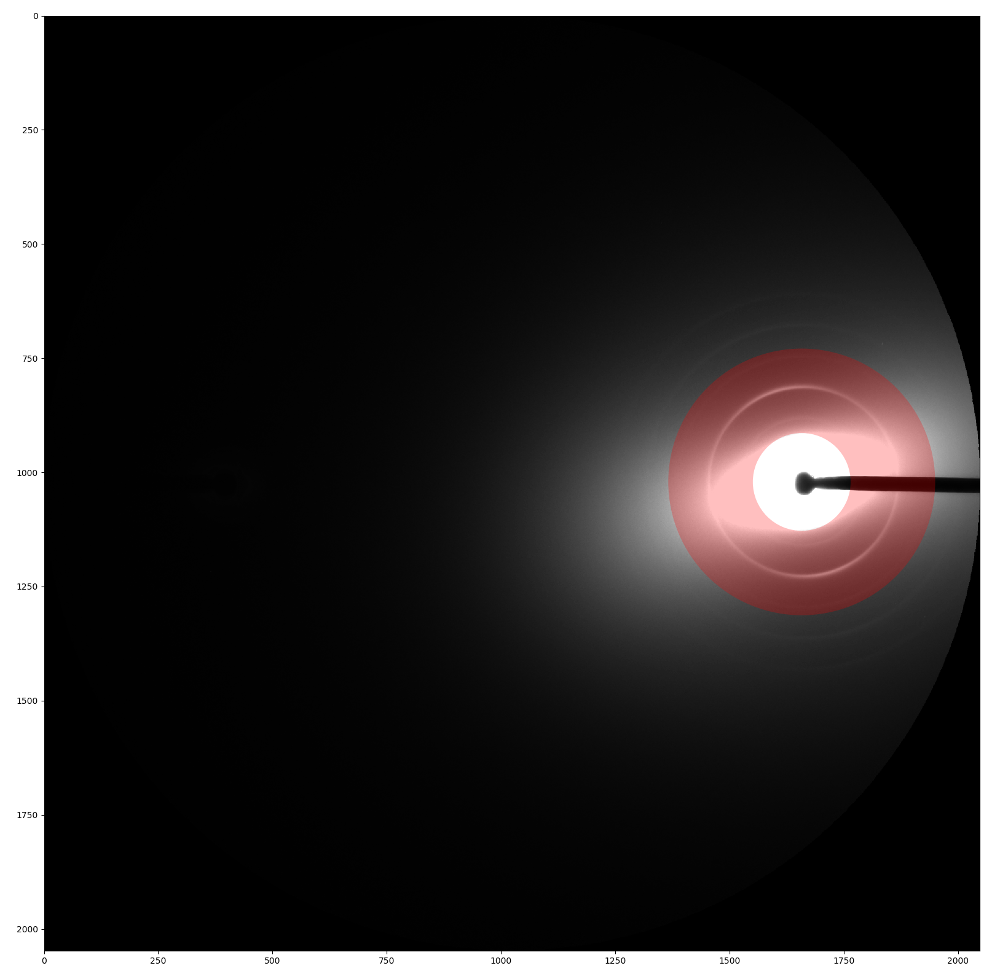
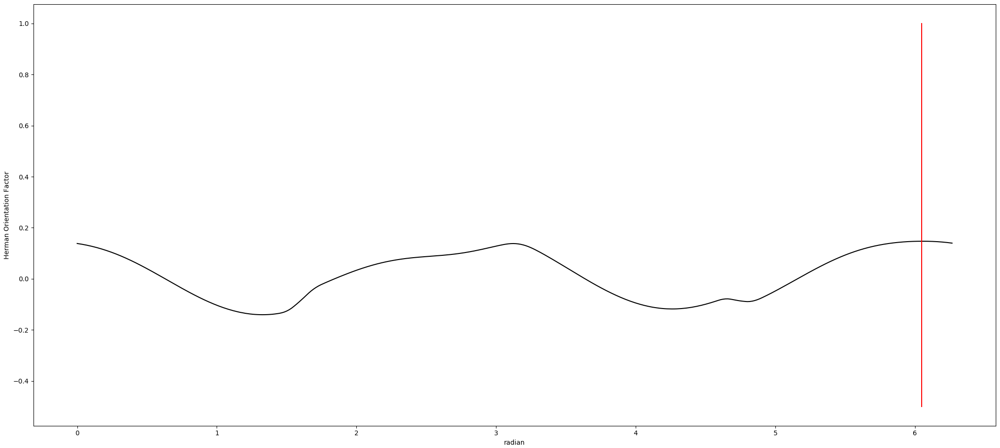

# Image Processing Functions

## Finding Center
To find the center, the image will be converted to an 8 bit image, Gaussian filter is applied to reduce noise, apply thresholding and find the circle by fitting an ellipse to the biggest contour of the threshold image. The center is the center of ellipse. 

  

If the center obtained by the above method is a floating number, the entire image is translated such that the center is at the closest integer coordinates. 

If the circle cannot be determined this way, the center will be calculated by using the [moments](http://docs.opencv.org/2.4/modules/imgproc/doc/structural_analysis_and_shape_descriptors.html?highlight=moments#moments) method of OpenCV to find the center of the object.

## Calculate Rotation Angle
The program will first calculate the initial angle by fitting an ellipse to the pattern. However, another approach will be applied to find more accurate angle by using azimuthal integration histogram. To find the angle from azimuthal integration histogram is just getting the angle with highest intensity. If the angle from this method is not too different from the initial angle, the angle from this method will be returned. Otherwise, the initial angle will be returned. It is ensured that the angle returned is always an acute angle (closest acute angle from the calculated angle).


Following methods are all based on the azimuthal integration described above.
### Gaussian Mixture Model (GMM)
See [Scanning Diffraction](ScanningDiffraction/Scanning-Diffraction--How-it-works.html#finding-other-properties-of-each-ring) for details.

### Herman Orientation Factor


After getting the circular histogram from azimuthal integration, we can calculate Herman Orientation Factor for each degree. The formula is
```eval_rst
:math:`HoF = \frac{3\langle\cos^2\phi\rangle-1}{2}`, where 
:math:`\langle\cos^2\phi\rangle = \frac{\sum_{i=0}^{i=x}I_i\cos^2\phi_i\sin\phi_i}{\sum_{i=0}^{i=x}I_i\sin\phi_i}`
```
*x* is either equal to 180 or 90 degrees.


We can get the same number of Herman Factors as the length of the histogram. (See [Page 7](http://www.personal.psu.edu/irh1/PDF/Orientation.pdf) for properties of Herman Factor.) Following two figures seperately show results of integration on 90 and 180 degrees.




```eval_rst
.. note:: In *Scanning Diffraction* program, the area of azimuthal integration is set by ROI. In other programs, the area of azimuthal integration is fixed where the inner radius is 0 and the outer radius is 1/3 max radial length.
```

## Calculate R-min
R-min is the minimum radius from the center to be analyzed in a given diffraction pattern. The program will create a radial histogram. The x-axis is radius, and the y-axis is the intensity. R-min is determined as the 50% of its maximum value. However, this radius should not be more than 150% of the maximum point location to prevent over removal. For example, if the maximum point is at 35, R-min should be between 36 - 59. If the program cannot find the 50% of the maximum value in this range, R-min will be 59.

